In this unit, you'll evaluate trained brains and assess the performance of the brain by creating a custom assessment. Note that managed simulations are those pushed to the Bonsai Azure storage account. This is the default method that most projects should use.

## Assessment list

The assessment list is accessible from the Train tab in the Bonsai UI. By default, the list includes all automatic and custom assessments associated with the selected brain version. Select the checkmarks next to Automatic or Custom to filter the list of assessments.

- Select the assessment name from the list to display the details of an assessment.
- To return to the default Train display, select "Concept overview: (ConceptName)".


## Create a custom assessment with Moab

### Start an assessment with Bonsai UI

### *Step 1: Generate an assessment configuration file*

The Bonsai UI can assist you in generating an assessment configuration file for your Custom Assessment.

1. Select the + New assessment button in the assessment panel.

    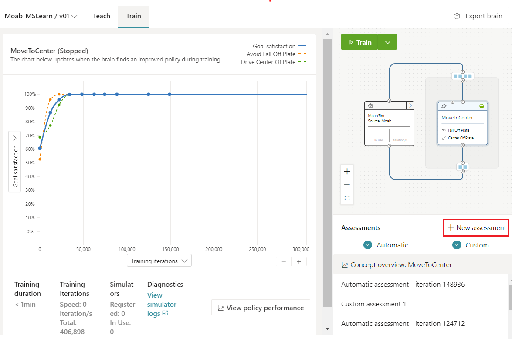

1. Review the number of episodes for your assessment.

    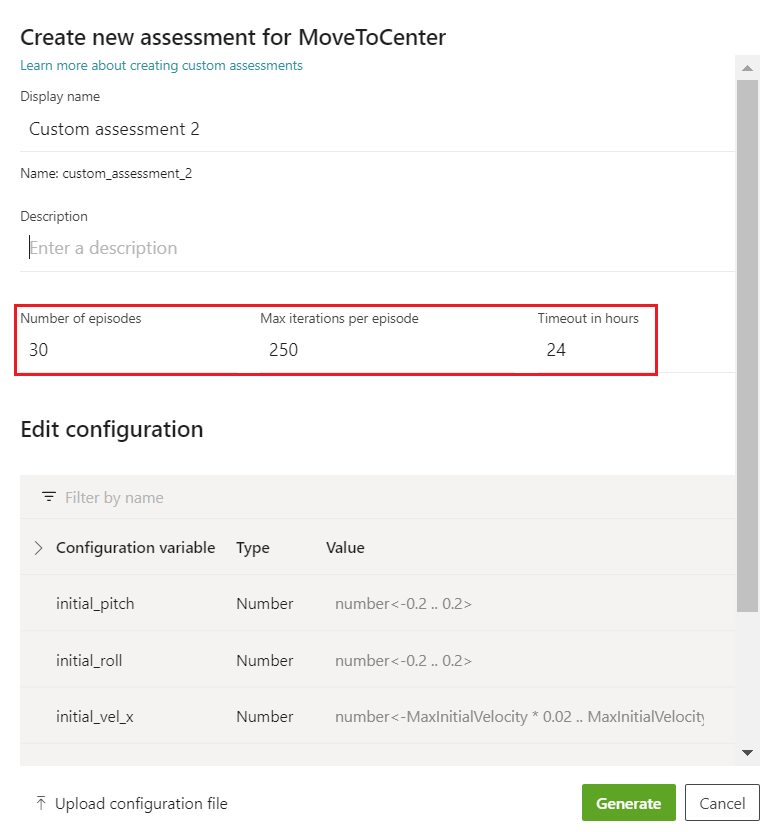

1. Review the configuration variable list in the assessment model. Note, only configuration parameters included in SimConfig will be available for definition within any Custom Assessment.

    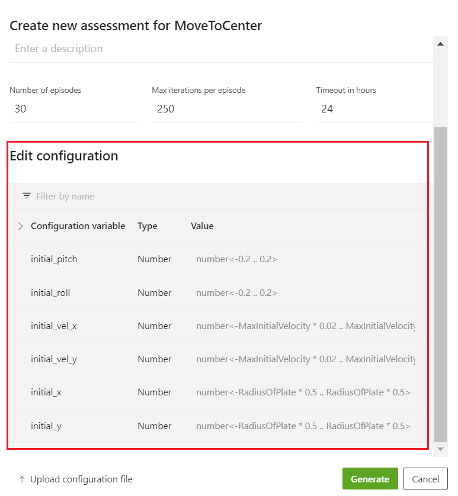

1. Cancel to create an assessment and select the Teach tab to open the Moab Inkling file.
1. Scroll to the simulator statement. Configuration variables are defined in the SimConfig type used by the simulator statement.

    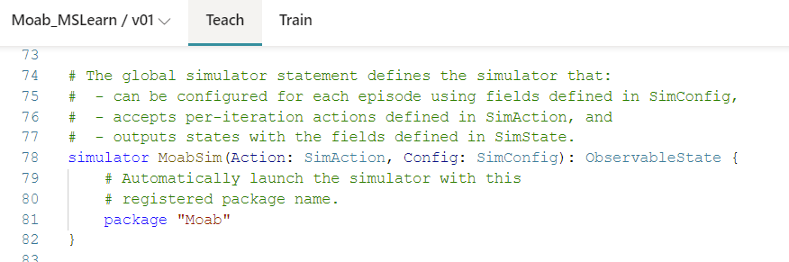

1. Scroll to the SimConfig definition in the Inkling.

    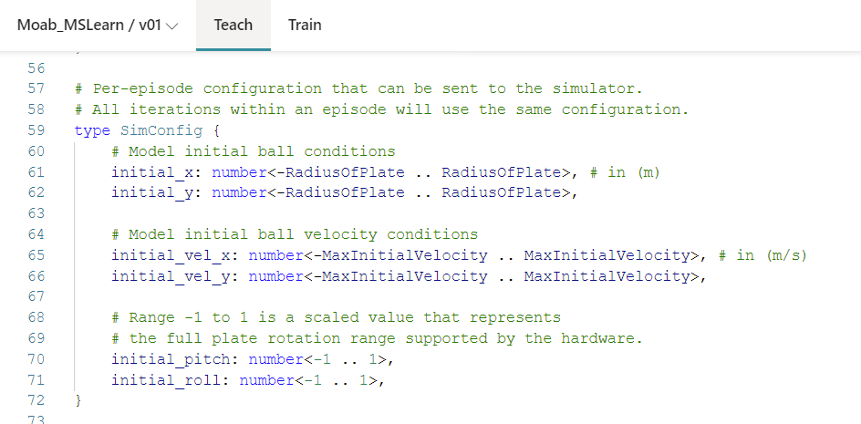

1. Add height_z as a configuration variable and constrain the value to be a float between 0.1 m and 0.2 m.

    ```
    height_z: number<0.1 .. 0.2>
    ```

    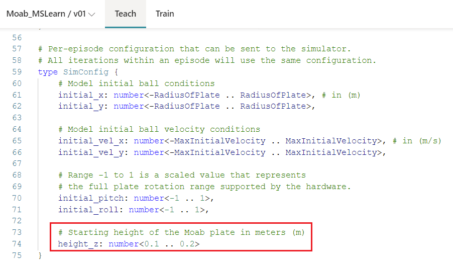

1. Save the Inkling file and select the Train tab to go back to the assessment list.
1. Select + New assessment button
1. Review the configuration variable list in the assessment model. Notice that height_z now appears in the configuration variable list.

    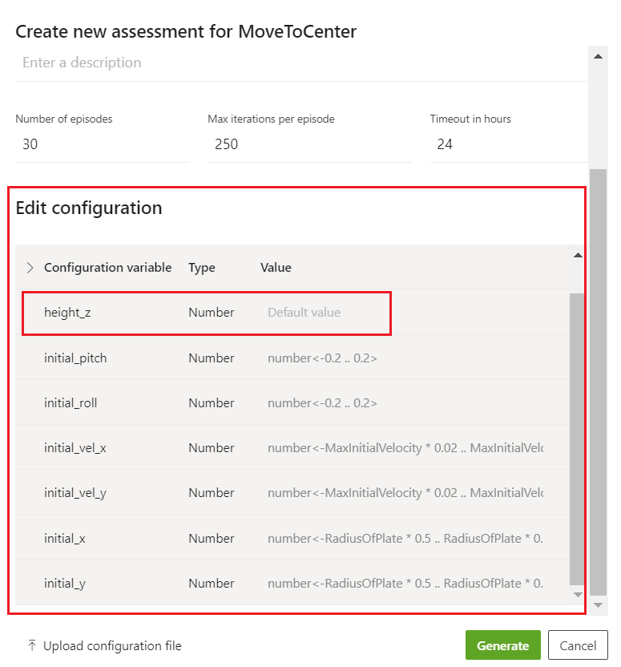

1. Configure height_z in the assessment modal between 0.1 m and 0.15 m as indicated below.
1. Change the number of episodes to 100 as indicated below. This tells Bonsai to generate 100 independent episodes based on the configuration variables and valid ranges defined for the custom assessment within “Edit configuration”.
1. Assign constant values to all other configuration variables as indicated below. 250 for the Max iteration count, and 24 for the simulation timeout.

    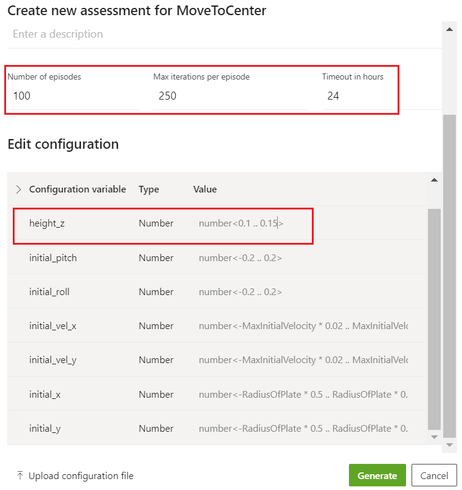

1. Select Generate to create an assessment configuration file. You'll now see the JSON file that Bonsai crafted for you. This JSON file contains 100 episode configurations. The values for height_z will be uniformly distributed between 0.1m and 0.15m across all 100 episodes while all other configuration variables are distributed within the ranges manually defined by you on the previous screen. Note that if no values are provided for specific Config parameters within the JSON file, no values are sent to the simulation during episode start. Thus, the simulation will run with whichever default initialization values coded within episode start (either fixed or randomly distributed).
1. Review the generated JSON assessment episode configurations.

    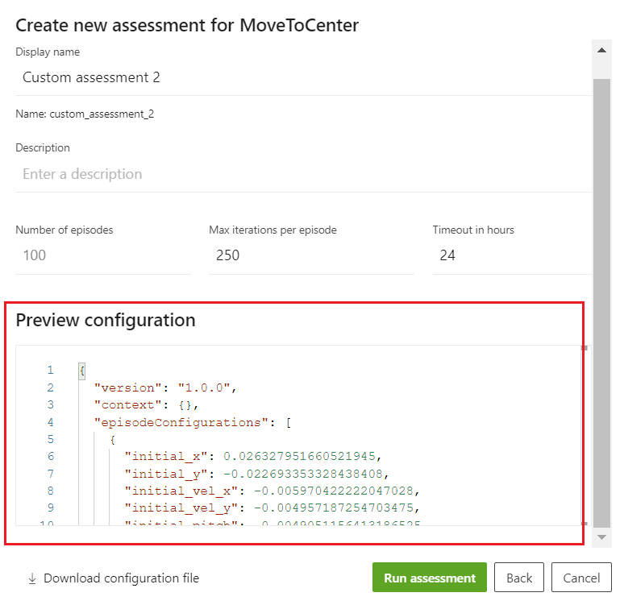

### Step 2: Run assessment

When the JSON file looks correct, click Run assessment to start the assessment. Assessment automatically starts with the simulator package defined in your Inkling file.  The assessment data and episodic results for this assessment won't be available until all episodes are run.

## Evaluate assessment results

After you run a custom assessment, these are the three components you can expect to see as part of any custom assessment:

- **(A) Metadata header**: Displays general information related to the assessment.
- **(B) Brain Performance panel**: Displays the high-level summary of assessment results. At a high level, this section presents the aggregated performance in terms of the objectives met/unmet by the tested episodes.
- **(C) Episode panel**: Displays the detailed iteration, configuration, and performance data for each episode in the assessment. Each episode is displayed, along with its states and actions, allowing Machine Teachers to independently review how the brain performed or failed for each episode.

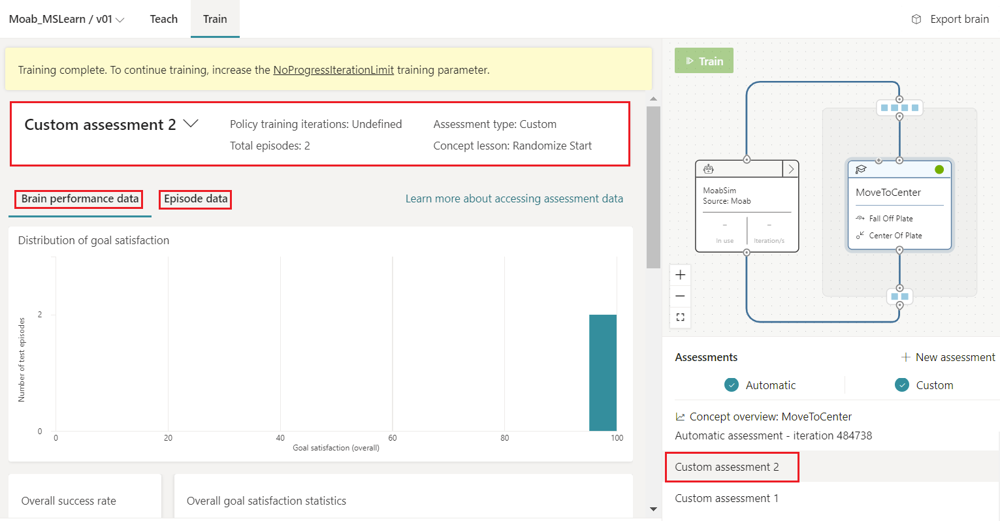

Note that you can go back to your training graph at any time by clicking back on "Concept overview: MoveToCenter".Alternatively, you can directly click over the concept on the Concept Graph.

### *Brain Performance Data*

**Brain Performance Data** that displays the analysis for aggregate Success rate, Goal Satisfaction rate and Goal Robustness rate that can be used to find the overall performance across the episode runs for our analysis.

- As we can see from the below screenshot, we have the success rate of 100 episodes all have values of 1.0 that concludes all the episodes run successfully without any failure.

    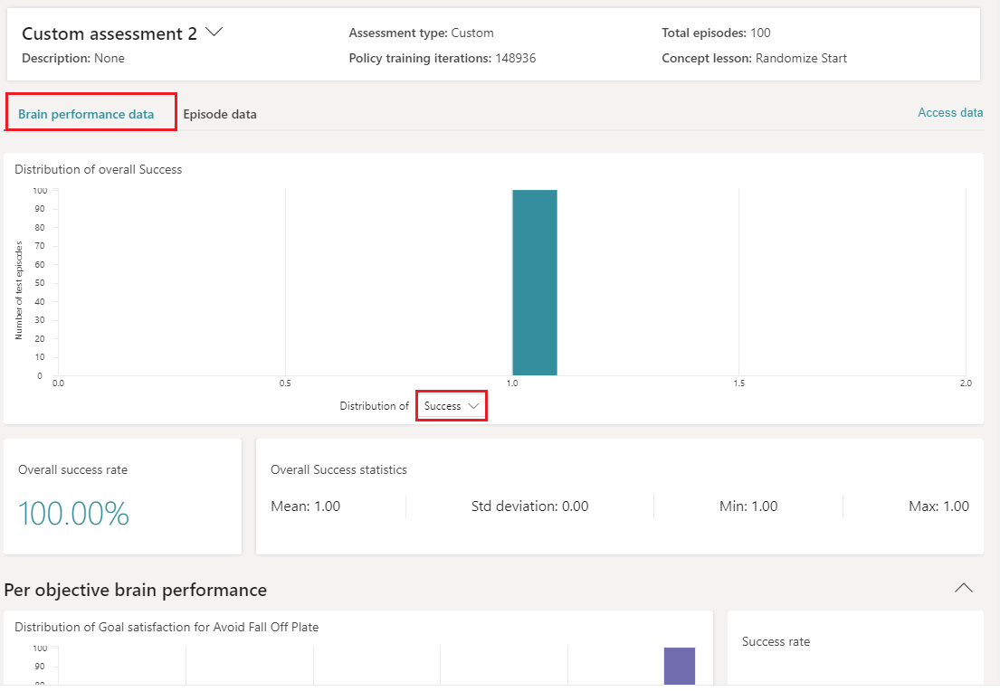

- In the next screenshot we have a Goal Satisfaction result that shows all the episodes performing 100% which indicates the goal being met as per the requirement. In the result, we don't have any episode that has unmet goals in the test run.

    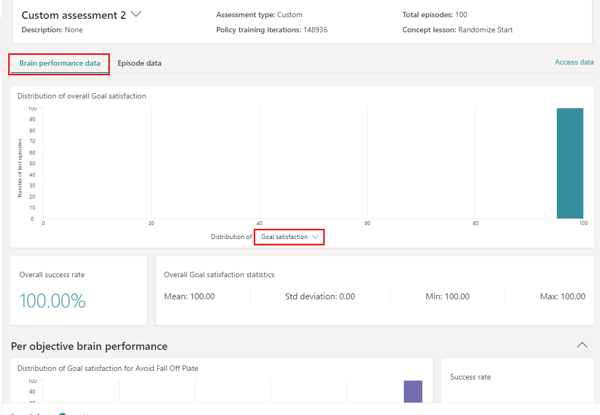

- In the last screenshot, we have a Goal Robustness chart that shows distribution of the goal robustness of the test episode and lists how the episode met the goal with/without deviation. This is an important factor in determining how consistently the episode performed with respect to the goal satisfaction. Close to value 1 shows less deviation, i.e. better consistency result. Value around 0.5 means there was a varying deviation while meeting the goal and indicating average robustness for the specified custom assessment. The long-term goal should be improving the robustness to achieve value above threshold closer to 1.0.

    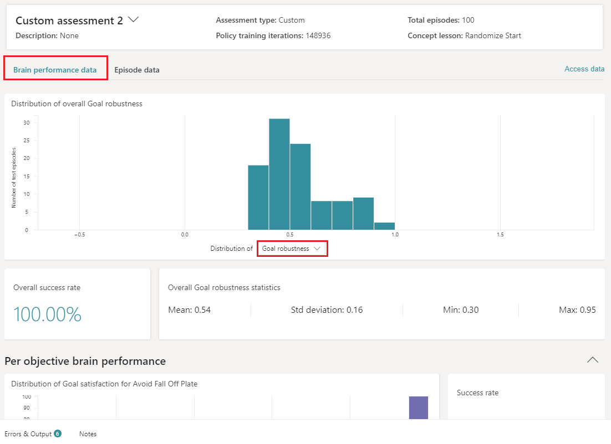

### *Episode data*

The episode data UI includes three key components:

1. **Filter episode data**: Shows histogram that shows users overall brain performance. You can click on a bar, and filter the content of the episode configuration table and episode iteration charts to only show episodes that fit into the performance range of the chosen bar. You can select more than one bar at a time.
1. **Episode configuration values**: Shows episode configuration values and performance data for each assessment episode. You can choose the configurations you want to view in the columns by selecting the edit button. You can also use the episode configuration table to filter which episode charts you see beneath the table by clicking on the appropriate rows. If you don't select anything, all charts will be shown.
    - As indicated below, episode data that shows results for each of the episodes under tests and lists a detailed summary of the assessment data being used along with the Goal Robustness, Goal Satisfaction, Success based on objectives. We can filter the episode data for in-depth analysis of how each of the episodes performed.

    - Note that this graph can also display the additional metrics that are threshold independent such as “Episode iterations” and “Maximize – Mean Value”. For our purposes, you would like to look at “Drive - % of iterations in target region”, even if it's threshold-dependent.

        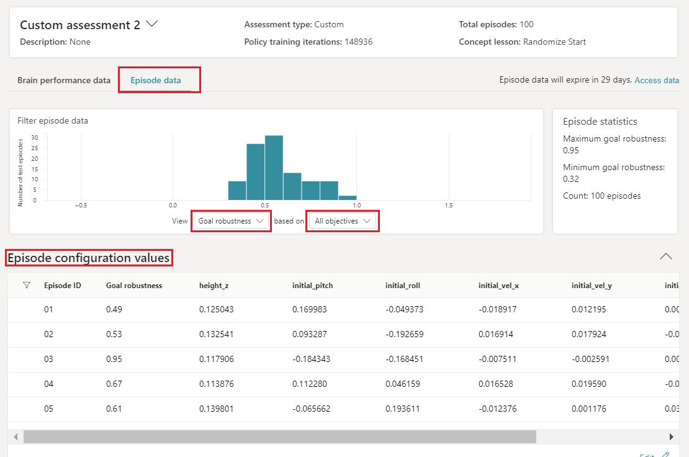

1. **Episode iteration data**: Provides a visualization for any state or action variable values across episodes. The iteration data panel also lets users visualize how reward varies across episodes. You can select and edit the state, action, or reward variables that you want to visualize.

    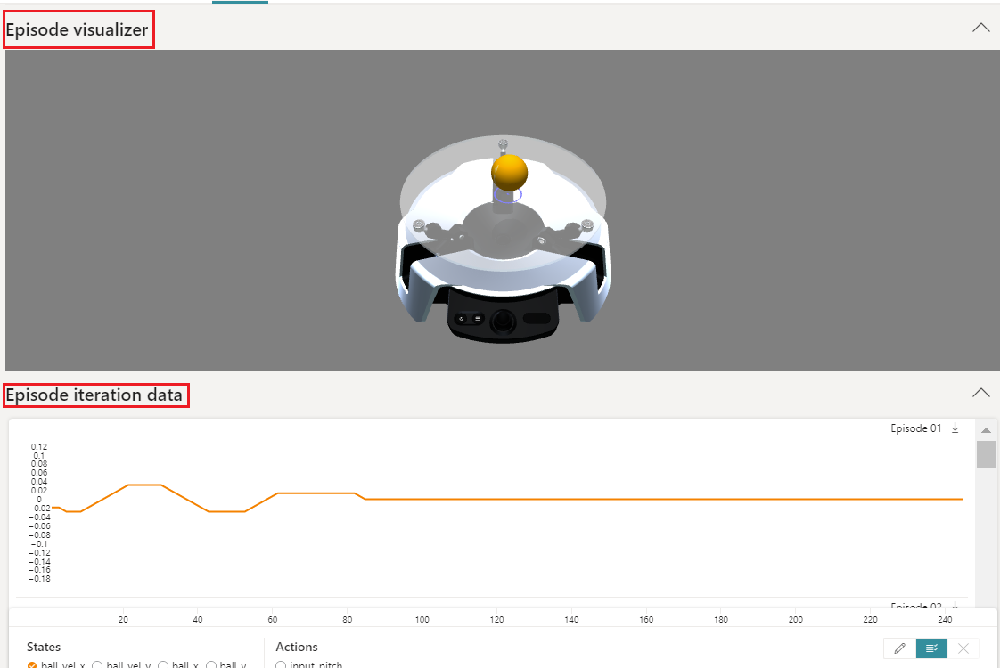

    You can also view the episode iteration data across each episode and obverse the state or action values using visualization. You can edit the visible variables by clicking on the EDIT button (pencil button).

    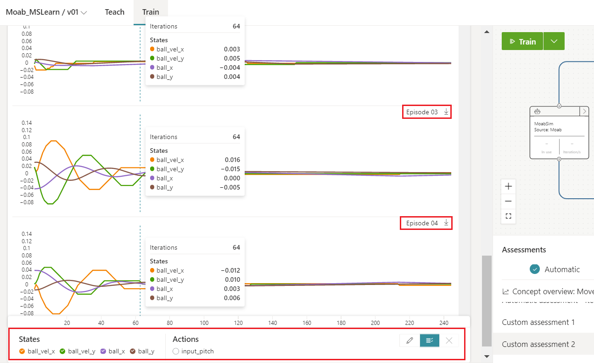
