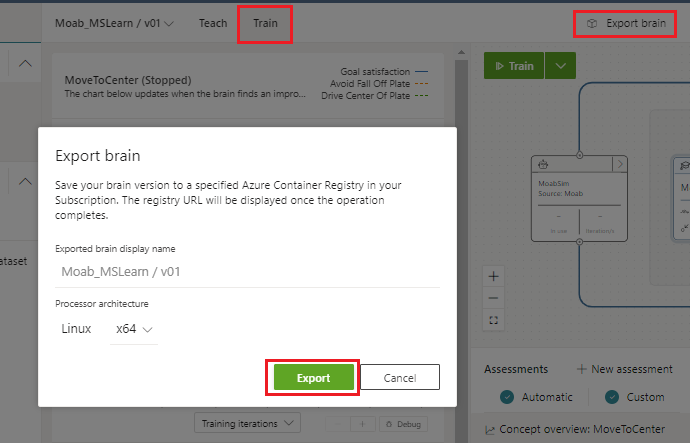

In this unit, you'll export and run the brain in ACR deployment.

## Export the brain as a docker image

1. Log in to the Bonsai UI.
1. Select the brain and version you want to work with.
1. Navigate to the Train tab.
1. Click the Export brain button.
1. In the dialog box that opens:
    - Provide a name for the exported brain.
    - Select the processor architecture the brain will run on.



An image of the exported brain is packaged as a Docker container, saved to the ACR associated with your workspace, and added to the list of available brains under Exported Brains in the left-hand menu.

Bonsai displays exported brains by the name you assign during export. The full image name in ACR is **BRAIN_NAME:VERSION-OS_TYPE-ARCHITECTURE** where:

- **BRAIN_NAME** is the human-readable name assigned to the brain during export.
- **VERSION** is the brain version you chose to export.
- **OS_TYPE** is the operating system set during export.
- **ARCHITECTURE** is the processor architecture you selected during export.

## Install the Bonsai CLI and SDK for Python

In this section, you'll install the Bonsai SDK and needed packages in order to download the exported brain and run it locally.

### Step 1: Download Bonsai API Samples for Python

The Microsoft Bonsai API (MBA) provides Bonsai integration packages for Simulations in Python, Java, TypeScript, and C#. Follow the instructions bellow to get the API into your local device:

1. Download the GitHub repository: https://github.com/microsoft/microsoft-bonsai-api.
2. Save and unzip the repo to a directory of your choice, such as C:\bonsai\microsoft-bonsai-api-main.

### Step 2: Install Miniconda and create a virtual environment

To use Bonsai commands from your local computer, you need to install the Bonsai SDK and CLI. To make installation simpler for you, we have put together a YML file with all the packages you'll need to install, and their respective compatible versions.

1. If you're using Miniconda or Anaconda, go ahead to the next step. If not, follow this link to install Miniconda. Miniconda will help you handle your virtual environments. A virtual environment helps isolate your package installations, helping minimize dependency mismatches and other conflicts across environments. If you rather use the CLI or Anaconda to handle your virtual environments, that is okay too.

    - For Windows, double click on the downloaded executable to install Miniconda.
    - For Mac, use the “bash your-miniconda-sh-file” command to get it installed.

2. Download the following environment yml file to your local device (please click on the Raw button before downloading). The yml file indicates the Python version to be installed (v3.7), as well as the relevant python libraries needed. Among these libraries, we include the bonsai-cli, microsoft-bonsai-api, and azure-cli.

3. Next, open the Miniconda/Anaconda Prompt and traverse to the location where you downloaded the YML file. Then, run the following command to install the virtual environment. This command will create a new virtual environment named bonsai-preview. This virtual environment should always be activated prior to running any other Bonsai commands.

    ``(base) C:\Downloads> conda env update -f environment.yml``

4. Now, you need to activate your virtual environment. Every time you open a new Anaconda/Miniconda Prompt, enter the following command to activate the virtual environment:

    ``(base) C:\> conda activate bonsai-preview``

5. The name in between the parenthesis reflects the current active environment. After running the command you should see the tag change to the selected environment as follows:

    ``(bonsai-preview) C:\>``


## Download and run the Docker container

To download your exported brain:

1. Log in to your Azure Container Registry with the Azure CLI:

    ```
    az login
    az acr login --name ACR_NAME
    ```

    - **ACR_NAME**: The name of your Azure Container Registry (ACR) instance.

2. Fetch the containerized brain image and save it to your local machine. Replace WORKSPACE_NAME, WORKSPACE_ID,BRAIN_NAME,VERSION,OS_TYPE and ARCHITECTURE.

    ```
    docker pull  WORKSPACE_NAME.azurecr.io/WORKSPACE_ID/BRAIN_NAME:VERSION-OS_TYPE-ARCHITECTURE
    ```

    - **ACR_NAME**: The name of your Azure Container Registry (ACR) instance.
    - **WORKSPACE_NAME**: The name you gave to your Bonsai workspace when it was provisioned.
    - **WORKSPACE_ID**: The Azure-assigned resource ID of your Bonsai workspace
    - **CONTAINER_NAME**: A human-readable name for the local Docker container.

3. Run the container as a local server.  Replace WORKSPACE_NAME, WORKSPACE_ID,BRAIN_NAME,VERSION,OS_TYPE and ARCHITECTURE.

    ```
    docker run \ --detach \ --publish 5000:5000 \ --name CONTAINER_NAME \ WORKSPACE_NAME.azurecr.io/WORKSPACE_ID/BRAIN_NAME:VERSION-OS_TYPE-ARCHITECTURE
    ```

    The detach flag starts the container in the background without blocking your terminal. The 	publish flag tells Docker to route traffic on port 5000 of the container to port 5000 on your local machine (localhost:5000).

4. Check the status of the container. Run the following to list the status of all running containers by default.

    ```
    docker ps
    ```

## Clean up

Stop the Docker container when you have finished working with the brain locally.

To stop the brain, use the **docker ps** command to get the local container ID and **docker stop CONTAINER_ID** to stop the associated container.
