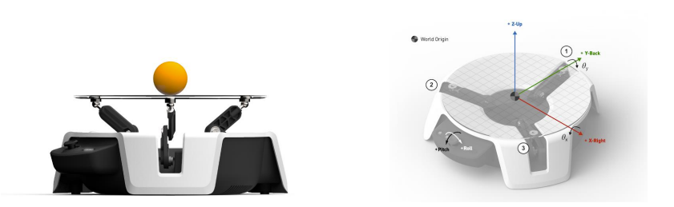

Project Bonsai is a powerful low-code platform to implement the Machine Teaching paradigm of Autonomous AI for industrial applications.

Project Bonsai's platform core is built on a new special-purpose programming language and runtime technology called **Inkling**. The Bonsai platform enables users to combine automated systems, machine learning, and reinforcement learning using a new AI paradigm called Machine Teaching. **Bonsai’s AI Engine (training engine)** provides a runtime platform to initialize, train, assess, and export Reinforcement Learning (RL) models that learn and adapt to the various scenarios through the Inkling file and a scaled simulation environment.

The Bonsai platform brings together several innovations, which we outline below:

- ***Machine Teaching***: Machine teaching involves injecting subject matter expertise into brain designs to accelerate the time to value. It helps engineering brains that will outperform the current methods and optimize machines, processes or production lines, reduce waste and energy consumption, even solving problems with high business value, that weren't able to be solved before.

- ***Simulation friendly***: Bonsai provides accelerated simulation integration capabilities that simplify scaled training. You can easily integrate any simulation with Bonsai. Today, Bonsai offers seamless integrations for Anylogic, Simulink, VP-Link, and FMU simulations. Additionally, Bonsai has a Python integration accelerator for Python simulators, which can also be used for ad-hoc instancing of non-python simulators.

- ***AI Engine-centered***: Automating neural network management and RL training is a crucial Bonsai feature. Hence, there's no need to define a training architecture. Furthermore, Bonsai also takes care of supervising training sessions, making those available to the user. This feature includes sharing key brain performance metrics live, preventing brain unlearning by keeping the best brain weights, and allowing for custom assessment on specific scenarios once training is finished.

- ***Deployment-oriented***: Bonsai allows flexible runtime to deploy and scale models in the real world. You can export a Brain at any time. You can deploy the exported Brain either locally or in the cloud. The inference is as fast as every tenth of a millisecond.

- ***Integration with other technologies***:  Bonsai allows the integration of other technologies with RL as part of brain design whenever needed, including Machine Learning models for advanced perception, control-theory-based models, optimization algorithms, expert rules, and constraints. This enables you to use the best technology for each task at the right hierarchical level.

## What is Project Moab?

Microsoft Project Moab is a fully integrated system for users of all levels to learn and explore to build autonomous intelligent controls using Deep Reinforcement Learning (DRL) through Project Bonsai's Machine Teaching platform. The device (shown in the image below) has three arms powered by servo motors. These arms work in tandem to control the angle of the transparent plate to keep a ping-pong ball balanced in the plate's center.

