Bonsai provides prepackaged simulations and sample codes.

To build a new brain for the ball balancing problem:

1. Click the Moab icon in the Getting started panel.
2. Name your new Brain (for example, "Moab MSLearn").
3. Click Create.

    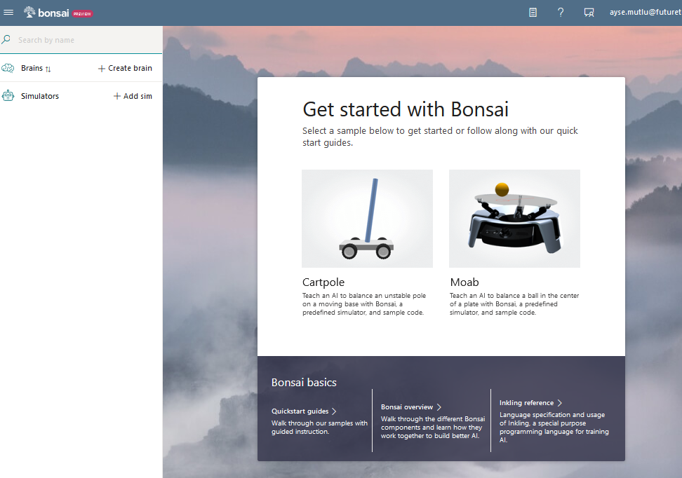

The sample Moab brain and simulator will be loaded.

## Overview of Bonsai UI components

Bonsai opens the teaching interface when your Moab brain loads, which is prepopulated with everything you need to get started.

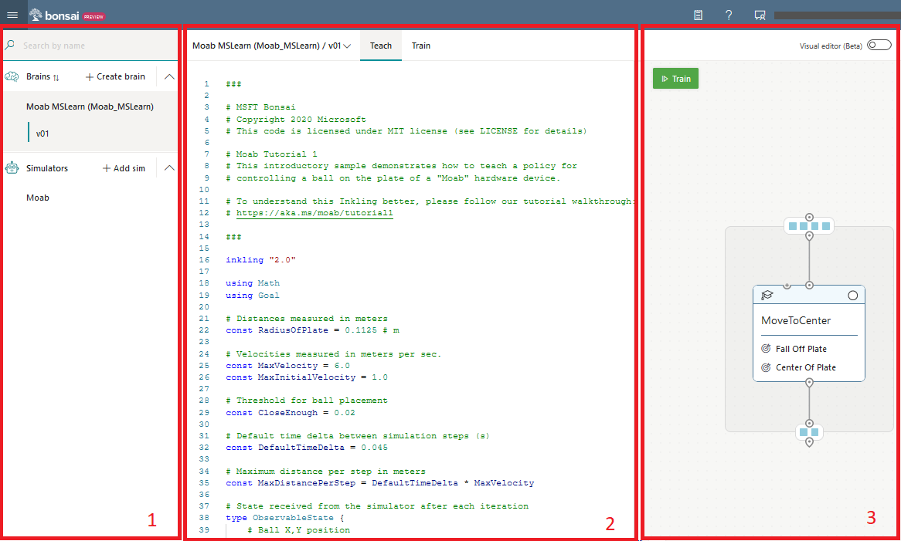

The teaching interface has three areas, as in the above illustration:

- **(1) The Navigation sidebar** lists all your brains, simulators, and exported brains (if any).
- **(2) The Coding panel** displays our teaching code (the curriculum) written in Inkling. Inkling is designed to focus on what you want to teach while handling your AI details. 
- **(3) The Visual Authoring** is the graphing panel that displays the observable environment states, control actions, concepts, and simulator configurations currently defined in the coding panel. There's a direct correlation between the graphical interface and the Inkling code. You can implement your brain with Visual Authoring or coding, depending on your preference. The platform is considered a low-code platform because the brain can be implemented using the graphical interface, and the Inkling code will be automatically generated.

## Navigate to the Visual Authoring

To turn on the Visual Authoring for brain teaching using the graphical interface, toggle the switch at the top right of the Bonsai UI on the Teach tab. The button will make your transition to the following page:

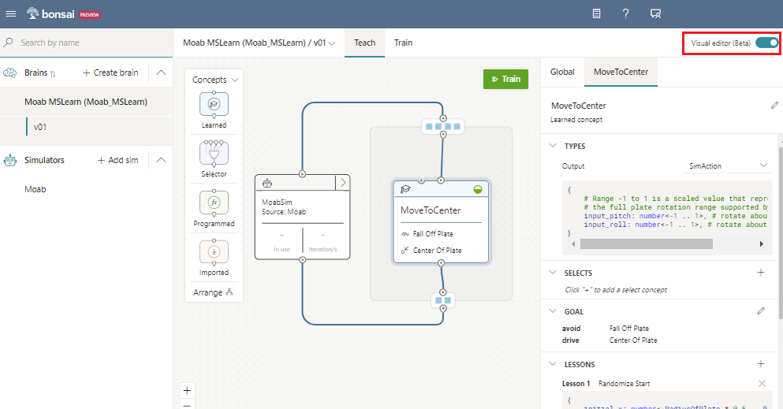

## Visual Authoring components

The Visual Authoring UI includes an editing canvas, and a properties editor panel. From left to right, the components are the following:

- **Concept picker**: a toolbar of concept widgets that you can add to the brain diagram. Drag a widget (Learned, Selector, Programmed, or Imported) from the picker to the editing canvas to add a concept to the brain diagram.
- **Brain diagram**: a directional graph of data flow between the simulation and the internal components of the Brain. Brain diagrams include nodes for concepts, simulations, environment state (brain input), and control actions (brain output).
- **Property editor**: a display to edit global properties (constants, type definitions) and property details for whatever is currently selected in the brain diagram.

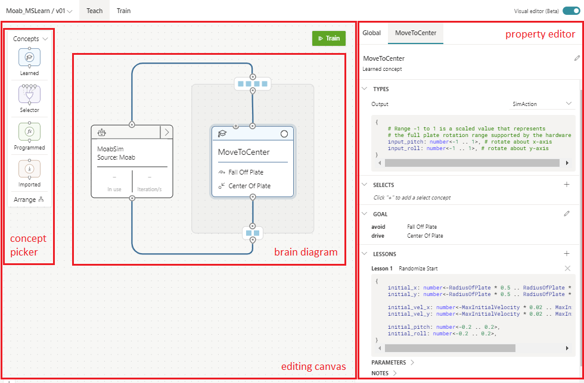

Hovering over the brain diagram elements displays tool tips above the debug console that provide information about the selected element, including the associated Inkling snippets and keyword definitions.

### Overview of concept picker

The concepts are subcomponents of the Brain. This concept might be learned, imported, or programmed. We have four concepts to choose from a concept picker.

- **Learned and Selector concepts** use Reinforcement Learning (DRL) for their training. For DRL concept training, you can define your goal using human-understandable objectives. Alternatively, you can use the traditional reward and termination functions that DRL typically uses. You can also define the lessons that the brain will be exposed to during training.

- **Programmed concept** acts like a function to perform a specific task that can be hardcoded.

- **Imported concept** lets you import Machine Learning (ML) models that have been trained elsewhere, such as Computer Vision preprocessors.

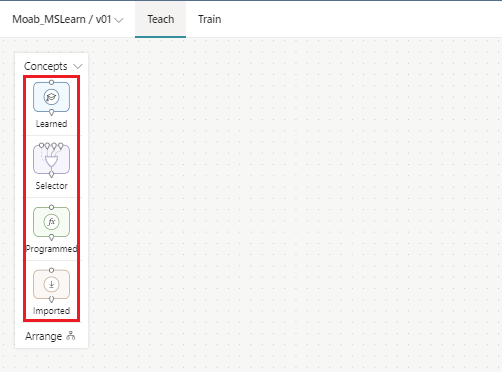

## Create your first Bonsai brain: Project Moab

The trained Bonsai brain for Moab should be able to adjust the plate pitch and roll to balance the ball at the center of the plate.

To achieve this, we first define the concept, “**Move to center**" which can be found in the extract of the AI specification document shown below.

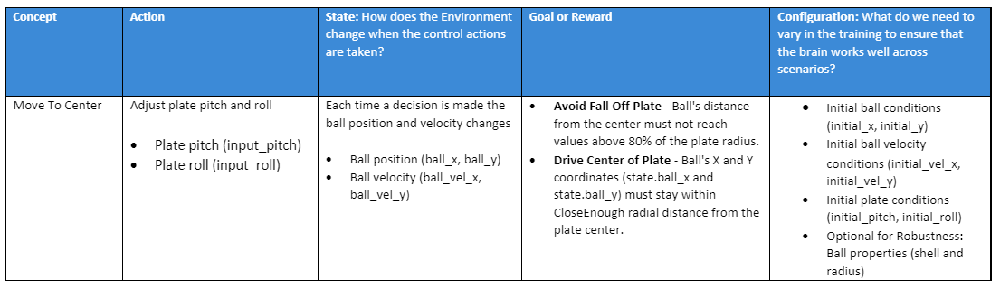

### Environment state

The environment state is obtained with the sensors placed in the environment or device. In the Moab example, a camera is located in the center under the plate. A preprocessor embedded with the simulation determines the ball's velocity and position at every iteration.

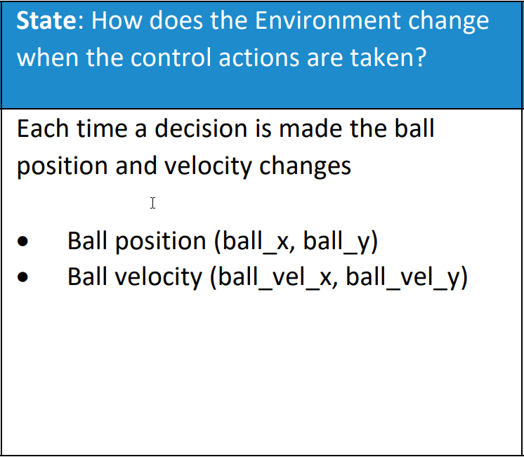

To define the valid state ranges in Inkling, we'll rely on three global parameters defined at the top of the Inkling file:

- **RadiusOfPlate**: The distance from the center to the edge of the plate. This parameter is set to 0.1125 in meters.
- **MaxVelocity**: Maximum expected speed in between iterations. This parameter is set to 6.0 in meters per second.
- **DefaultTimeDelta**: Default time delta between simulation steps (s). This parameter is set to 0.045.
- **MaxDistancePerStep**: The expected distance a ball with maximum valid speed could traverse for an iteration step. MaxDistancePerStep is multiple of DefaultTimeDelta and MaxVelocity. DefaultTimeDelta is set to 0.045. MaxVelocity is set to 6.0 in meters per second.

Using the above parameters, the environment state is then defined in Visual Authoring as shown below.

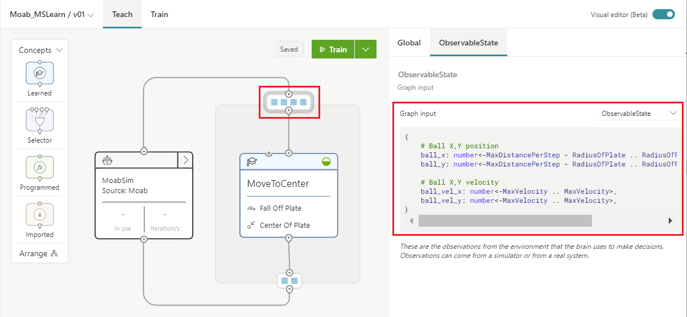

The Inkling associated with this is:

- **ball_x, ball_y**: the (x, y) ball position
- **ball_vel_x, ball_vel_y**: the x and y ball velocity components

```
{
    # Ball X,Y position
    ball_x: number<-MaxDistancePerStep - RadiusOfPlate .. RadiusOfPlate + MaxDistancePerStep>,
    ball_y: number<-MaxDistancePerStep - RadiusOfPlate .. RadiusOfPlate + MaxDistancePerStep>,

    # Ball X,Y velocity
    ball_vel_x: number<-MaxVelocity .. MaxVelocity>,
    ball_vel_y: number<-MaxVelocity .. MaxVelocity>,
}
```

### Control actions

Control action is what the Brain outputs after observing every environment state. For example, given the environment state, i.e., ball velocity and position, the brain will adjust the pitch and roll of the plate to meet the defined goal.

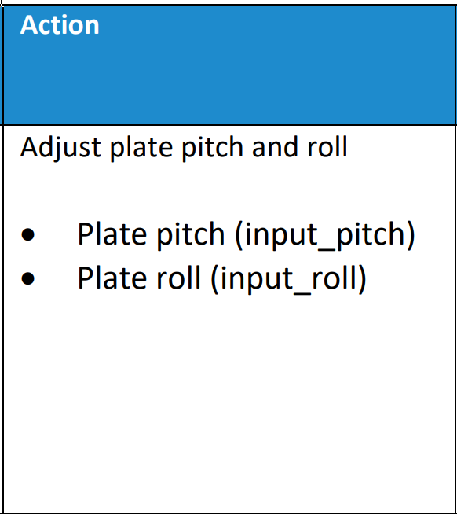

As shown below, the control action is provided as an output from the brain and input to the simulator or Moab device.

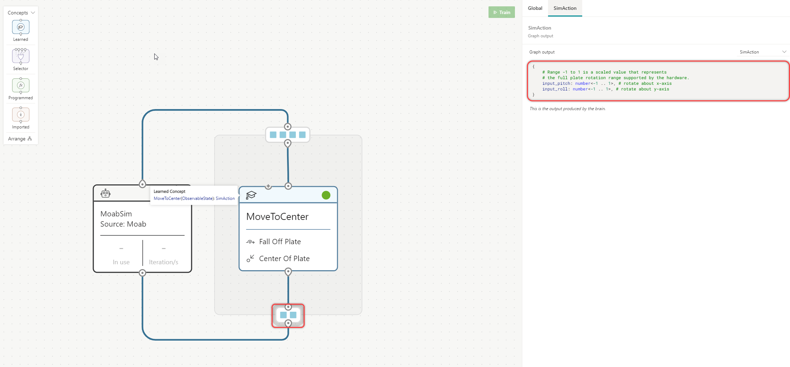

In the Moab simulation, the available control actions are captured by the following variables:

- **input_pitch**: a value that sets the new plate angle along the x-axis:
    - **-1** means "tilt the plate all the way forwards" (toward the joystick)
    - **+1** means "tilt the plate all the way backwards" (away from the joystick)
- **input_roll**: a value that sets the new plate angle along the y-axis:
    - **-1** means "tilt all the way to the left"
    - **+1** means "tilt all the way to the right"

```
{
    # Range -1 to 1 is a scaled value that represents
    # the full plate rotation range supported by the hardware.
    input_pitch: number<-1 .. 1>, # rotate about x-axis
    input_roll: number<-1 .. 1>, # rotate about y-axis
}
```

### Goals

Goals are a high-level specification of what the Brain should learn, and from the Moab AI solution specification.


As shown below, to achieve this, the goal is expressed with two goals:
  
  1. Do not let the ball fall off the plate.
  2. Drive the ball to the center of the plate.

To define the goals, we'll rely on two global parameters defined at the top of the Inkling file:

- **RadiusOfPlate**: The distance from the center to the edge of the plate. This parameter is set to 0.1125 in meters.
- **CloseEnough**: The max target distance allowed from center for the episode to be considered a success. This parameter is set to 0.02 in meters.

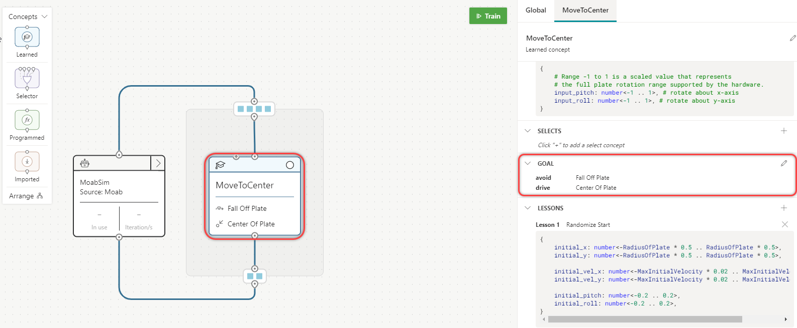

The inkling code associated with this is:

```
goal (State: ObservableState) {
                avoid `Fall Off Plate`:
                    Math.Hypot(State.ball_x, State.ball_y)
                    in Goal.RangeAbove(RadiusOfPlate * 0.8)
                drive `Center Of Plate`:
                    [State.ball_x, State.ball_y]
                    in Goal.Sphere([0, 0], CloseEnough)
```

Available [goal objectives](/bonsai/inkling/keywords/goal/objectives) in Inkling include:

- **Avoid**: Avoid a defined region.
- **Drive**: Get to a target as quickly as possible and stay inside the target.
- **Maximize**: Push a target value as high as possible beyond a desired threshold.
- **Minimize**: Push a target value as low as possible below the desired threshold.
- **Reach**: Get to a target as quickly as possible.

Note that goal objectives have links to Bonsai official Docs for further information on how each objective is used to guide brain training during a brain training experiment.

### Simulation

Simulations model real-world processes by computing the environment states as the Brain applies the control actions. Therefore, any simulation that integrates with Bonsai needs to have a sim initializer method, a stepping method where the actions of the Brain are applied, and an episode restart method to allow for stopping and restarting a new episode once the current episode is finished.

When restarting an episode, the simulation should take configuration parameters to define the initialization conditions for that episode. In the specific case of the Moab simulation, these are the initialization values that are set every time a new episode is initialized.

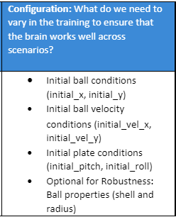

The simulator configuration can be accessed by clicking on the simulation box in Visual Authoring as shown below:


This is defined in Inkling as:

```
{
    # Model initial ball conditions
    initial_x: number<-RadiusOfPlate .. RadiusOfPlate>, # in (m)
    initial_y: number<-RadiusOfPlate .. RadiusOfPlate>,

    # Model initial ball velocity conditions
    initial_vel_x: number<-MaxInitialVelocity .. MaxInitialVelocity>, # in (m/s)
    initial_vel_y: number<-MaxInitialVelocity .. MaxInitialVelocity>,

    # Range -1 to 1 is a scaled value that represents
    # the full plate rotation range supported by the hardware.
    initial_pitch: number<-1 .. 1>,
    initial_roll: number<-1 .. 1>,

    # Starting height of the Moab plate in meters (m) 
    height_z: number<0.1 .. 0.2>

}
```

Note that Bonsai can't verify if config values are taken and applied by the simulation. Simulation engineers are the ones to inform brain trainers about the valid config parameters (and their ranges) that the simulation accepts during episode restart.

## Concept

The concept is named **MoveToCenter**. The **MoveToCenter** concept will receive environment states and respond with control actions. In the concept graph, you also define:

- **Goals**, already shown earlier. What the Brain should learn as defined in the Moab AI solution specification:
    - **Fall Off Plate**: That will avoid the ball falling off the plate
    - **Center of Plate**: That will drive the ball to the center of the plate
- **Lessons**, where episode randomization values are defined to be applied during each new episode restart. To prepare for deployment, you want to expose the Brain to complex scenarios. For example, initializing the ball at different positions and starting velocities ensures you can react to someone pushing the ball off center. Similarly, randomizing the initial plate pitch and roll prepares the Brain for a broader set of scenarios that could occur once deployed.

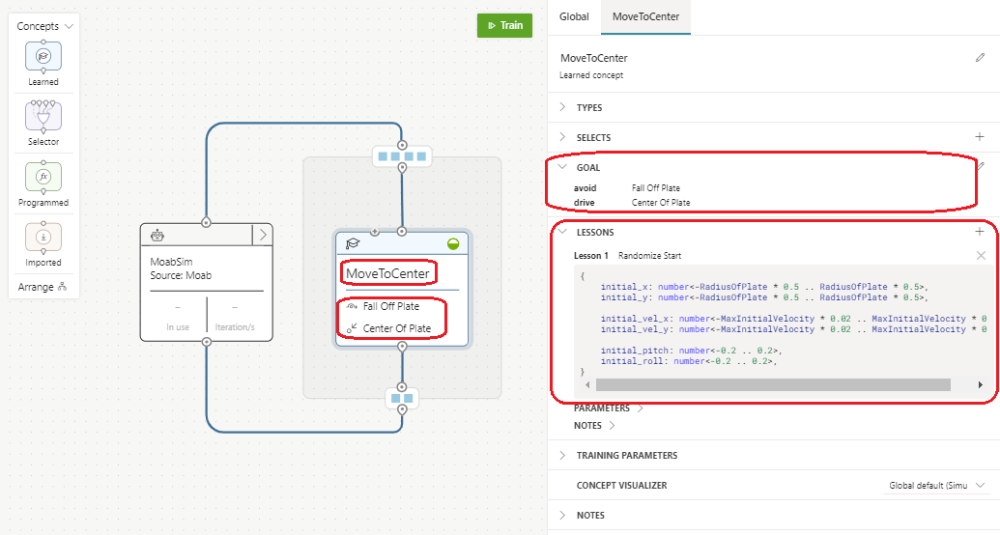

## Inspect the brain in Inkling editor

You can also turn off the Visual Authoring and navigate to the Inking editor. You can click on the graph or the node to highlight the relevant types in the Inking code. The concept graph (**MovetoCenter**) is shown below:

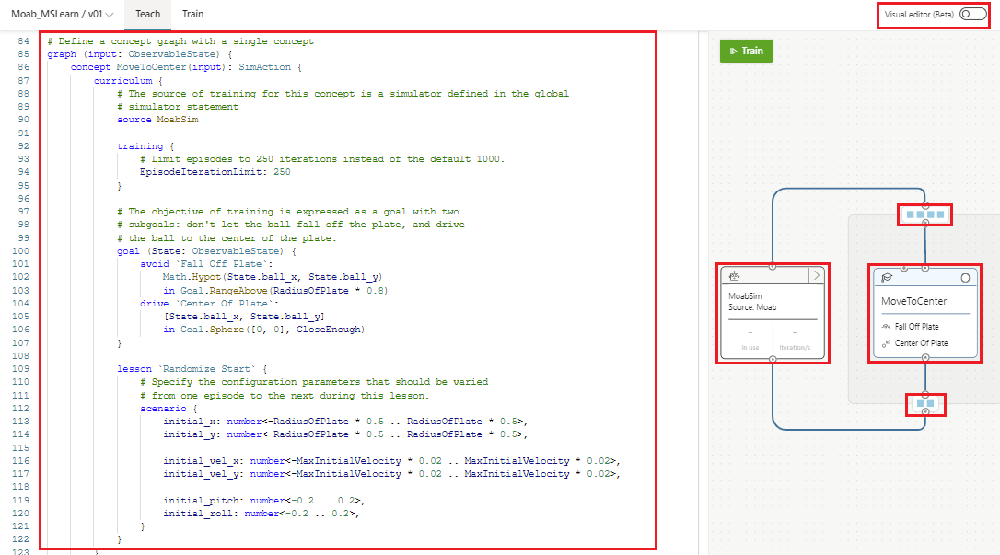


At a glance, you'll see that the Inkling code has different structs defined for the components we just reviewed within Visual Authoring: ObservableState, SimAction, goal, and lesson.
