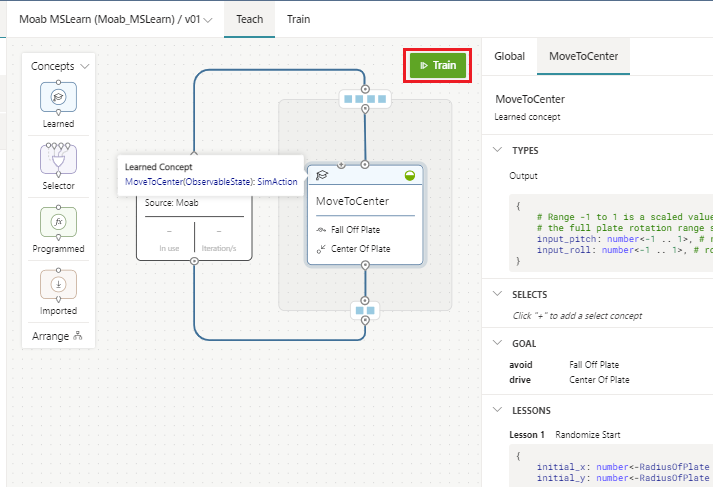
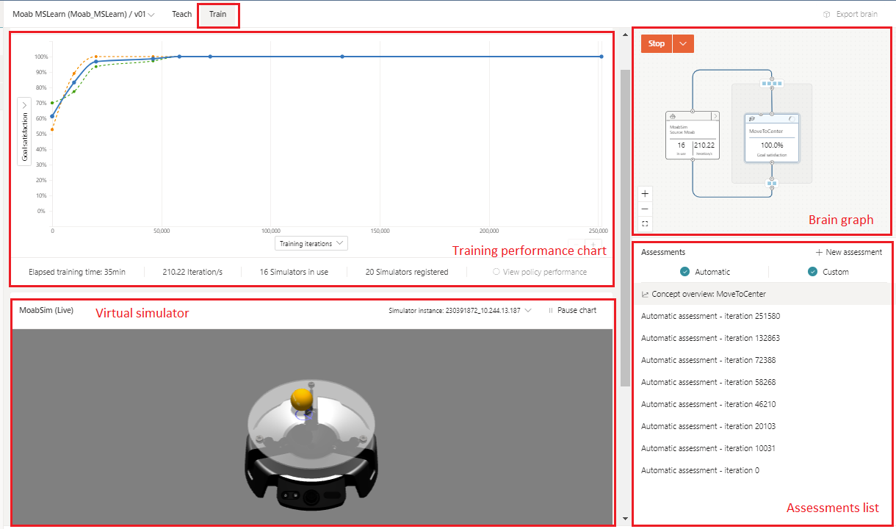
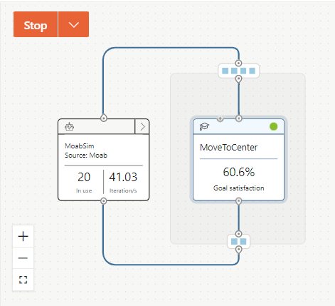
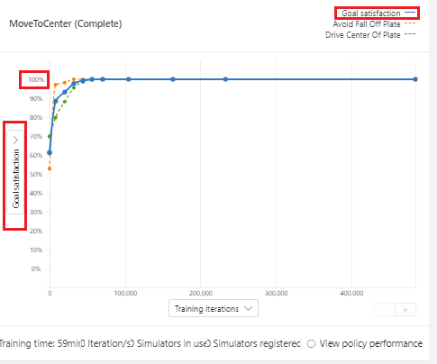
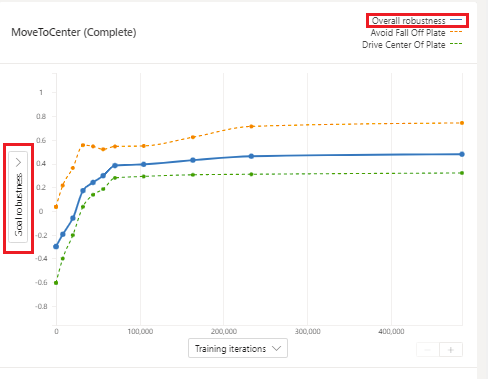
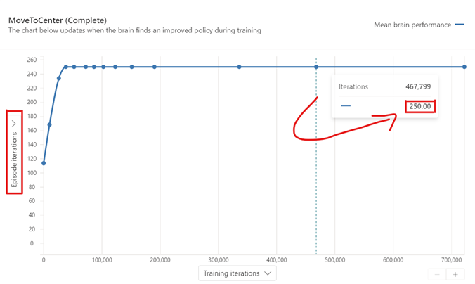
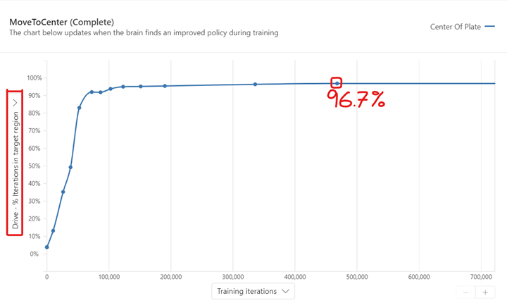
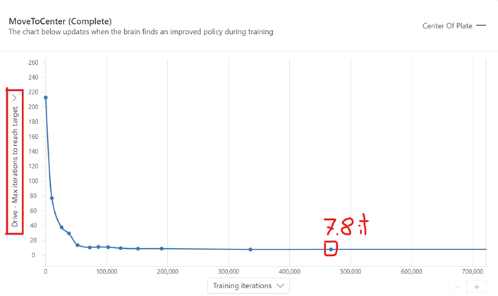
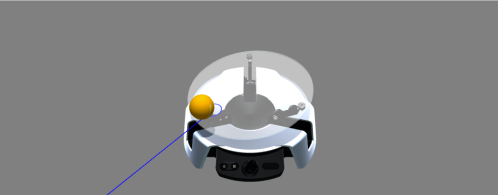

After defining environment states, control actions, and simulator configurations and confirming that the training goals are correct, you can start to train your Brain.

## Train Bonsai brain

First, click on **Train** in the Bonsai UI.

When you begin training, a few things happen automatically:

- Bonsai UI moves you to the Train tab and replaces the editor panel with a data panel.
- A set of virtual, managed simulations are initialized for episode training.
- The training performance chart begins populating with training data. Depending on the simulation running time, it might take time to display the initial performance. Don't worry if your training graph is blank for some time. For Moab, the starting time can take up to 5-10 minutes.
- Automatic assessments begin populating the Assessments list. Assessments are found under the Brain graph. Automatic assessments will be accessible for each champion found throughout training. Champions are represented by the checkpoints displayed on the Training performance chart, and they signify evaluation points where the new brain policy was found to beat all previous policies.

### The brain graph

The brain graph displays valuable information about the concept being trained and the simulators used during training, including:

- the name of the concept being trained (**MoveToCenter**)
- the overall goal satisfaction for the concept being trained
- the source type name (**MoabSim**)
- the name of the simulator package in use (**Moab**)
- the number of simulations running in parallel
- the training speed, measured in iterations per second

### The training performance chart

The chart at the top of the data panel displays the ***Goal Satisfaction Plot*** by default. The chart shows the average performance of the Brain for each automatic assessment (test episode). These assessments are run regularly during training. Automatic assessments evaluate brain performance without the exploratory noise added to actions during training. Exploration allows the Brain to try and test new control policies across the entire state-action space. During the assessment, we want to evaluate the exploitation of the current policy without exploration.

The goal satisfaction plot includes achievement progress for each objective defined for the concept being taught. For example, 100% goal satisfaction for Fall Off Plate objective indicates that the Brain has learned to consistently keep the ball on the plate (within 80% of the plate radius).

The overall goal satisfaction line (displayed in blue color) is the average goal satisfaction across all the objectives. As the brain trains, it improves at accomplishing the goals you defined, and the goal satisfaction values should eventually reach close to 100%. Satisfaction is met once all objective values are within the defined thresholds.

See the graph below, which displays the goal satisfaction for a completed training session. Goal satisfaction graphs start empty, getting evaluation points added once new automatic assessments are completed. Each assessment shown in the training performance represents a champion. As stated earlier, champions are checkpoints where the brain policy was found to be the most effective up to that point.

Reaching 100% goal satisfaction is not the end of the training session. For goals such as maximizing and minimizing, the teaching engine will continue to encourage the brain to move far beyond the desired threshold toward more robust and better performing policies. This continuous improvement is the so-called goal robustness of the brain.

Hover over the “Goal Satisfaction” tag (located on the left of your Goal Satisfaction plot) to switch to the ***Goal Robustness Plot***. This chart shows how robust the learned policy is, beyond the 100% goal satisfaction limit. Goal robustness is a better criterion to follow brain training once you consistently meet 100% goal satisfaction for some of your objectives.

Goal robustness should always be above zero for passing policies. The closer to a value of 1, the stronger the policy found for that custom assessment.

Note that **Goal Satisfaction** and **Goal Robustness** are good metrics to evaluate success for brains that have similar goal definitions. Yet, the moment that you switch a threshold for one of the goal objectives, or if you add or remove another goal objective, you will not be able to use these metrics for comparison. For that reason, the Product team embedded a different set of metrics that allow for more consistent evaluation.

The first metric that is key for assessment of AVOID goals (no matter how many you have them) is the Episode iterations, which shows the number of iterations in average across all assessment episodes.

If your average is lower than your Episode Iteration Limit (EIL) — 1,000 by default —, your episodes are being cut early due to hitting any of the AVOID conditions. For Moab, our EIL is 250 iterations, thus we know our brain is effectively controlling the ball without having the ball drop off the plate.

The Drive objective has 2 additional metrics of interest to us, that are unfortunately dependent on the goal threshold: % (percentage) of iterations in target region; as well as Max iterations to reach target.

The Drive goal does depend on the threshold defined, but the metrics for MINIMIZE & MAXIMIZE do not. At the very beginning of a training session, you might want to start with MINIMIZE or MAXIMIZE to be able to compare more absolutely across brain versions. The 2 metrics that are useful on MINIMIZE & MAXIMIZE goal objectives are the following:

- Minimize/Maximize – Mean Value
    - Average throughout all iterations the episode lasted before hitting any of the AVOID conditions (if any).
- Minimize/Maximize – Total Value
    - Total sum of the per-iteration value before hitting any of the AVOID conditions (if any).

### Simulation visualization

The Moab sample simulation includes a live visualization of the Moab simulation below the goal satisfaction plot.

In addition to the 3D ball and hardware, the visualization displays:

- The ball velocity (the blue arrow projected onto the plate).
- The estimated ball position (blue circle projected onto the plate under the ball).

You can click and drag the image to rotate the visualization view angle.

Below the visualization, you can find an interactive graph that plots training values. You can click **ball_x** and **ball_y** to display the **(x, y)** coordinates of the ball. The vertical dashed lines show the stop and start of new episodes.

The training episodes will get longer as the Brain learns to keep the ball from falling off the plate. And as the Brain learns to center the ball, ball_x and ball_y will reach zero every episode.

> [!NOTE]
> During a training session, both training and evaluation episodes are displayed under the Goal Satisfaction graph. Thus, don’t expect the policy to be effective throughout training, even after reaching 100% Goal Satisfaction. Your brain will keep exploring new policies until no progress is made and only suboptimal policies are found.

## Evaluate training progress

An essential question in Machine Teaching is: "When should we stop training?"

As the Moab sample trains, goal satisfaction trends upwards for the first 100k – 200k iterations. After 200k iterations, the various performance lines converge and flatten. When the lines converge and flatten, the Brain has reached a peak, so additional training time will not yield meaningful improvement.

Note that you can stop training when you notice that the goal satisfaction has not made any meaningful progress. You can typically stop training at (or before) 500k iterations for the Moab sample.

There is also an automatic stop planned when we reach 500k consecutive iterations where no better control policy has been found. When a brain fails to improve after a given number of consecutive iterations (as defined by NoProgressIterationLimit), Bonsai terminates the training to avoid wasting computational resources. Managed resources are shut down automatically once training is stopped.

If you want to stop training early, click the red Stop Training button at the top of the graph panel. You can always restart training at any time by clicking the green Train button again. The session will continue from wherever it was manually stopped.
