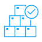

## Asset management

### Why ask these questions

These questions allow you to:

- Know how assets are identified, labeled, and classified.
- Learn the requirements that dictate how users should handle data.
- Verify how data is stored.

### What questions to ask

|Question|Areas to cover|
|--------|--------------|
|**Describe your data retention policy.**|<ul><li>How long documents are kept for.</li></ul>|
|**Describe how physical assets are handled, transported, and destroyed.**|<ul><li>Process to secure assets during transport or destruction.</li><li>Security controls used during handling, like encryption, locks, memory wipes, and trusted vendors.</li><li>Systems used to prevent accidental data leakage during asset handling.</li></ul>|
|**Describe the classification and labeling process for logical and physical assets.**|<ul><li>Asset labeling and classification process.</li><li>Label and classification review cadence.</li><li>Process used to assess risk or make classification level changes.</li><li>Employee training on data classification.</li><li>Process used to store classified data in assets of the same or higher classification levels.</li><li>Asset tracking systems used.</li><li>Asset groupings.</li><li>Security and privacy control implementations based on classification levels.</li><li>Requirements for everyone managing the process.</li></ul>|
|**How are confidential assets destroyed when they’re no longer needed?**|<ul><li>Security requirements for data destruction across all mediums, like hard drives, tapes, and disks.</li><li>Third-party system or company used to assist with asset destruction.</li></ul>|
|**What happens if an asset is lost, missing, or shipped outside of the enterprise?**|<ul><li>Workflow used for each scenario.</li><li>Data security process before and after each workflow is completed.</li></ul>|
|**Describe how data is secured.**|<ul><li>Data encryption at-rest, in-use, and in-transit.</li><li>Use of digital signatures, HMACs, and hashes.</li><li>Use of blockchain and off-chain encryption to prevent collusion.</li><li>This question is similar to another one under Cryptography.</li></ul>|
|**What are the mechanisms in place to prevent unauthorized sharing and downloading of data?**|<ul><li>Security controls used to prevent unauthorized sharing and downloading of data. Examples include notifications, logs, sharing review process, or other restrictions.</li></ul>|
|**Describe the process used to time out working sessions across assets and services.**|<ul><li>Automatically time out sessions designed to prevent unauthorized access.</li></ul>|

> [!TIP]
> Check out [Azure data classification](/azure/cloud-adoption-framework/govern/policy-compliance/data-classification) for tips on classifying enterprise data.