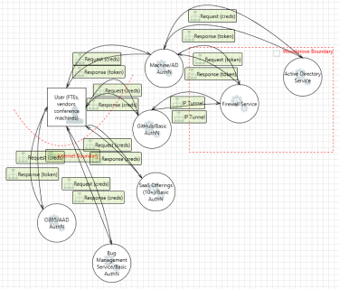
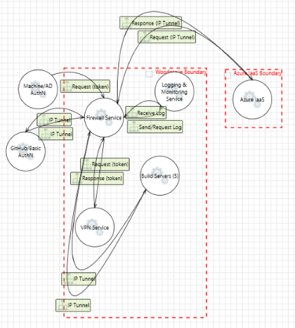
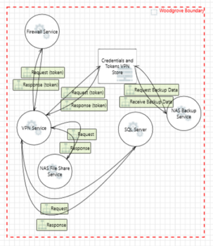
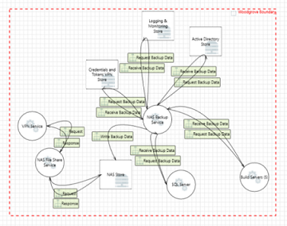
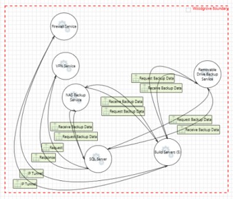
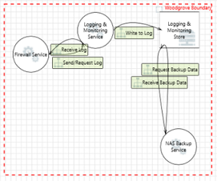
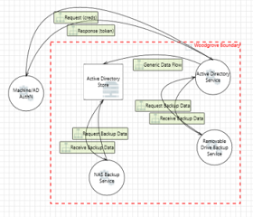
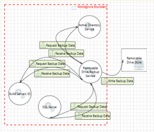
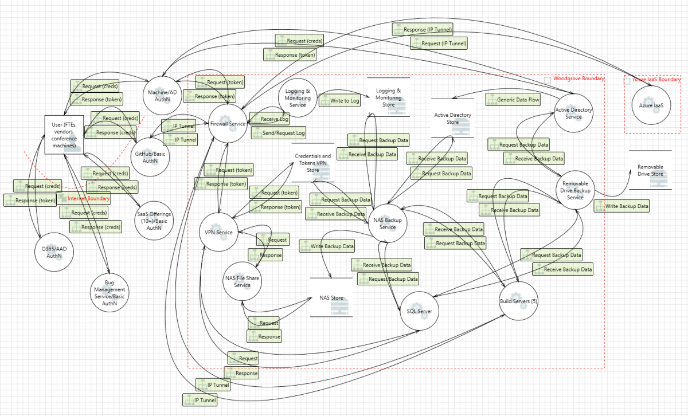

The next step in the infrastructure threat modeling process is to create a data-flow diagram.

## General assumptions

To build this diagram, we make the following assumptions:

- **Zero trust** - The data-flow starts from outside of the corporate network and can't be trusted.
- **Context level** - The data-flow diagram begins with a high-level context diagram, followed by more in-depth diagrams as needed. For more information, see [Provide context with the right depth layer](/training/modules/tm-provide-context-with-the-right-depth-layer/) module from the [Threat Modeling Security Fundamentals](/training/paths/tm-threat-modeling-fundamentals/) learning path.

## Elements

[!INCLUDE [Process](../includes/4-visualize-risk-process.md)]

 

---

[!INCLUDE [Data store](../includes/4-visualize-risk-data-store.md)]

 

---

[!INCLUDE [External entity](../includes/4-visualize-risk-external-entity.md)]

 

---

[!INCLUDE [Data-flow](../includes/4-visualize-risk-data-flow.md)]

 

---

[!INCLUDE [Trust boundary](../includes/4-visualize-risk-trust-boundary.md)]

> [!NOTE]
> Check out the [Create a threat model using data-flow diagram elements](/training/modules/tm-create-a-threat-model-using-foundational-data-flow-diagram-elements/) module from our [Threat Modeling Security Fundamentals](/training/paths/tm-threat-modeling-fundamentals/) learning path for an in-depth review of each element.

## Interactions

The next step is to capture the data-flow between each interaction:

### User

|Element A|Data-flow|Element B|Crosses boundary|Details|
|---------|---------|---------|----------------|-------|
| User| Bi-directional| Microsoft 365| Yes|<ul><li>HTTPS</li><li>Azure AD authentication</li><li>User credentials</li><li>Session tokens</li><li>Requests and responses</li></ul>|
| User| Bi-directional| Bug management service| Yes|<ul><li>HTTPS</li><li>Service authentication</li><li>User credentials</li><li>Session tokens</li><li>Requests and responses</li></ul>|
| User| Bi-directional| SaaS offerings (grouped)| Yes|<ul><li>HTTPS</li><li>SaaS authentication</li><li>User credentials</li><li>Session tokens</li><li>Requests and responses</li></ul>|
| User| Bi-directional| GitHub| Yes|<ul><li>HTTPS</li><li>GitHub authentication</li><li>User credentials</li><li>Session tokens</li><li>Requests and responses</li></ul>|
| User| Bi-directional| Machine| No|<ul><li>AD authentication</li><li>User credentials</li></ul>|

### Initial services

|Element A|Data-flow|Element B|Crosses boundary|Details|
|---------|---------|---------|----------------|-------|
| GitHub| Bi-directional| Firewall service| Yes|<ul><li>HTTPS</li><li>IP allowlist</li><li>IPSec tunnel</li><li>Requests and responses</li></ul>|
| Machine| Bi-directional| Firewall service| Yes|<ul><li>IP allowlist</li><li>Requests and responses</li></ul>|
| Machine| Bi-directional| Active Directory service| Yes|<ul><li>User credentials</li><li>Session tokens</li></ul>|
| Machine| Bi-directional| User| Yes|*See **User** for details*|
| GitHub| Bi-directional| User| Yes|*See **User** for details*|
| Microsoft 365| Bi-directional| User| Yes|*See **User** for details*|
| Bug management service| Bi-directional| User| Yes|*See **User** for details*|
| SaaS offerings (grouped)| Bi-directional| User| Yes|*See **User** for details*|

### Firewall

|Element A|Data-flow|Element B|Crosses boundary|Details|
|---------|---------|---------|----------------|-------|
| Firewall service| Bi-directional| VPN service| No|<ul><li>VPN tunnel</li><li>Requests and responses</li></ul>|
| Firewall service| Bi-directional| Build servers (grouped)| No|<ul><li>Requests and responses</li><li>GitHub IPSec tunnel</li></ul>|
| Firewall service| Bi-directional| Logging and monitoring service| No|<ul><li>Requests and responses</li></ul>|
| Firewall service| Bi-directional| Azure IaaS| Yes|<ul><li>IPSec tunnel</li><li>IP allowlist</li><li>Requests and responses</li></ul>|
| Firewall service| Bi-directional| Machine| Yes|*See **Initial services** for details*|
| Firewall service| Bi-directional| GitHub| Yes|*See **Initial services** for details*|

### VPN

|Element A|Data-flow|Element B|Crosses boundary|Details|
|---------|---------|---------|----------------|-------|
| VPN service| Bi-directional| Firewall service| No|<ul><li>IP allowlist</li><li>User credentials</li><li>Session tokens</li><li>Requests and responses</li></ul>|
| VPN service| Bi-directional| Credentials and tokens VPN store| No|<ul><li>VPN tunnel</li><li>User credentials</li><li>Session tokens</li><li>Requests and responses</li></ul>|
| VPN service| Bi-directional| NAS file share service| No|<ul><li>VPN tunnel</li><li>Requests and responses</li></ul>|
| VPN service| Bi-directional| SQL server| No|<ul><li>VPN tunnel</li><li>Requests and responses</li></ul>|
| Credentials and tokens VPN store| Bi-directional| NAS backup service| No|<ul><li>Requests and responses</li></ul>|

### Network attached storage (NAS)

|Element A|Data-flow|Element B|Crosses boundary|Details|
|---------|---------|---------|----------------|-------|
| NAS file share service| Bi-directional| NAS store| No|<ul><li>Requests and responses</li></ul>|
| NAS backup service| Bi-directional| NAS store| No|<ul><li>Requests and responses</li></ul>|
| NAS backup service| Bi-directional| Active Directory store| No|<ul><li>Requests and responses</li></ul>|
| NAS backup service| Bi-directional| Logging and monitoring store| No|<ul><li>Requests and responses</li></ul>|
| NAS backup service| Bi-directional| SQL server| No|<ul><li>Requests and responses</li></ul>|
| NAS backup service| Bi-directional| Build servers (grouped)| No|<ul><li>Requests and responses</li></ul>|
| NAS file share service| Bi-directional| VPN service| No|*See **VPN** for details*|
| NAS backup service| Bi-directional| Credentials and tokens VPN store| No|*See **VPN** for details*|

### Servers

|Element A|Data-flow|Element B|Crosses boundary|Details|
|---------|---------|---------|----------------|-------|
| SQL server| Bi-directional| Removable drive backup service| No|<ul><li>Requests and responses</li></ul>|
| Build servers (grouped)| Bi-directional| Removable drive backup service| No|<ul><li>Requests and responses</li></ul>|
| SQL server| Bi-directional| VPN service| No|*See **VPN** for details*|
| SQL server| Bi-directional| NAS backup service| No|*See **NAS** for details*|
| Build servers (grouped)| Bi-directional| NAS backup service| No|*See **NAS** for details*|
| Build servers (grouped)| Bi-directional| Firewall service| No|*See **Firewall** for details*|

### Logging and monitoring

|Element A|Data-flow|Element B|Crosses boundary|Details|
|---------|---------|---------|----------------|-------|
| Logging and monitoring service| Bi-directional| Logging and monitoring store| No|<ul><li>Requests and responses</li></ul>|
| Logging and monitoring store| Bi-directional| NAS backup service| No|*See **NAS** for details*|
| Logging and monitoring service| Bi-directional| Firewall service| No|*See **Firewall** for details*|

### Active Directory

|Element A|Data-flow|Element B|Crosses boundary|Details|
|---------|---------|---------|----------------|-------|
| Active directory store| Bi-directional| Active directory service| No|<ul><li>User credentials</li><li>Session tokens</li><li>Requests and responses</li></ul>|
| Active directory service| Bi-directional| Removable drive backup service| No|<ul><li>User credentials</li><li>Session tokens</li><li>Requests and responses</li></ul>|
| Active directory service| Bi-directional| Machine| Yes|*See **Initial services** for details*|
| Active directory store| Bi-directional| NAS backup service| No|*See **NAS** for details*|

### Removable drive

|Element A|Data-flow|Element B|Crosses boundary|Details|
|---------|---------|---------|----------------|-------|
| Removable drive backup service| Bi-directional| Removable drive store| Yes|<ul><li>Requests and responses</li></ul>|
| Removable drive backup service| Bi-directional| SQL server| No|*See **Servers** for details*|
| Removable drive backup service| Bi-directional| Build servers (grouped)| No|*See **Servers** for details*|
| Removable drive backup service| Bi-directional| Active directory service| No|*See **Active directory** for details*|

### Azure

|Element A|Data-flow|Element B|Crosses boundary|Details|
|---------|---------|---------|----------------|-------|
| Azure IaaS| Bi-directional| Firewall service| Yes|<ul><li>IPSec tunnel</li><li>Azure AD authentication</li><li>User credentials</li><li>Session tokens</li><li>Requests and responses</li></ul>|

## Finished diagram

