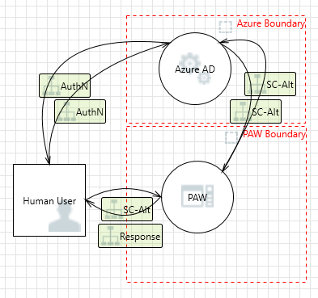
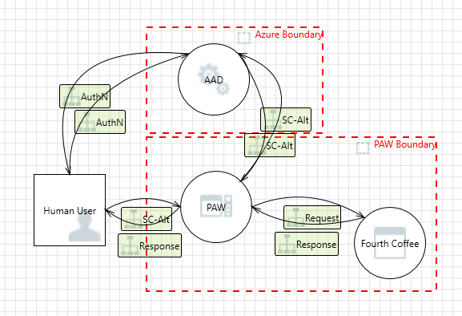
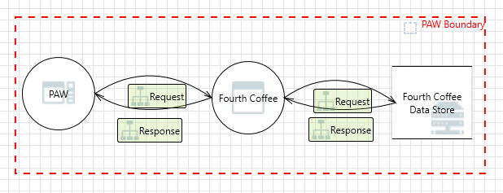

The next step in the threat modeling process is to create a data-flow diagram.

## General assumptions

To build this diagram, we make the following assumptions:

- **Zero trust** - Data-flow begins in a zone that can't be trusted.
- **Context level** - The data-flow diagram begins with a high-level context diagram, followed by more in-depth diagrams as needed. Check out the [Provide context with the right depth layer](/training/modules/tm-provide-context-with-the-right-depth-layer/) module from the [Threat Modeling Security Fundamentals](/training/paths/tm-threat-modeling-fundamentals/) learning path to learn more.

## Elements

[!INCLUDE [Process Element](../includes/4-visualize-risk-process.md)]

 

---

[!INCLUDE [Data store Element](../includes/4-visualize-risk-data-store.md)]

 

---

[!INCLUDE [External entity Element](../includes/4-visualize-risk-external-entity.md)]

 

---

[!INCLUDE [Data-flow Element](../includes/4-visualize-risk-data-flow.md)]

 

---

[!INCLUDE [Trust boundary Element](../includes/4-visualize-risk-trust-boundary.md)]

> [!NOTE]
> Check out the [Create a threat model using data-flow diagram elements](/training/modules/tm-create-a-threat-model-using-foundational-data-flow-diagram-elements/) module from our [Threat Modeling Security Fundamentals](/training/paths/tm-threat-modeling-fundamentals/) learning path for an in-depth review of each element.

## Interactions

The next step is to capture the data-flow between each interaction:

### User

|Element A|Data-flow|Element B|Crosses boundary|Details|
|---------|---------|---------|----------------|-------|
| User| Bi-directional| PAW| Yes|<ul><li>Azure AD authentication</li><li>User credentials</li><li>Session tokens</li><li>Requests and responses</li></ul>|
| User| Bi-directional| Azure AD| Yes|<ul><li>Phone authentication</li><li>2FA</li><li>User credentials</li><li>Session tokens</li><li>Requests and responses</li></ul>|

### Azure AD

|Element A|Data-flow|Element B|Crosses boundary|Details|
|---------|---------|---------|----------------|-------|
| Azure AD| Bi-directional| User| Yes|<ul><li>Azure AD authentication</li><li>User credentials</li><li>Session tokens</li><li>Requests and responses</li></ul>|
| Azure AD| Bi-directional| PAW| Yes|<ul><li>Authentication tokens and credentials</li><li>Requests and responses</li></ul>|

### PAW

|Element A|Data-flow|Element B|Crosses boundary|Details|
|---------|---------|---------|----------------|-------|
| PAW| Bi-directional| Azure AD| Yes|*See **Azure AD** for details*|
| PAW| Bi-directional| User| Yes|*See **User** for details*|
| PAW| Bi-directional| Fourth Coffee| No|<ul><li>Requests and responses</li></ul>|

### Fourth Coffee

|Element A|Data-flow|Element B|Crosses boundary|Details|
|---------|---------|---------|----------------|-------|
| Fourth Coffee| Bi-directional| PAW| No|*See **PAW** for details*|
| Fourth Coffee| Bi-directional| Fourth Coffee store| No|<ul><li>User credentials</li><li>Requests and responses</li></ul>|

## Finished diagram

