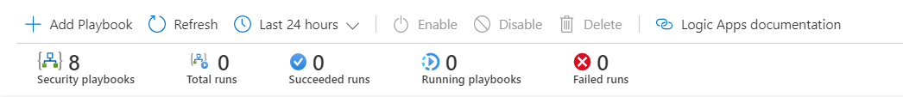
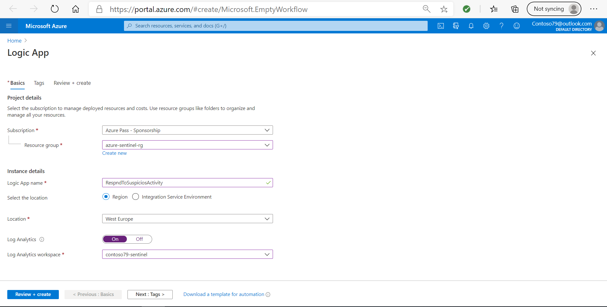
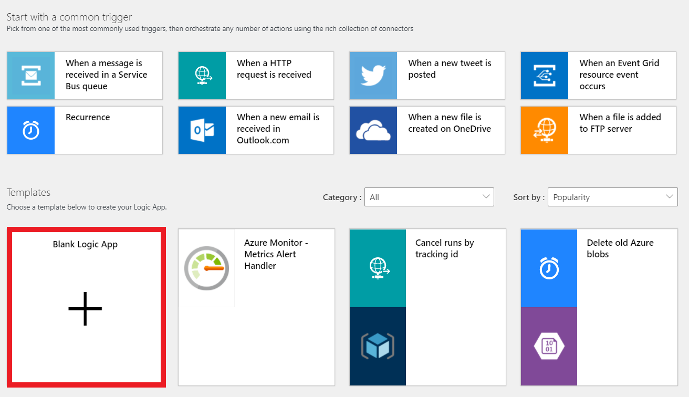
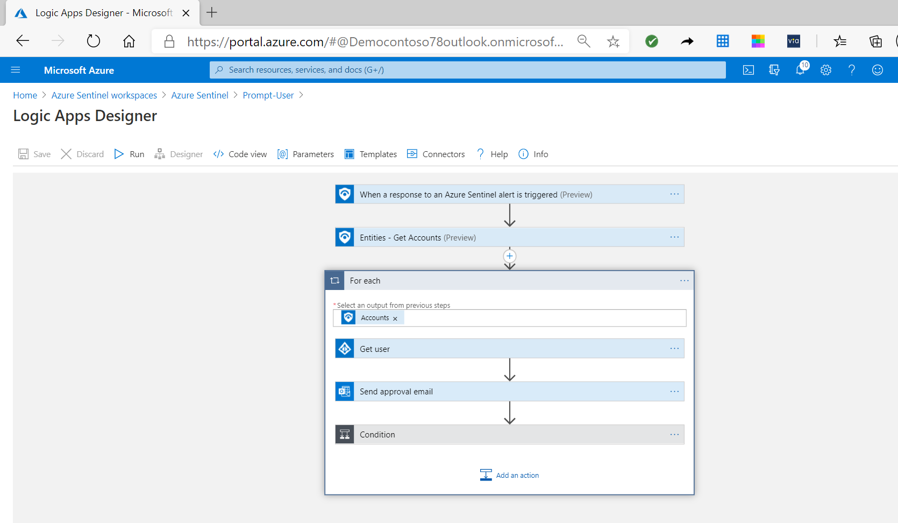

Now, that you understand a little more about Azure Sentinel playbooks, let&#39;s see how Contoso can automatically respond to a security threat. 

## Explore the Playbooks page

You can automate respond to threats in the **Playbooks** page. On this page, you can see all the playbooks that are created from Azure Logic Apps. The column **Trigger kind** presents what type of connectors are used in the logic app.

You can use the header bar, as displayed in the following diagram, to create new playbooks or to enable or disable existing playbooks.

The header bar provides the following options:

- Use the **Add Playbook** button to create a new playbook.
- Use the **Refresh** button to refresh the display, for example, after you create a new playbook.
- Use the drop-down time field to filter the status of the running of the playbooks. 
- The **Enable**, **Disable**, and **Delete** buttons are only available if you select one or more logic apps.
- Use the **Logic Apps documentation** button to review links to official Microsoft documentation for more information on logic apps.

Contoso wants to use automated actions to prevent suspicious users from accessing their network. As their security administrator, you can create a playbook to implement this action. To create a new playbook, select **Add Playbook**. You will be directed to the page where you should create a new Logic App by providing inputs for the following settings:

- **Subscription**. Select the subscription that contains the Azure Sentinel. 
- **Resource Group**. You can use an existing resource group or create a new one.
- **Logic App name**. Provide a descriptive name for the logic app.
- **Location**. Select the same location as where your Log Analytics workspace is located.
- **Log Analytics**. If you enable log analytics, you can get information about playbook&#39;s runtime events.

Once that the inputs are provided, you should select **Review + Create** button, and then select **Create**.

## Logic Apps Designer

Azure Sentinel creates the Logic App, and then you are directed to the **Logic App Designer** page.

The Logic App Designer provides a design canvas that you use to add a trigger and actions to your workflow. For example, you can configure the trigger to come from the Azure Sentinel Connector when a new security incident is created. In the Logic App Designer page, there are many predifinied templates, that you can use, but to create a playbook, you should start with **Blank Logic App**, to design the logic app from scretch.

The automathed activity in the playbook is start from the Azure Sentinel trigger. You can search for the Azure Sentinel trigger in the search box of the design canvas, and then select one of the the two available triggers:

- When a response to an Azure Sentinel alert is triggered
- When Azure Sentinel incident creation rule was triggered

Opening Azure Sentinel Connector for the first time prompts you to **Sign in** to your tenant either with a user account from Azure Active Directory (Azure AD) or with Service Principal. This establishes an API connection to your Azure AD. The API connections store variables and tokens that are required to access the API for the connection, such as Azure AD, Microsoft 365, or similar.

Each playbook starts with trigger followed by actions that design the automated response on a security incident. You can combine actions from Azure Sentinel Connector with other actions from other Logic Apps connectors.

For example, you can add the trigger from Azure Sentinel Connector when an incident is triggered, follow it with an action that identifies the entities from Azure Sentinel alert, and then another action that sends an email to an Microsoft Office 365 email account. Every action is created as a **New Step** and define the activity that you are adding in the logic app.

The following screenshot displays the incident triggered by Azure Sentinel Connector, which detects a suspicious account and sends an email to the administrator. 

Each step in the workflow design has different fields that you must fill. For example, the **Entities - Get Accounts** action requires you to provide the list of entities from Azure Sentinel Alert. An advantage of using Azure Logic Apps is that you can provide this input from the **Dynamic content** list, which is populated with the outputs of the previous step. For example, the  Azure Sentinel Connector trigger **When a response to Azure Sentinel Alert is triggered** provides dynamic properties such as **Entities, Alert Display name**, which you can use to fill the inputs.

You can also add a control action that lets your logic app make decissions. The control action can include logical condition, switch case conditions, or loops. 
A **condition** action is an **if** statement that lets your app do different things based on the data you're processing. It consists of a Boolean expression and two actions. At runtime, the execution engine evaluates the expression and chooses an action based on whether the expression is true or false.
For example, Contoso receive a large volume of alerts, many of them with recurring patterns, so they cannot be process or investigated. Using real-time automation, Contoso SecOps teams can significantly reduce their workload by fully automating the routine responses to recurring types of alerts.
The followng screenshot present similar situation, where based on the user input playbook can change the status of the alert. The control action will intercept the user input, and for true statement will change the status of the alert. In case that control identify false value for the expression, playbook can run other activities, such as sending an email as shown in the following screenshot:

After you provide all the steps in the Logic Apps Designer, save the logic app to create a playbook in Azure Sentinel.

