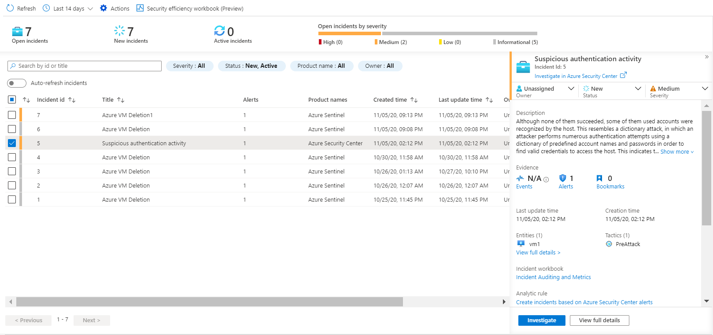

Some incidents at Contoso might require further investigation before you run a playbook.

## Run a playbook on demand

You can configure playbooks to run on demand based on incident details, to trigger specific steps as part of the investigation, or to conduct some remediation action.

Consider the scenario where suspicious users are prevented from accessing corporate resources. As the Contoso security administrator, you find one false positive incident. Some users at Contoso were accessing resources over a VPN connection from remote computers while  being connected to the office computers at the same time. Microsoft security graph received signals and based on the vulnerability that detects potential threat from atypical travel locations, it tagged the users as medium risk.

You can use a playbook that can automatically dismiss this risky user property in Azure AD. 

## Azure Sentinel repository on GitHub

[Azure Sentinel repository on GitHub](https://github.com/Azure/Azure-Sentinel) contains ready to use playbooks to help you to automate response on incidents. These playbooks are defined with Azure Resource Manager (ARM) templates that uses Logic App Azure Sentinel triggers.

For the scenario described earlier, you can use the **Dismiss-AADRiskyUser** playbook, which is located in the Azure Sentinel repository on GitHub, and deploy it directly in your Azure subscription.

For each deployment from GitHub, you first must authorize each connection in the playbook before you edit them in Logic Apps Designer. Autorization will create an API connection to the appropriate connector and store the token and variables. You can locate the API connection in the resource group where you created the logic app. 
The name of each API connection is appended with **azuresentinel** prefix. You can also edit the connection in the Logic App Designer, when you edit the logic app.

## Attach a playbook on existing incident

After your playbook is ready, you can open the **Incident** page in Azure Sentinel, and then select the existing incident. In the details pane on the right, you can select **View full details** to explore the properties of the incident. From the **Alerts blade,** you can select **View playbooks**, and then you can run one of the existing playbooks. 
Following the scenario of suspicios authentication activity, as shown in the following screenshot, you can attach the plabook **Dismiss-AADRiskyUser**. 

 

After you have investigated the incident, you can choose to run the playbook manually to respond to a security threat.
