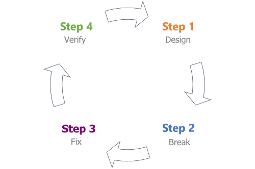

Threat modeling is a technique used by anyone who knows how their system works and has a working knowledge of information security. 

The technique is broken down into four different phases, each containing important steps to help you create a data-flow diagram and analyze it for potential threats.

|Phase|Title|Description|
|-----|-----|-----------|
|1|Design|Capture all requirements for your system and create a data-flow diagram.|
|2|Break|Apply a threat modeling framework to the data-flow diagram and find potential security issues.|
|3|Fix|Decide how to approach each issue with the right combination of security controls.|
|4|Verify|Verify requirements are met, issues are found, and security controls are implemented.|

 

We'll discuss each phase in the next few units.

> [!IMPORTANT]
> The units in this module will introduce important threat modeling concepts at a high-level, which will be discussed in detail across other modules under the Threat Modeling Fundamentals learning path.
