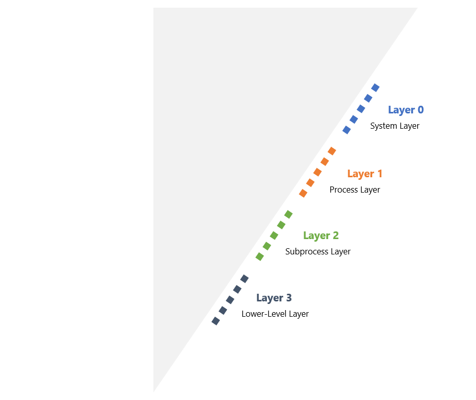

Data-flow diagram depth layers can help you decide how much context to include for a successful threat-modeling exercise. There are many factors that can help you decide how much depth you should go into.

Every system should have a high-level overview of how it works. Most should have further data-flow diagrams focusing on parts of the system that need a closer look.

Examples include:

- A process parsing highly sensitive data
- Third-party authentication systems

At a high level, there are four depth layers used in threat modeling:

|Layer|Description|
|-----|-----------|
|0|This layer is required for all systems, and contains major system parts.|
|1|This layer is required for most systems, and contains diagrams for each system part.|
|2|This layer is required for highly sensitive systems, and contains diagrams for system subparts.|
|3|This layer is required for critical or kernel level systems, and contains diagrams for every process.|

We review each depth layer in the next few units.
