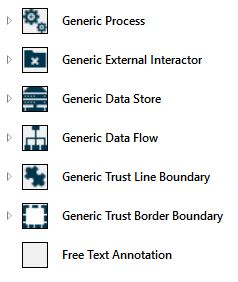
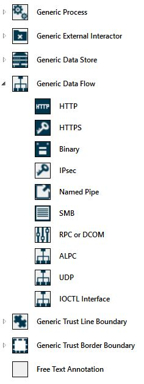
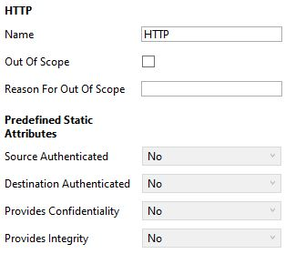
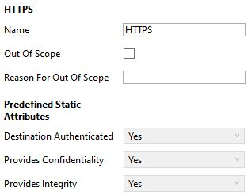
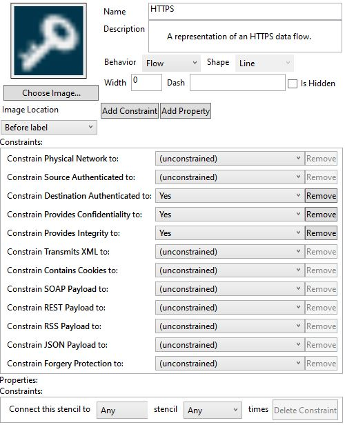
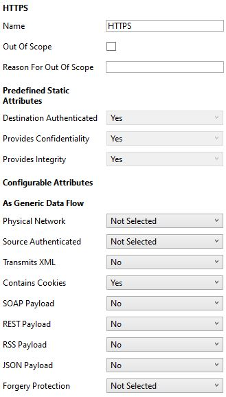
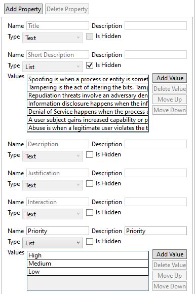
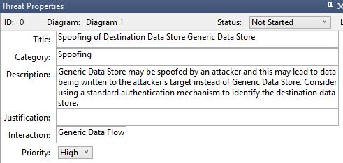
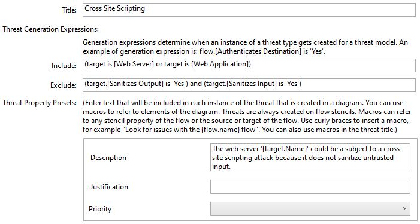

## Quick Overview

Published by Microsoft and recognized by the threat modeling community, Microsoft Threat Modeling Tool helps engineers create data-flow diagrams and apply STRIDE for their threat modeling work.

The Threat Modeling Tool offers:

- Customizable templates
- Threat generation engine with threats and risk reduction strategies

The default template is called "SDL TM Knowledge Base" and gives you a basic set of elements and threat generation capabilities. All you need is a basic understanding of data-flow diagrams and STRIDE.

### Remember

STRIDE is the acronym for the six major threat categories: 

- Spoofing - Pretending to be someone or something else
- Tampering - Changing data without authorization
- Repudiation - Not claiming responsibility for an action taken
- Information Disclosure - Seeing data without permission
- Denial of Service - Overwhelming the system
- Elevation of Privilege - Having permissions I should not have

## Advanced User Section

For more advanced users, the template can be customized across three main sections.

### Stencils

Process, external entity, data store, data-flow, and trust boundaries make up the parent elements.

You can also create children elements to help provide granularity for additional context, actionable threat generation, and risk reduction strategies.

#### Example of How Children Elements Work

The **data-flow** parent element gives you the option to choose between the **HTTP** and **HTTPS** children elements.

HTTP should generate more threats because tampering, information disclosure and spoofing threats are common with unencrypted channels.

##### Using HTTP

##### Using HTTPS

#### How to Add Element Properties

If you have additional properties that must be included in the default template, you can add them to each element in the administrator view.

Users will see the changes whenever they drag and drop that element onto the canvas.

### Threat Properties

Properties allow you to create fields that are filled out for each generated threat, just like stencil properties allow you to create fields for each element.

Remember: the goal is to have as much context as possible in the simplest manner.

#### Example of Threat Properties

##### Administrator View

Add fields that give you more context and actionable steps. Examples include:

- **Issue Priority** - understand which issues need to be worked on first
- **Hyperlinks** - link issues to online documentation
- **External Risk Mapping** - speak the same risk language of other organizations by using reliable third-party sources, such as OWASP Top 10 and CWE Details

##### User View

Threat Modeling Tool users will see those changes whenever they analyze their data-flow diagrams.

|

### Threats and Risk Reduction Strategies

This section is the heart of the threat modeling tool. The threat generation engine looks at individual and connected elements to decide which threats to generate.

#### How Threat Generation Works

##### Step 1 - Specify Sources and Targets

The threat generation engine uses simple sentences to generate a threat. Examples include:

- target is [element name]
- source is [element name]

You can also use the element name on titles and descriptions. The format is: '{target.Name}' or '{source.Name}'

##### Step 2 - Combine Sources and Targets

You can be precise with the way a threat is generated. Combine targets, sources, and their individual properties with AND OR operators. Examples include:

- target.[property name] is 'Yes' **AND** source.[property name] is 'No'
- flow crosses [trust boundary name]

##### Step 3 - Generate or Ignore Threats

The threat generation engine uses two fields to generate or ignore a threat:

- **Include** - threat will be generated if sentences added in this field are true
- **Exclude** - threat will not be generated if sentences added in this field are true

Here's an actual example from the default template to bring these steps together:

- **Threat:** Cross Site Scripting
- **Include:** (target is [Web Server]) **OR** (target is [Web Application])
- **Exclude:** (target.[Sanitizes Output] is 'Yes') **AND** (target.[Sanitizes Input] is 'Yes')

The Cross Site Scripting threat above will **only** be generated when:

- The process is either a Web Server or a Web Application
- Input and output are not sanitized

|

> [!NOTE]
> Microsoft Threat Modeling Tool template creation is a complex topic and will not be fully discussed in this learning path.