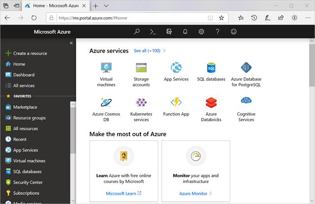
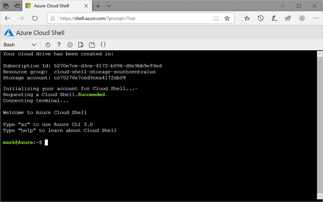

You can configure and manage Azure using a broad range of tools and platforms. There are tools available for the command line, language-specific Software Development Kits (SDKs), developer tools, tools for migration, and many others.

Tools that are commonly used for day-to-day management and interaction include:

- **Azure portal** for interacting with Azure via a Graphical User Interface (GUI)
- **Azure PowerShell** and **Azure Command-Line Interface** (CLI) for command line and automation-based interactions with Azure
- **Azure Cloud Shell** for a web-based command-line interface
- **Azure mobile app** for monitoring and managing your resources from your mobile device

## Azure portal

The [Azure portal](https://portal.azure.com) is a public website that you can access with any web browser. Once you sign in with your Azure account, you can create, manage, and monitor any available Azure services. You can identify a service you're looking for, get links for help on a topic, and deploy, manage, and delete resources. It also guides you through complex administrative tasks using wizards and tooltips.



The dashboard view provides high-level details about your Azure environment. You can customize the dashboard by moving and resizing tiles and displaying services you're interested in.

The portal doesn't provide any way to automate repetitive tasks. For example, to set up multiple VMs, you would need to create them one at a time by completing the wizard for each VM. This process makes the portal approach time-consuming and error-prone for complex tasks.

## Azure PowerShell

Azure PowerShell is a module that you can install for Windows PowerShell or PowerShell Core, which is a cross-platform version of PowerShell that runs on Windows, Linux, or macOS. Azure PowerShell enables you to connect to your Azure subscription and manage resources. Windows PowerShell and PowerShell Core provide services such as the shell window and command parsing. Azure PowerShell then adds the Azure-specific commands.

For example, Azure PowerShell provides the `New-AzVM` command that creates a virtual machine for you inside your Azure subscription. To use it, you would launch PowerShell, install the Azure PowerShell module, sign in to your Azure account using the command `Connect-AzAccount`, and then issue a command such as:

```powershell
New-AzVM `
    -ResourceGroupName "MyResourceGroup" `
    -Name "TestVm" `
    -Image "UbuntuLTS" `
    ...
```

Creating administration scripts and using automation tools is a powerful way to optimize your workflow. You can automate repetitive tasks. Once a script is verified, it runs consistently, which can reduce errors. Another scripting environment is the Azure CLI.

## Azure CLI

Azure CLI is a cross-platform command-line program that connects to Azure and executes administrative commands on Azure resources. *Cross-platform* means that  it can be run on Windows, Linux, or macOS. For example, to create a VM, you would open a command prompt window, sign in to Azure using the command `az login`, create a resource group, then use a command such as:

```azurecli
az vm create \
  --resource-group MyResourceGroup \
  --name TestVm \
  --image UbuntuLTS \
  --generate-ssh-keys \
  ...
```

## Azure Cloud Shell

[Azure Cloud Shell](https://shell.azure.com/) is an interactive, authenticated, browser-accessible shell for managing Azure resources. It provides the flexibility of choosing the shell experience that best suits the way you work, either Bash or PowerShell.



You can switch between the two shells, and both support the Azure CLI and Azure PowerShell module. Bash defaults to the Azure CLI (with the `az` command pre-installed), but you can switch to PowerShell Core within Linux by typing `pwsh`. The PowerShell environment has both CLI tools pre-installed. In addition to these administrative tools, the Cloud Shell has a suite of developer tools, text editors, and other tools available, including:

:::row:::
  :::column:::
**Developer Tools**

- .NET Core
- Python
- Java
- Node.js
- Go
  :::column-end:::
  :::column:::
**Editors**

- code (Cloud Shell Editor)
- vim
- nano
- emacs
  :::column-end:::
  :::column:::
**Other tools**

- git
- maven
- make
- npm
- [and more...](https://docs.microsoft.com/azure/cloud-shell/features#tools)
  :::column-end:::
:::row-end:::

You can create, build, and deploy apps right from this browser-based environment. It's all persistent as well - you're prompted to create an Azure Storage Account when you access the Azure Cloud Shell. This storage area is used as your $HOME folder, and any scripts or data you place here is kept across sessions. Each subscription has a unique storage account associated with it, so you can keep the data and tools you need specific to each account you manage.

We'll use the Cloud Shell in Microsoft Learn for many interactive exercises to try out Azure features.

## Azure mobile app

:::row:::
  :::column:::

  :::column-end:::
  :::column span="3":::
The [Microsoft Azure mobile app](https://aka.ms/azuremobileapp/) allows you to access, manage, and monitor all your Azure accounts and resources from your iOS or Android phone or tablet. Once installed, you can:

- Check the current status and critical metrics of your services
- Stay informed with notifications and alerts about important health issues
- Quickly diagnose and fix problems anytime, anywhere
- Review the latest Azure alerts
- Start, stop and restart virtual machines or web apps
- Connect to your virtual machines
- Manage permissions with role-based access control (RBAC)
- Use the Azure Cloud Shell to run saved scripts or perform ad hoc administrative tasks
- and more...
  :::column-end:::
:::row-end:::

## Other options

There are also Azure SDKs for a range of languages and frameworks and REST APIs that you can use to manage and control Azure resources programmatically. For a full list of tools available, see the [Downloads](https://azure.microsoft.com/downloads/) page.

When starting with Azure, you'll most often use the Azure portal. Let's take a closer look at the portal approach.
