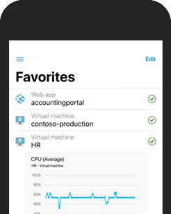

You can configure and manage Azure using a broad range of tools and platforms. There are tools available for the command line, language-specific Software Development Kits (SDKs), developer tools, tools for migration, and many others.

Tools that are commonly used for day-to-day management and interaction include:

- **Azure portal** for interacting with Azure via a Graphical User Interface (GUI)
- **Azure PowerShell** and **Azure Command-Line Interface** (CLI) for command-line and automation-based interactions with Azure
- **Azure Cloud Shell** for a web-based command-line interface
- **Azure mobile app** for monitoring and managing your resources from your mobile device

When you're starting out with Azure, you'll probably use the Azure portal most often.

## Azure portal

The [Azure portal](https://portal.azure.com) is a public website you can access with any web browser. Once you sign in with your Azure account, you can create, manage, and monitor Azure services and resources. In the Azure portal, you can use search to find different types of services and get links for help on a topic. The Azure portal also guides you through complex administrative tasks using wizards and tooltips.

:::image type="content" source="../media/2-azure-portal.png" alt-text="Screenshot of the Azure portal Home page.":::

The Azure portal is often the best interface for carrying out single tasks, or when you want to look at configuration options in detail.

Generally speaking, the portal doesn't let you automate repetitive tasks. For example, to set up multiple VMs, you would need to create them one at a time. This process may make the portal approach less ideal for complex tasks that involve repetition. For these types of tasks, Azure PowerShell and Azure CLI can be helpful.

## Azure PowerShell

Azure PowerShell lets you connect to your Azure subscription and manage resources. You can install the Azure PowerShell module for Windows PowerShell or for PowerShell Core, which is a cross-platform version that runs on Windows, Linux, or macOS. Windows PowerShell and PowerShell Core provide services such as the shell window and command parsing. Azure PowerShell then adds the Azure-specific commands.

For example, Azure PowerShell provides the `New-AzVM` command that creates a virtual machine for you inside your Azure subscription. To use it, you launch PowerShell and install the Azure PowerShell module if you haven't already done so. Then sign in to your Azure account using the command `Connect-AzAccount` and issue a command such as:

```powershell
New-AzVM `
    -ResourceGroupName "MyResourceGroup" `
    -Name "TestVm" `
    -Image "UbuntuLTS" `
    ...
```

Creating administration scripts and using automation tools is a powerful way to optimize your workflow and automate repetitive tasks. Once a script is verified, it runs consistently, which can reduce errors.

## Azure CLI

Azure CLI is a command-line program that connects to Azure and executes administrative commands on Azure resources. Azure CLI can run on Windows, Linux, or macOS.

For example, to create a VM, you open a command prompt window and install the Azure CLI if you haven't already done so. Then sign in to Azure using the command `az login` and issue a command such as:

```azurecli
az vm create \
  --resource-group MyResourceGroup \
  --name TestVm \
  --image UbuntuLTS \
  --generate-ssh-keys \
  ...
```

## Azure Cloud Shell

[Azure Cloud Shell](https://shell.azure.com/) is an interactive, authenticated, browser-accessible shell for managing Azure resources using scripting tools like Azure CLI or Azure PowerShell. You can choose the shell experience that best suits the way you work: Bash or PowerShell.

:::image type="content" source="../media/2-cloud-shell.png" alt-text="Screenshot of an Azure Cloud Shell instance using Bash within a Microsoft Edge browser window." lightbox="../media/2-cloud-shell.png" :::

Both shells support Azure CLI and Azure PowerShell. Bash defaults to the Azure CLI (with the `az` command preinstalled), but you can switch to PowerShell Core within Linux by typing `pwsh`.

 The Cloud Shell also has many other developer tools available, such as text editors, source control tools, databases, and more.

You can access Azure Cloud Shell from within the Azure portal or by navigating to <https://shell.azure.com>.

Many of the interactive exercises across Microsoft Learn use the Cloud Shell to try out Azure features.

## Azure mobile app

:::row:::
  :::column:::

  :::column-end:::
  :::column span="3":::
The [Microsoft Azure mobile app](https://aka.ms/azuremobileapp/) allows you to access, manage, and monitor all your Azure accounts and resources from your iOS or Android phone or tablet. Once installed, you can:

- Check the current status and critical metrics of your services
- Stay informed with notifications and alerts about important health issues
- Quickly diagnose and fix problems anytime, anywhere
- Review the latest Azure alerts
- Start, stop and restart virtual machines or web apps
- Connect to your virtual machines
- Manage permissions with role-based access control (RBAC)
- Use the Azure Cloud Shell to run saved scripts or perform administrative tasks
  :::column-end:::
:::row-end:::

## Other options

There are also Azure SDKs for a range of languages and frameworks and REST APIs that you can use to manage and control Azure resources programmatically. For a full list of tools available, see the [Downloads](https://azure.microsoft.com/downloads/) page.

Let's take a closer look at the portal approach.
