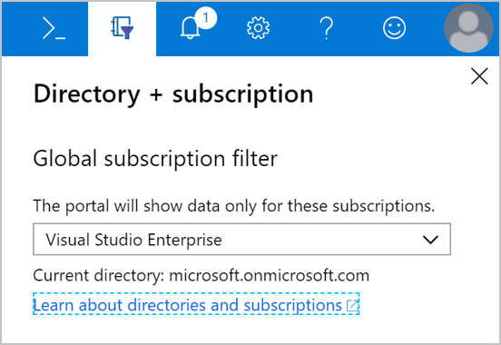

With an Azure account, we can sign into the **Azure portal**. The portal is a web-based administration site that lets you interact with all of your subscriptions and resources you have created. Almost everything you do with Azure can be done through this web interface.

## Azure portal layout

The Azure portal is the primary graphical user interface (GUI) for controlling Microsoft Azure. You can carry out the majority of management actions in the portal, and it is typically the best interface for carrying out single tasks or where you want to look at the configuration options in detail.

:::row:::
    :::column:::
    
    :::column-end:::
    :::column span="3":::
    **Resource Panel**
    
    In the left-hand sidebar of the portal is the resource pane, which lists the main resource types. Note that Azure has more resource types than just those shown. The resources listed are part of your _favorites_. 

    You can customize this with the specific resource types you tend to create or administer most often. 

    You can also collapse this pane; with the **<<** caret. This will minimize it to just icons which can be convenient if you are working with limited screen real-estate.
    :::column-end:::
:::row-end:::

The remainder of the portal view is for the specific elements you are working with. The default (main) page is the _dashboard_. We'll cover later, but this represents a customizable birds-eye-view of your resources. You can use it to jump into specific resources you want to manage or search for resources with the **All resources** entry in the resource panel. When you are managing a resource, such as a virtual machine or a web app, you will work with a _blade_ that presents specific information about the resource.

## What is a blade?

The Azure portal uses a blades model for navigation. A _blade_ is a slide-out panel containing the UI for a single level in a navigation sequence. For example, each of these elements in this sequence would be represented by a blade: **Virtual machines** > **Compute** > **Ubuntu Server**.

Each blade contains some information and configurable options. Some of these options generate another blade, which reveals itself to the right of any existing blade. On the new blade, any further configurable options will spawn another blade, and so on. Soon, you can end up with several blades open at the same time. You can maximize blades as well so that they fill the entire screen.

Since new blades are always added to the right of the owner, you can use the scrollbar at the bottom of the window to go backward to see how you got to this spot in the configuration. Alternatively, you can close blades individually by clicking the `X` button in the top corner of the blade. If you have unsaved changes, Azure will prompt you to let you know that the changes will be lost if you continue.

## What is the Azure Marketplace?

One of the blades you can access in the portal is the _Azure Marketplace_. This blade is often where you will start when creating new resources in Azure. The Marketplace allows customers to find, try, purchase, and provision applications and services from hundreds of leading service providers, all certified to run on Azure.

The solution catalog spans several industry categories, including but not limited to open-source container platforms, virtual machine images, databases, application build and deployment software, developer tools, threat detection, and blockchain. Using Azure Marketplace, you can provision end-to-end solutions quickly and reliably, hosted in your own Azure environment. At the time of writing, this includes over 8,000 listings.

> [!NOTE]
> While Azure Marketplace is designed for IT professionals and cloud developers interested in commercial and IT software, Microsoft Partners also use it as a launch point for all joint Go-To-Market activities.

## Configuring settings in the Azure portal

The Azure portal displays several configuration options, mostly in the status bar at the top-right of the screen.

### Notifications

Clicking the bell icon displays the **Notifications** pane. This pane lists the last actions that have been carried out, along with their status.

### Cloud Shell

If you click the **Cloud Shell** icon (>_), you will create a new Azure Cloud Shell session. Recall that Azure Cloud Shell is an interactive, browser-accessible shell for managing Azure resources. It provides the flexibility of choosing the shell experience that best suits the way you work. Linux users can opt for a Bash experience, while Windows users can opt for PowerShell. This browser-based terminal lets you control and administer all of your Azure resources in the current subscription through a command-line interface built right into the portal.

### Settings

Click the **gear** icon to change the Azure portal settings. These settings include:

- Sign out time
- Color and contrast themes
- Toast notifications (to a mobile device)
- Language and regional format

When you have changed settings, click **Apply** to accept your changes.

### Feedback blade

The **smiley face** icon opens the **Send us feedback** blade. Here you can send feedback to Microsoft about Azure. You can decide as part of your feedback whether Microsoft can respond to your feedback by email.

### Help blade

Click the **question mark** icon to show the **Help** blade. Here you choose from several options, including:

- Help + Support
- What's new
- Azure roadmap
- Launch guided tour
- Keyboard shortcuts
- Show diagnostics
- Privacy + terms

#### Help + Support options

This opens the main support area for the Azure portal and includes documentation options for a variety of common questions. One of the hidden areas here is the **New support request** link which is on this page. This is how you can open a support ticket with the Azure team.

> [!NOTE] 
> All Azure customers can access billing, quota, and subscription-management support. *The availability of support for other issues depends on the support plan you have*.

When you open a support ticket, you will complete the **Problem** section of the form by using provided dropdown lists and text-entry fields.
    - In the **Title** text-entry field, describe your issue briefly.  Provide additional information about your issue in the **Details** text-entry field.
    - Provide your contact information by choosing your **preferred contact method** and entering your contact details, as prompted by the form.

Once you've filled out the form, select **Create** to submit your support request. The Azure support team will contact you after you submit your request.

You can then check the status and details of your support request, through the **All support requests** from the **Help + support** blade.

### Directory and subscription

Click the **Book and Filter** icon to show the **Directory + subscription** blade.

Azure allows you to have more than one subscription associated with one directory. On the **Directory + subscription** blade, you can change between subscriptions. Here, you can change your subscription or change to another directory.

### Profile settings

If you click on your name in the top right-hand corner, a menu opens with a few options:

- Sign in with another account, or sign out entirely
- View your account profile, where you can change your password
- Check your permissions
- View your bill (click the "..." button on the right-hand side)
- Update your contact information (click the "..." button on the right-hand side)

If you click "..." and then **View my bill**, Azure takes you to the **Cost Management + Billing - Invoices** page, which helps you analyze where Azure is generating costs.

Azure is a large product, and the Azure portal user interface (UI) reflects this. The sliding blade approach allows you to navigate back and forth through the various administrative tasks with ease. Let's experiment a bit with this UI so you get some practice.

### Azure Advisor
Finally, the Azure Advisor is a free service built into Azure that provides recommendations on high availability, security, performance, and cost. Advisor analyzes your deployed services and looks for ways to improve your environment across those four areas. You can view recommendations in the portal or download them in PDF or CSV format.

With Azure Advisor, you can:
- Get proactive, actionable, and personalized best practices recommendations. 
- Improve the performance, security, and high availability of your resources as you identify opportunities to reduce your overall Azure costs.
- Get recommendations with proposed actions inline.

You can access Azure Advisor by selecting **Advisor** from the navigation menu, or search for it in the **All Services** menu.

Let's try some of these features out!