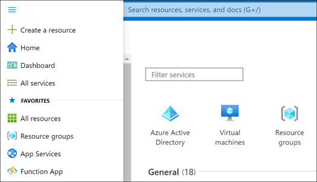
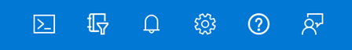
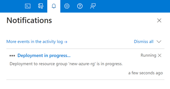

Let's look at some of the more common areas you'll typically use in the Azure portal.

## All services

1. In the top left-hand corner of the Azure portal, select the **Show portal menu** icon.

   :::image type="content" source="../media/5-show-portal-icon.png" alt-text="Screenshot of the Show portal menu option in the Azure portal.":::

   Selecting this icon expands the portal menu on the left-hand side of the screen.

   

1. Select **All services**. Take a minute to browse through the list to get an idea of how many services Azure offers. You can filter the services that appear by using the search box near the top of the pane.

1. Select **Virtual machines**. If you don't see it, use the search box.

1. The **Virtual machines** pane appears. You haven't created any virtual machines yet, so there are no results.

1. Select **+ Create** > **Azure virtual machine**. The **Create a virtual machine** pane appears.

1. If you wanted to create a virtual machine, you could enter information here. For now, select the **X** in the top right-hand corner to close the **Create a virtual machine** pane.

1. Select the **X** in the top right-hand corner to close the **Virtual machines** pane.

1. Select **Microsoft Azure** on the top left-hand side to return to the **Home** page.

## Global controls

Find the global control menu at the top of the screen.

These options are always available in the portal, no matter what service you're using.

Hover over each icon until you see a tooltip pop up. These tooltips show the name of each menu item.

Next, we'll explore each of these items.

## Azure Cloud Shell

The Azure Cloud Shell is available in the Sandbox environment that we're using for this exercise, but the Sandbox version of the shell has reduced functionality. To explore all of the Azure Cloud Shell features, use your own Azure subscription.

1. Select the Azure Cloud Shell (`>_`) icon in the toolbar. Azure Cloud Shell will launch at the bottom of the screen.

1. Read the welcome menu that appears, then select either **Bash** or **PowerShell**.

1. Since we won't use the shell further in this exercise, select **Close**.

## Directories and subscriptions

1. Select the **Directory + Subscription** (book and filter) icon to show the **Directories + subscriptions** pane.  

    This is where you can switch between multiple subscriptions or directories. You should see that you are in the Concierge Subscription of the Microsoft Learn Sandbox directory here. If your account has access to other Azure directories, those directories subscriptions will be available as well.

1. Select the **X** in the top right-hand corner to close the **Directories + subscriptions** pane.

## Notifications

1. On the icon bar menu bar, select the **Notifications** (bell) icon. This window shows any pending notifications.

    

1. If any notifications appear, hover your mouse over one of them. Select the **X** that appears in that notification to dismiss it.

1. Select the **X** in the top right-hand corner to close the **Notifications** pane.

## Settings

1. Select the **Settings** (gear) icon to open the **Portal settings** pane. The **Directories + subscriptions** section is shown by default.

1. Select the **Signing out + notifications** tab at the left. In the **Sign me out when inactive** drop-down menu, select **After one hour**.

1. Select **Enable pop-up notifications**. When this option is checked, notifications will appear as pop-up "toast"-style notifications. They'll still show up in the Notifications pane as well.

1. Select **Apply** to save your **Signing out + notifications** selections.

1. Select the **Appearance + startup views** tab at the left. Under **Theme**, select one of the different colored themes and select **Apply**. Observe the changes to the portal. Try all of the options, and leave it set to the one you like the best.

1. Under **High contrast theme**, try the three different options.

1. Select the **Language + region** tab at the left. In the **Language** drop-down box, select **Español**. Select the **Apply** button, then select **OK** to confirm your changes. If a **Translate this page** dialog box appears, close the box. The whole Azure portal now appears in Spanish. You can select **Microsoft Azure** to view the **Home** page in Spanish, or navigate to other pages.

1. To revert back to English, select the **Settings** (cog) icon in the top menu bar, then select the **Idioma y región** tab at the left. In the **Idioma** drop-down box, select **English**. Select the **Aplicar** button, then select **Aceptar** to confirm. The portal will now appear in English again.

## Support + troubleshooting pane

1. Select the **Support + troubleshooting** (`?`) icon to show the **Support + troubleshooting** pane.

1. Select the **Help + support** button.

1. In the **Help + support** pane, select **Create a support request**.

1. Support requests can only be created using an active paid subscription. Creating support requests from a free Microsoft Learn sandbox is not supported, but you can click through the process on the **New support request** screen:

    - On the **Problem description** tab, you select an issue type and describe your issue.
    - On the **Recommended solution** tab, you'll see suggested solutions that may help resolve your issue.
    - On the **Additional details** tab, you provide your preferred contact method, contact info, and other information.
    - On the **Review + create** tab, you review your information and submit your support request.

1. Since you aren't submitting a real support request, select **Home** in the top left corner. If you're prompted about unsaved edits, select **OK**.

1. If the **Troubleshooting + support** pane isn't still open, select the **Support + troubleshooting** (`?`) icon again

1. Under **Health Events**, select **View service health**.

1. Review the information on the screen about any current service issues or planned maintenance.

1. In the **Support + troubleshooting** pane, explore the options in the **Support resources** section, such as **Ask the Azure community**, **Explore Azure documentation**, or **Visit Quickstart Center**.

1. When you're finished, select the **X** in the top right-hand corner to close the **Help** pane.

## Feedback pane

1. Select the **Feedback** (person with dialog box) icon to open the **Send feedback to Microsoft** pane.

1. Select one of the icons to indicate whether you are satisfied with your experience.

1. Type your impressions of Azure in the **Tell us about your experience** box.

1. Optionally, select the box that says **Microsoft can email you about your feedback**. Then select **Submit feedback**.

1. A **Feedback sent** notification will appear. You can view this notification again by selecting the **Notifications** (bell) icon, as described earlier.

## Profile settings

1. Select your name in the top right-hand corner of the portal.

1. Select "..." then select **My permissions**.

1. Review the information that appears to see the role you've been assigned on the **Concierge Subscription**.

1. Select the **X** in the top right-hand corner to close the **My permissions** page.

Now that we've explored all the main areas of the Azure portal, let's learn about one of the most useful features: Dashboards.
