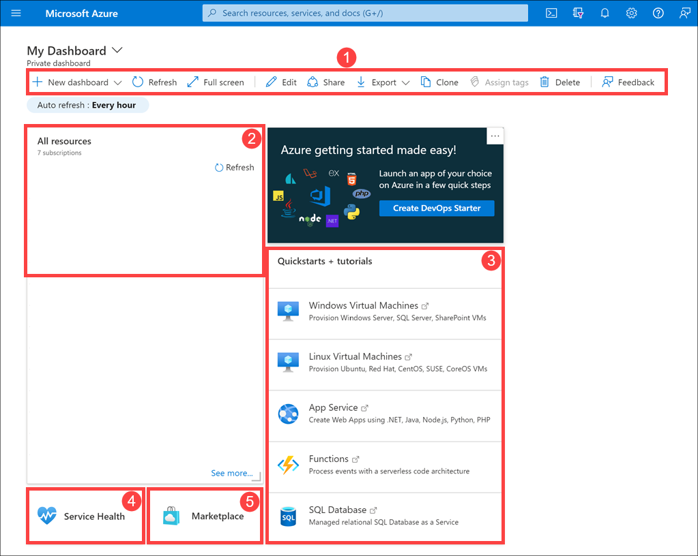

Let's look at how to create and modify dashboards in the Azure portal. In this unit, you'll learn about creating and using dashboards. And in the next unit, you'll try out the things you've learned.

## What is a dashboard?

A *dashboard* is a customizable collection of UI tiles displayed in the Azure portal. You can add, remove, and position tiles to create the exact view you want, and then save that view as a dashboard. Multiple dashboards are supported, and you can switch among them as needed. You can even share your dashboards with other team members.

Dashboards give you flexibility in what information to display. For example, you can create dashboards for specific roles within the organization, then use role-based access control (RBAC) to control who can access each dashboard.

Dashboards are stored as JavaScript Object Notation (JSON) files. This format means a dashboard can be downloaded so you can edit the file directly, then upload it again to Azure, or share it with other users. Azure stores dashboards within resource groups, just like any other resource that you can manage within the portal.

## Explore the default dashboard

The default dashboard is named "Dashboard". When you log into the portal for the first time and select **Dashboard** from the portal menu, you are presented with this dashboard containing five tiles.

These default web parts are

1. Dashboard controls

1. All resources tile

1. Quickstarts + tutorials tile

1. Service Health tile

1. Marketplace tile

## Creating and managing dashboards

At the top of the dashboard are the controls that let you create, upload, download, edit, and share a dashboard. You can also switch a dashboard to full screen, clone it, or delete it.

## Select dashboard

At the top of the toolbar on the far left, next to the dashboard's name, is the dashboard selection drop-down control. Selecting this control lets you choose from dashboards that you have already defined for your account. This control makes it simple for you to switch between multiple dashboards for different purposes.

Dashboards that you create will initially be private; that is, only you can see them. To make a dashboard available across your enterprise, you need to share it. We'll look at that option shortly.

## Create a new dashboard

To create a new dashboard, select **Create**. If you select **Custom**, the dashboard workspace appears with no tiles present. You can then add, remove, and adjust tiles however you like, and give your dashboard a name. When you are finished customizing the dashboard, select **Save** to save and switch to that dashboard.

You can also select **Upload** to upload a dashboard JSON file you've customized, rather than creating the dashboard in the portal.

## Export

To download your current dashboard as a JSON file, select **Export**, then select **Download**. You can then customize the file and upload it, or have someone else upload that file to the Azure portal to use as their dashboard.

You can also select **Export**, then select **Print** to print a copy of current your dashboard.

## Edit a dashboard using the portal

To use the portal to make changes your current dashboard, select the **Edit** (pencil icon) button or right-click  the dashboard background area and select **Edit**.

The dashboard will switch to edit mode.

On the right-hand side you'll find the **Tile Gallery**, showing many different tiles you can add to your dashboard. You can filter the Tile Gallery by using the search box to show only items that match your search term.

To add a tile to your dashboard, select the tile from the list and then drag it to the work area. You can then move each tile, resize it, or customize the data that it displays.

> [!TIP]
> You can also take elements from a resource page and pin them to your dashboard. When using a service, look for the **Pin** icon. When you select it, you'll see a **Pin to dashboard** pane which allows you to select a dashboard (or create a new one) for a tile containing details for that service.

In edit mode, the dashboard work area is divided into squares. Each tile must occupy at least one square, and tiles will snap to the nearest largest set of tile dividers. Any overlapping tiles will be moved out of the way.

### Change tile sizes

Some tiles have a set size, and you can only edit their size  programmatically. However, if a tile has a gray bottom right-hand corner, you can resize it by dragging the corner indicator.

Alternatively, right-click the tile and then specify the size you want.

### Change tile settings

Some tiles have editable settings. For example, with the clock tile, you can select **Edit** to open the **Edit clock** pane. You can then set the time zone and choose whether the time displays in 12- or 24-hour format.

For multi-national/regional or transcontinental companies, you could add several clocks, each with a different time zone.

### Accepting your edits

You can select **Preview** to see your proposed edits. When you have arranged the tiles as you want them, select **Save**.

## Share or unshare a dashboard

When you define a new dashboard, it is private and visible only to your account. To make it visible to others, select **Share**.

As with any other Azure resource, you need to specify a new resource group (or use an existing resource group) in which to store shared dashboards. If you do not have an existing resource group, Azure will create a *dashboards* resource group in whichever location you specify.

When you have shared the template, you'll see a **Manage sharing** link in place of **Share**. From here, you can unshare the dashboard, or select **Access control** to specify who can view and edit the dashboard.

## Clone a dashboard

Cloning a dashboard creates an instant copy called "Clone of \<dashboard name>" and opens that copy in edit mode.

Cloning is an easy way to create dashboards before sharing them. For example, if you have a dashboard that is similar to a new one you want to share, you can clone it, make the changes that you need, and then share it.

## Delete a dashboard

Deleting a dashboard removes it from your list of available dashboards. You are prompted to confirm that you want to delete the dashboard, but there is no way to recover a dashboard that has been deleted.

Now let's try out some of these options by creating a new dashboard.
