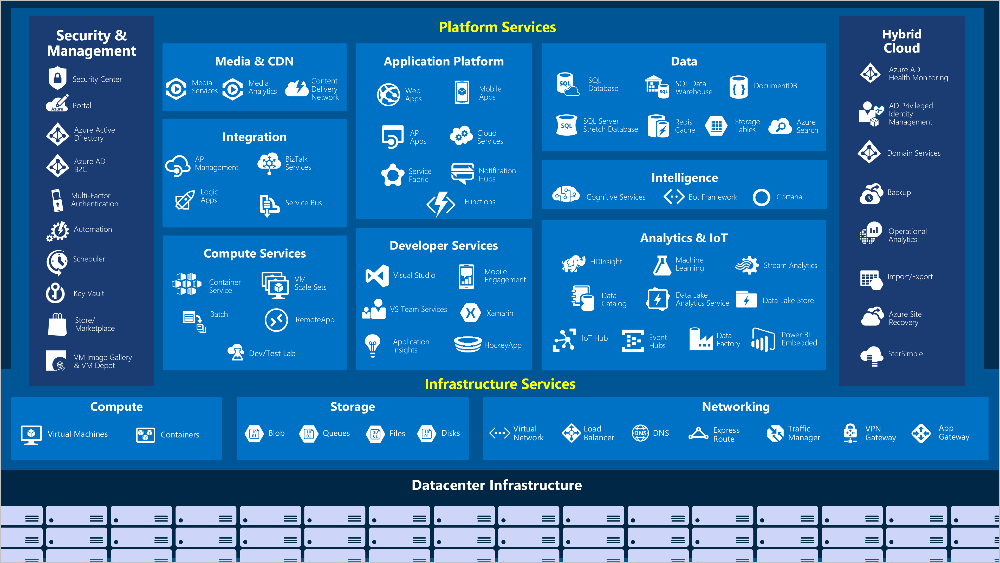

Microsoft Azure is a continually expanding set of cloud services that help your organization meet your current and future business challenges. Azure gives you the freedom to build, manage, and deploy applications on a massive global network using your favorite tools and frameworks. Let's take a quick tour of the high-level services Azure offers.

#### Azure: the big picture

> [!VIDEO https://www.microsoft.com/videoplayer/embed/RE2yuas]

## Azure services

Azure provides a vast range of cloud-based services, with features added and enhanced every month.

Let's take a closer look at a few of the more commonly-used features:

- Compute
- Networking
- Storage
- Mobile
- Databases
- Web

### Compute

Compute services are often one of the primary reasons why companies move to the Azure platform. Azure provides a range of options for hosting applications and services. Here are some examples of compute services in Azure:

|  Service name             | Service function                                                         |
|---------------------------|--------------------------------------------------------------------------|
| Azure Virtual Machines    | Windows or Linux virtual machines (VMs) hosted in Azure                  |
| Azure Virtual Machine Scale Sets | Scaling for Windows or Linux VMs hosted in Azure                  |
| Azure Kubernetes Service  | Enables management of a cluster of VMs that run containerized services   |
| Azure Service Fabric      | Distributed systems platform. Runs in Azure or on-premises               |
| Azure Batch               | Managed service for parallel and high-performance computing applications |
| Azure Container Instances | Provides containers without requiring VM provision or higher services    |
| Azure Functions           | An event-driven, serverless compute service                              |

### Networking

Linking compute resources and providing access to applications is the key function of Azure networking. Networking functionality in Azure includes a range of options to connect the outside world to services and features in the global Microsoft Azure datacenters.

Azure networking facilities have the following features:

|  Service name             | Service function                                                                     |
| -------------             | -------------                                                                        |
| Azure Virtual Network     | Connects VMs to incoming Virtual Private Network (VPN) connections                   |
| Azure Load Balancer       | Balances inbound and outbound connections to applications or service endpoints       |
| Azure Application Gateway | Optimizes app server farm delivery while increasing application security             |
| Azure VPN Gateway         | Accesses Azure Virtual Networks through high-performance VPN gateways                |
| Azure DNS                 | Provides ultra-fast DNS responses and ultra-high domain availability                 |
| Azure Content Delivery Network  | Delivers high-bandwidth content to customers globally                          |
| Azure DDoS Protection     | Protects Azure-hosted applications from distributed denial of service (DDOS) attacks |
| Azure Traffic Manager     | Distributes network traffic across Azure regions worldwide                           |
| Azure ExpressRoute        | Connects to Azure over high-bandwidth dedicated secure connections                   |
| Azure Network Watcher     | Monitors and diagnoses network issues using scenario-based analysis                  |
| Azure Firewall            | Implements high-security, high-availability firewall with unlimited scalability      |
| Azure Virtual WAN         | Creates a unified wide area network (WAN), connecting local and remote sites         |

### Storage

Azure provides four main types of storage services. These services are:

|  Service name       | Service function                                                                     |
| -------------       | -------------                                                                        |
| Azure Blob storage  | Storage service for very large objects, such as video files or bitmaps               |
| Azure File storage  | File shares that you can access and manage like a file server                        |
| Azure Queue storage | A data store for queuing and reliably delivering messages between applications       |
| Azure Table storage | A NoSQL store that hosts unstructured data independent of any schema                 |

Each of these services shares common characteristics, which are:

- Durable and highly available with redundancy and replication.
- Secure through automatic encryption and role-based access control.
- Scalable with virtually unlimited storage.
- Managed, handling maintenance and any critical problems for you.
- Accessible from anywhere in the world over HTTP or HTTPS.

### Mobile

Azure enables developers to create engaging iOS, Android, and Windows apps quickly and easily in a wide range of languages using their choice of development environment. Features that used to take time and increase project risks, such as adding corporate sign-in and then connecting to on-premises resources such as SAP, Oracle, SQL Server, and SharePoint, are now simple to include.

Other features of this service include:

- Offline data synchronization.
- Connectivity to on-premises data.
- Broadcasting push notifications.
- Autoscaling to match business needs.

### Databases

Azure provides multiple database services to store a wide variety of data types and volumes. And with global connectivity, this data is available to users instantly.

|  Service name              | Service function                                                                                |
| -------------              | -------------                                                                                   |
| Azure Cosmos DB            | Globally distributed database that supports NoSQL options                                       |
| Azure SQL Database         | Fully managed relational database with auto-scale, integral intelligence, and robust security    |
| Azure Database for MySQL   | Fully managed and scalable MySQL relational database with high availability and security        |
| Azure Database for PostgreSQL   | Fully managed and scalable PostgreSQL relational database with high availability and security   |
| SQL Server on VMs          | Host enterprise SQL Server apps in the cloud                                                    |
| Azure SQL Data Warehouse   | Fully managed data warehouse with integral security at every level of scale at no extra cost    |
| Azure Database Migration Service    | Migrates your databases to the cloud with no application code changes                  |
| Azure Cache for Redis      | Caches frequently used and static data to reduce data and application latency                   |
| Azure Database for MariaDB | Fully managed and scalable MariaDB relational database with high availability and security        |

### Web

Web services in Azure include the following facilities:

| Service Name | Description |
|--------------|-------------|
| Azure App Service | Quickly create powerful cloud apps for web and mobile. |
| Azure Notification Hubs |Send push notifications to any platform from any back end. |
| Azure API Management | Publish APIs to developers, partners, and employees securely and at scale. |
| Azure Search | Fully managed search as a service. |
| Web Apps feature of Azure App Service | Create and deploy mission-critical web apps at scale. |
| Azure SignalR Service | Add real-time web functionalities easily. |

Now that we've identified some of the areas that might interest a company looking to migrate to Azure let's look at where these services are in the cloud.
