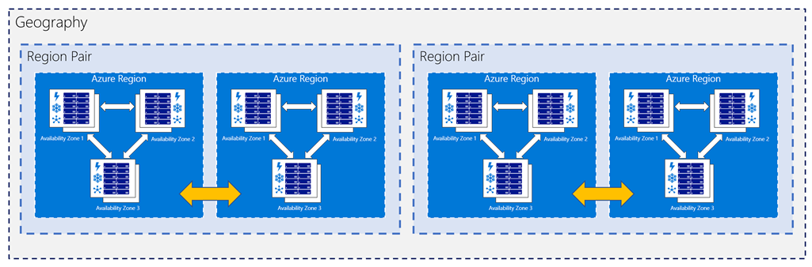

Microsoft Azure is made up of datacenters located around the globe. When you leverage a service or create a resource such as a SQL database or virtual machine, you are using CPU and storage that is located in one or more of these data centers.

The specific datacenters aren't exposed to end users directly, instead, Azure organizes them into _regions_.

## What is a region?

A **region** is a geographical area on the planet containing at least one, but potentially multiple datacenters that are in close proximity and networked together with a low-latency network. Azure intelligently assigns and controls the resources within each region to ensure workloads are properly balanced. 

When you deploy a resource in Azure, you will often need to choose the region where you want your resource to be deployed. 

> [!IMPORTANT]
> Some services or virtual machine features are only available in certain regions, such as specific virtual machine sizes or storage types. There are also some global Azure services that do not require you to select a particular region, such as Microsoft Azure Active Directory, Microsoft Azure Traffic Manager, and Azure DNS. 

A few examples of regions are *West US*, *Canada Central*, *West Europe*, *Australia East*, and *Japan West*. Here's a view of all the available regions as of December 2018:

Azure has more global regions than any other cloud provider. This gives you the flexibility to bring applications closer to your users no matter where they are. It also provides better scalability, redundancy, and preserves data residency for your services.

#### Special Azure regions

Azure has some special regions that you might want to use when building out your applications for compliance or legal purposes. These include:

- *US DoD Central*, *US Gov Virginia*, *US Gov Iowa* and more: These are physical and logical network-isolated instances of Azure for US government agencies and partners. They are operated by screened US persons. Includes additional compliance certifications.

- *China East*, *China North* and more: These regions are available through a unique partnership between Microsoft and 21Vianet, whereby Microsoft does not directly maintain the datacenters.

- *Germany Central* and *Germany Northeast*: 
These regions are available through a data trustee model whereby customer data remains in Germany under control of T-Systems, a Deutsche Telekom company, acting as the German data trustee. Any user or enterprise who needs their data to reside in Germany can use this service.

Regions are typically what you will work with when you identify the location for your resources, but there are two other terms you should also be aware of: _geographies_ and _availability zones_.

## What is a geography?

A *geography* is a discrete market typically containing two or more regions that preserve data residency and compliance boundaries.

Geographies allow customers with specific data-residency and compliance needs to keep their data and applications close. Geographies ensure that data residency, sovereignty, compliance, and resiliency requirements are honored within geographical boundaries. Geographies are fault-tolerant to withstand complete region failure through their connection to dedicated high-capacity networking infrastructure.

Geographies are broken up into *Americas*, *Europe*, *Asia Pacific*, *Middle East and Africa*.

## What is an availability zone?

*Availability zones* are physically separate datacenters within an Azure region.

Each availability zone is made up of one or more datacenters equipped with independent power, cooling, and networking. It is set up to be an isolation boundary. If one availability zone goes down, the other continues working. The availability zones are typically connected to each other through very fast, private fiber-optic networks.

Regions that support Availability Zones include *Central US*, *North Europe*, and *SouthEast Asia* - a full list is available in the documentation.

Availability zones allow customers to run mission-critical applications with high availability and low-latency replication. They are offered as a service within Azure, and to ensure resiliency, there’s a minimum of three separate zones in all enabled regions.

> [!NOTE]
> Not all services support the use of availability zones - they are used primarily for VMs, managed disks, load balancers, and SQL databases. Check the documentation to determine which elements of your architecture you can associate with an availability zone.

## What is a region pair?

Each Azure region is always paired with another region within the same geography (such as US, Europe, or Asia) at least 300 miles away. This approach allows for the replication of resources (such as virtual machine storage) across a geography that helps reduce the likelihood of interruptions due to events such as natural disasters, civil unrest, power outages, or physical network outages affecting both regions at once. 

Since the pair of regions are directly connected and far enough apart to be isolated from regional disasters, you can use them to provide service and data redundancy. In fact, some services provide automatic geo-redundant storage using region pairs.

Additional advantages of region pairs include:

- In the event of a wider Azure outage, one region out of every pair is prioritized to help reduce the time it takes to restore them for applications. 

- Planned Azure updates are rolled out to paired regions one region at a time to minimize downtime and risk of application outage. 

- Data continues to reside within the same geography as its pair (except for Brazil South) for tax and law enforcement jurisdiction purposes.

Examples of region pairs would be West US paired with East US, and SouthEast Asia paired with East Asia.

Now that we've explored some basic services in Azure and how the physical infrastructure is organized, let's talk about how you consume services with an Azure account.