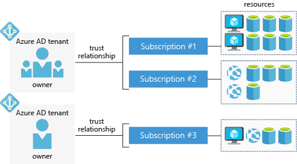

With a free Azure account, you can build, test, and deploy enterprise applications, create custom web and mobile experiences, and gain insights from your data through machine learning and powerful analytics.

## What is an Azure account?

An _Azure account_ is tied to a specific identity and holds information like:

- Name, email, and contact preferences
- Billing information such as a credit card

An Azure account is what you use to log in to the Azure portal or the Azure CLI. Every Azure account is associated with one or more  _subscriptions_.

## What is an Azure subscription?

An _Azure subscription_ is a logical container used to provision resources in Microsoft Azure. It holds the details of all your resources like virtual machines, databases, etc.

Billing occurs at the subscription level &mdash; one bill is generated for every Azure subscription on a monthly basis. You can set spending limits on each subscription to ensure you aren't surprised at the end of the month.

## What is an Azure AD tenant?

Azure AD (Azure Active Directory) is a modern identity provider that supports multiple authentication protocols to secure applications and services in the cloud. It's _not_ the same as Windows Active Directory, which is focused on securing Windows desktops and servers. Instead, Azure AD is all about web-based authentication standards such as OpenID and OAuth.

Users, applications and other entities registered in Azure AD aren't all lumped into a single global service. Instead, Azure AD is partitioned into separate _tenants_. A tenant is a dedicated, isolated instance of the Azure Active Directory service, owned and managed by an organization.

When it comes to Azure AD tenants, there is no concrete definition of "organization" &mdash; tenants can be owned by individuals, teams, companies, or any other group of people. Tenants are commonly associated with companies. If you sign up for Azure with an email address that's not associated with an existing tenant, the sign-up process will walk you through creating your own tenant, owned entirely by you.

> [!NOTE]
> The email address you use to sign in to Azure can be associated with more than one tenant. You might see this if you have your own Azure account and you use Microsoft Learn's Azure sandbox to complete exercises. In the Azure portal, you can only view resources belonging to one tenant at a time. To switch the tenant you're viewing resources for select the **Book and filter** icon at the top of the portal and choose a different tenant in the **Switch directory** section.

Azure AD tenants and subscriptions have a many-to-one trust relationship: A tenant can be associated with multiple Azure subscriptions, but every subscription is associated with only one tenant. This structure allows organizations to manage multiple subscriptions and set security rules across all the resources contained within them.

Here's a simple representation of how accounts, subscriptions, tenants, and resources work together.

Notice that each Azure AD tenant has an _account owner_. This is the original Azure account that is responsible for billing. You can add additional users to the tenant, and even invite guests from other Azure AD tenants to access resources in subscriptions.

## Azure account types

Azure has several account types that cater to different customer types. The most commonly used accounts are:

- Free
- Pay-As-You-Go
- Enterprise Agreement

### Azure free account

An Azure free account includes a **$200 credit** to spend for the first 30 days, free access to the most popular Azure products for 12 months, and access to more than 25 products that are always free. This is an excellent way for new users to get started. To set up a free account, you need a phone number, a credit card, and a Microsoft account.

> [!NOTE]
> Credit card information is used for identity verification only. You won’t be charged for any services until you upgrade.

### Azure Pay-As-You-Go account

A Pay-As-You-Go (PAYG) account bills you monthly for the services you used. This account type is appropriate for a wide range of users, from individuals to small businesses and many large organizations as well.

### Azure Enterprise Agreement

An Enterprise Agreement provides flexibility to buy cloud services and software licenses under one agreement, with discounts for new licenses and Software Assurance. It is targeted at enterprise-scale organizations.

## Summary

Whether you are an individual, a small business, or an enterprise, you need an account to use Azure services. The typical sequence is to start with a free account so that you can evaluate Azure services. When your trial period expires, you will convert from the free account to Pay-As-You-Go.