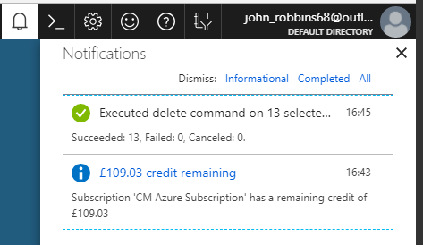
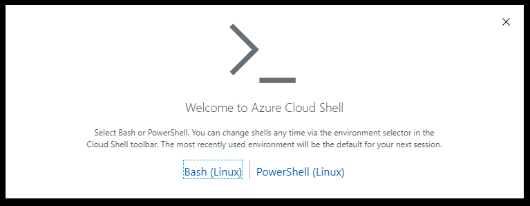
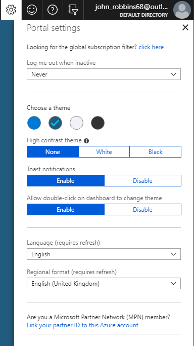
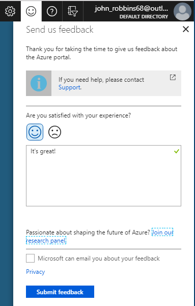
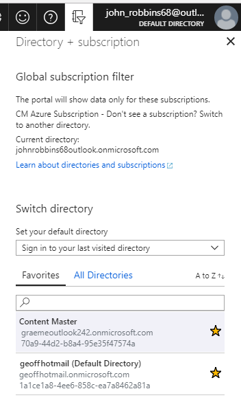
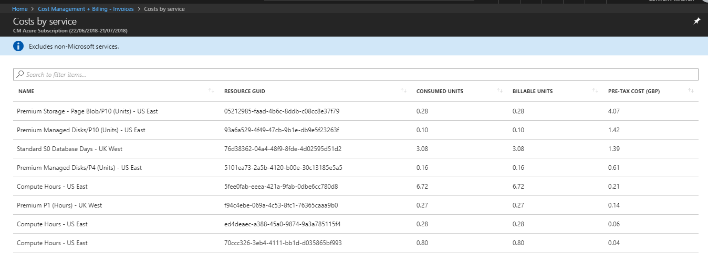

## Motivation

Azure products have a deep hierarchy. For example, suppose you needed to create a Linux Virtual Machine. You might navigate through these levels: **Home** **>** **Virtual machines** **>** **Compute** **>** **Ubuntu Server**. The Azure portal optimizes its UI to make this type of navigation sequence intuitive. Here, you will survey the key UI elements that make this possible. You will navigate through menus and sub-menus and use blades to find and configure services.

## Azure Portal Layout

The Azure portal is the main graphical user interface (GUI) for controlling Microsoft Azure. You can carry out the large majority of management actions on the portal and the portal is typically the best interface for carrying out single tasks or where you want to look at the configuration options in detail.

On the left-hand pane of the portal is the resource pane, which lists the main resource types. Note that Azure has far many more resource types than just those shown.

## Using Blades in Azure Portal

The Azure Portal uses a blades model for navigation. A _blade_ is a slide-out panel containing the UI for a single level in a navigation sequence. For example, each of these elements in this sequence would be represented by a blade: **Virtual machines** **>** **Compute** **>** **Ubuntu Server**.

Each blade within the UI typically contains a number of configurable options. Some of these options generate another blade, which reveals itself to the right of any existing blade. On the new blade, any further configurable options will spawn another blade, and so on. Pretty soon, you can end up with several blades open at the same time. You can maximize blades as well so that they fill the entire screen.

If you try to close a blade without saving any configuration changes that you have made, then you will receive a prompt.

## Configuring Settings in Azure Portal

The Azure portal displays several configuration options, mostly in the status bar to the top-right of the screen.

### Notifications

Clicking the bell icon displays the Notifications pane. This pane lists the last actions that have been carried out, along with their status.

### Cloud Shell

If you click the Cloud Shell icon (>_), you will create a new cloud shell session. You are prompted to use either Linux Bash or PowerShell on Linux in that session.

### Settings

Clicking on the "gear" icon to change Azure Portal settings. These settings include:

* Logout time
* Color scheme
* High contrast themes
* Toast notifications (to a mobile device)
* Double-click to change theme
* Language
* Regional format

When you have changed settings, click **Apply** to accept your changes.

### Feedback Blade

The smiley face icon opens the **Send us feedback** blade. Here you can send feedback to Microsoft about Azure. Note that you can specify whether Microsoft can respond to your feedback by email.

### Help Blade

Click the question mark to show the **Help** blade. Here you choose from a number of topics, including:

* What's new
* Azure roadmap
* Launch guided tour
* Keyboard shortcuts
* Show diagnostics
* Privacy + terms

### Directory and Subscription

Click the Book and Filter icon to show the **Directory + subscription** blade.

Azure allows you to have more than one subscription associated with one directory. In the Directory and Subscription blade, you can change between subscriptions. Here, you can change your subscription, or change to another directory.

### Profile Settings

If you click on your name in the top right-hand corner, you can then change your profile settings.
Options include:

* Sign out of Azure
* Change password
* Change contact information
* View permissions
* Submit an idea to the Azure team
* View your bill
* Switch directory (shows the Directory + Subscription blade as in the previous section)

If you now click **View my bill**, Azure takes you to the **Cost Management + Billing - Invoices** page, which helps you analyze where Azure is generating costs.

## Summary

Azure is a large product and the portal UI reflects this. The primary way that the portal helps you navigate this complexity is with blades to indicate hierarchy. Blades let you focus on a specific task while clearly indicating the path you took to reach that point.