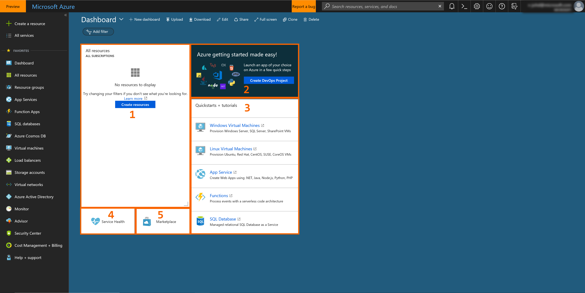
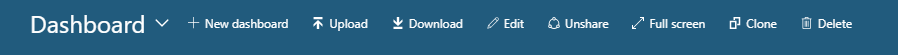
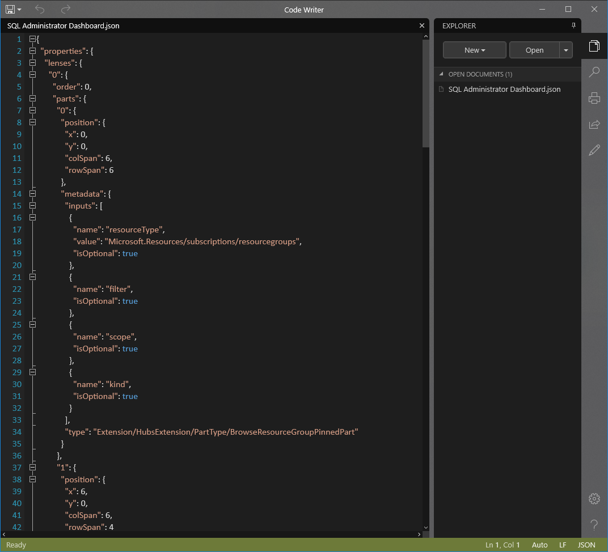
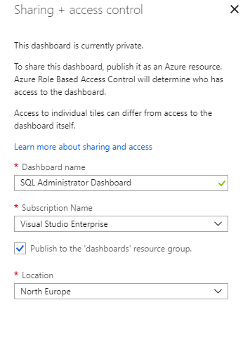
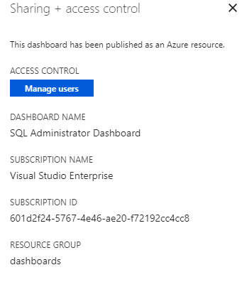
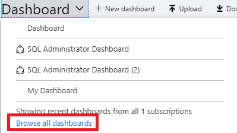
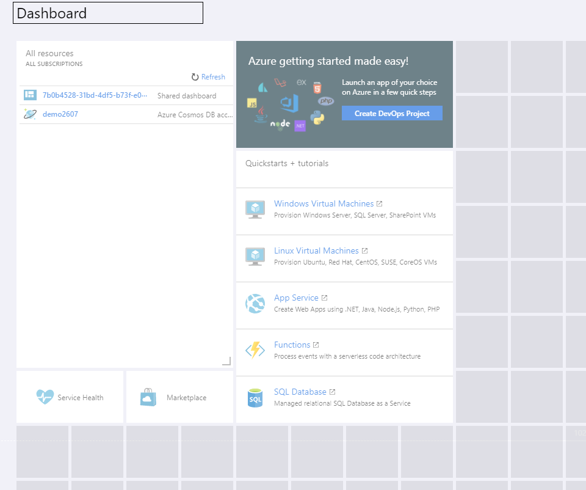

# Customize the Dashboard

Here, you will create and modify dashboards using the portal UI and by editing the underlying JSON file directly.

## What is a Dashboard?

A _dashboard_ is a customizable collection of UI tiles displayed in the Azure portal. You add, remove, and position tiles to create the exact view you want, then save that view as a dashboard. Multiple dashboards are supported and you can switch between them as needed. You can even share your dashboards with other team members.

Dashboards give you considerable flexibility in terms of how you manage Azure. For example, you can create dashboards for specific roles within the organization, then use Role-Based Access Control (RBAC) to control who can access that dashboard. Hence, your database administrator would have a dashboard that contains views of the SQL database service, whereas your Azure Active Directory administrator would have views of the users and groups within Azure AD.

Dashboards are stored as JavaScript Object Notation (.JSON) files. This means they can be uploaded and downloaded to other computers, or shared with members of the Azure directory. Azure stores dashboards within resource groups, just like virtual machines or storage accounts that you can manage within the portal.

Because dashboards are .JSON files, you can can also customize dashboards programmatically, making them very powerful administrative tools. In addition, some tile types can be query-based so they update automatically when the source data changes.

## Default Dashboard

The default Dashboard is simply named Dashboard. When you log into the portal, you are presented with this dashboard containing five web parts.

These default web parts are

1. All resources
2. Quickstarts + tutorials
3. Service Health
4. Marketplace
5. Azure Getting Started

## Creating and Managing Dashboards

Along the top of the dashboard are the controls that enable you to create, upload, download, edit, and share a dashboard. You can also switch a dashboard to full screen, clone it, or delete it.

### Select Dashboard

To the left is the Select Dashboard drop-down control. Clicking this control enables you to select from dashboards that you have already defined for your account. This control makes it simple for you to define multiple dashboards for different purposes, then simply switch from one to another and back again, depending on what you are trying to do at the time.

Note that any dashboards that you create will initially be private; that is, only you can see them. To make a dashboard avaiable across your enterprise, you need to share it. See the later section on sharing/unsharing dashboards for more information.

### Create a new dashboard

To create a new dashboard, simply click **New dashboard**. The dashboard workspace appears, with no tiles present. You can now add tiles, as detailed in the later section on Edit a Dashboard through the User Interface later in this unit. When you have completed adding and adjusting tiles, and changed the name of the dashboard, simply click **Done customizing** to save and switch to that dashboard.

### Upload and Download

The **Upload** and **Download** buttons enable you to download your current dashboard as a .JSON file, customize it, then distribute it and upload it or have someone else upload that file back to the Azure Portal, thereby replacing their current dashboard.

If you click **Download**, the current dashboard downloads into your default Downloads folder. Opening the downloaded file then shows the .JSON code.

You can then edit that code manually, for example, by changing tile sizes, and then upload it back to Azure by clicking the **Upload** button.

### Edit a Dashboard

See the Edit a Dashboard through the User Interface topic for more information on this topic.

### Share/Unshare a Dashboard

When you define a new dashboard, it is private and only visible to your account. To make it visible to others, you need to share a dashboard. However, like any other Azure resource, you need to specify a Resource Group (or use an existing resource group) to store shared dashboards in. If you do not have an existing resource group, Azure will create a 'dashboards' resource group in whichever Location you specify. If you have existing resource groups, then you can specify that resource group to store the dashboards.

When you have shared the template, you will see a second **Sharing + access control** blade.

You can then click **Manage users** to specify the users who have access to that dashboard.

### Switching to a shared dashboard

To switch to a shared dashboard, you click on the list of dashboards, then click **Browse all dashboards**.

You will now see the All dashboards blade, with the names of any shared dashboards displayed. Simply click on a dashboard to apply it to the Azure portal.

### Display a Dashboard as a Full Screen

If you really want the largest dashboard real estate, click the **Full screen** button to display your current dashboard without any browser menus. If you have any tiles that are outside the boundaries of your screen display, then slider bars will appear at the right and bottom of your screen.

When you have finished working in full screen mode, press the Escape key or click **Exit Full Screen** next to the Dashboard name at the top of the screen.

### Clone a Dashboard

Cloning a dashboard simply creates an instant copy called "Clone of (dashboard name)" and switches to that copy as the current dashboard. Cloning is also an easy way to create dashboards prior to sharing them. For example, if you have a dashboard that is almost as you want it, simply clone it, then make the changes that you need, and then share it.

### Delete a Dashboard

Deleting a dashboard removes it from your list of available dashboards. You are prompted to confirm that you want to delete the dashboard, but there is no facility to recover a dashboard that has been deleted.

## Edit a Dashboard through the User Interface

Although you can edit a dashboard by downloading the .JSON file, changing values in the file, and uploading the file back to Azure, that approach isn't terribly intuitive for designing a user interface. To use the GUI to configure your current dashboard, click the **Edit** button or right-click on the dashboard and click **Edit**. The dashboard switches to edit mode.

On the left-hand side appears the Tile Gallery, with a number of tiles below. You can filter the Tile Gallery by the following criteria:

* General
* Type
* Search
* Resource Group
* Tag

You can also further refine each of these options by category, for example, Azure Active Directory, Internet of Things, Microsoft Intune, and so on.

Adding tiles is simply a question of selecting the tile from the list on the left, then dragging it and dropping it onto the work area. You can then move each tile about, resize it, or change the data that it displays.

The work area in edit mode is divided into squares. Each tile must occuppy at least one square, and tiles will snap to the nearest largest set of tile dividers. Any overlapping tiles are moved out of the way. When you make a tile smaller, the surrounding tiles will move back up against it.

### Change tile sizes

Some tiles have a set size and you can only edit their size programatically. However, tiles with a grey bottom right-hand corner you can edit by dragging and dropping the corner indicator.

Alternatively, right-click the context menu and specify the size you want.

To create your dashboard, simply pull tiles from the Tile Gallery onto the workspace and then rearrange them.

### Change tile settings

Some tiles have editable settings. For example, with the clock tile, when you drag it onto the workspace, it opens up the **Edit clock** tile. You can then set the time zone  which it displays and also whether it displays in 12 or 24-hour format.

For multi-national or transcontinental companies, you can add further clocks, each in different time zones.

### Accepting your edits

When you have arranged the tiles as you want them, either click **Done customizing**, or right-click and click **Done customizing**.

## Edit a Dashboard by changing the .JSON file

You can also edit a dashboard by changing the .JSON file. This approach provides more options for changing settings, but you cannot see the changes until you upload the file back into Azure.

In the example above, to change the size of the tile, edit the colSpan and rowSpan variables, then save the file and upload it back to Azure. You can also distribute the file to other users.

## Reset a dashboard

You can reset any dashboard to the default style. In edit mode, right-click and select **Reset to default state**. A dialog box will ask you to confirm that you want to reset that dashboard.

## Summary

Dashboards provides a flexible tool for managing different aspects of Azure services through the Portal. They make it convenient to monitor the state of your services. Because they are sharable, they help ensure that everyone on your team sees the same data and stays aware of the state of your critical components.