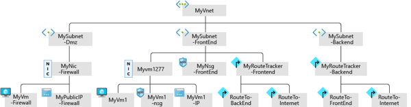

Network Watcher includes several tools that you can use to monitor your virtual networks and virtual machines (VMs). To effectively make use of Network Watcher, it's essential to understand all the available tooling options and the purpose of each tool.

In your engineering company, you want to enable your staff to choose the right Network Watcher tool for each troubleshooting task. To complete this task, they need to understand all the options available and the kinds of problems each tool can solve.

Here, we'll look at the Network Watcher tool categories, the tools in each category, and how each tool is applied using example use cases.

## What is Network Watcher?

Network Watcher is an Azure service that brings together a combination of tools in a central place to diagnose the health of Azure networking. The Network Watcher tools are divided into two categories:

- Monitoring tools
- Diagnostics tools

With tools to monitor for and diagnose problems, Network Watcher gives you a centralized hub for identifying network glitches, CPU spikes, connectivity problems, memory leaks, and other issues before they impact your business.

## Network Watcher monitoring tools

Network Watchers provides us with three monitoring tools:

- Topology
- Connection Monitor
- Network Performance Monitor

Let's look at each of these tools in turn.

### What is the Topology tool?

The Topology tool generates a graphical display of your Microsoft Azure Virtual Network (VNet), its resources, its interconnections, and their relationships with each other.

Suppose you have to troubleshoot a VNet created by your colleagues. Unless you were involved in the creation process of the network, you might not know about all the aspects of the built infrastructure. You can use the Topology tool to visualize and understand the infrastructure you're dealing with before you start troubleshooting.

We use the Azure portal to view the topology of an Azure network. In the Azure portal, we'll:

1. Navigate to **All Services > Networking > Network Watcher**.

1. Select **Topology**.

1. Select a subscription, the resource group of a virtual network, and then select the virtual network itself.

    > [!NOTE]
    > To generate the topology, you need a Network Watcher in the same region as the virtual network.

    Here's an example of a topology generated for a virtual network named MyVNet:

    

### What is the Connection Monitor tool?

The Connection Monitor tool provides a way to check that connections work between Azure resources.

Use this tool to check that two VMs can communicate if you want them to. This tool also measures the latency between resources and can catch changes that will impact connectivity, such as changes to the network configuration or Network Security Group (NSG) rule changes. It can probe VMs at regular intervals to look for failures or changes.

If there is an issue, Connection Monitor tells you why it occurred and how to fix it. As well as monitoring VMs, Connection Monitor can also examine an IP address or fully qualified domain name (FQDN).

### What is the Network Performance Monitor tool?

The Network Performance Monitor (NPM) tool gives you the ability to track and alert on latency and packet drops over time. It enables you to have a centralized view of your network.

When you decide to monitor your hybrid connections using NPM, check that the associated workspace is in a supported region. 

NPM allows you to monitor endpoint-to-endpoint connectivity:

- Between branches and data centers.
- Between VNets.
- For your on-premises to cloud connections.
- For express route circuits.

## Network Watcher diagnostic tools

Network Watcher includes seven diagnostic tools:

- IP flow verify
- Next hop
- Effective security rules
- Effective route
- Packet capture
- Connection troubleshoot
- VPN troubleshoot

Let's examine each tool and find out how they can help us to solve problems.

### What is the IP flow verify tool?

The IP flow verification tool tells you if packets are allowed or denied to a specific virtual machine. If a network security group denies a packet, the tool tells you the name of that group so that you can fix the problem.

This tool uses a 5-tuple packet parameter-based verification mechanism to detect whether packets inbound or outbound are allowed or denied from a VM. Within the tool, you specify a local and remote port, TCP/UDP, the local IP, the remote IP, the VM, and the VM's network card.

### What is the next hop tool?

When a VM sends a packet to a destination, it might take multiple hops in its journey. For example, if the destination is a VM in a different VNet, then the next hop might be the VNet gateway that routes the packet to the destination VM.

With the next hop tool, you can determine how a packet gets from a VM to any destination. You specify the source VM, source NIC, source IP address, and destination IP address, and the tool determines the packet's destination. You can use this tool to diagnose problems caused by incorrect routing tables.

### What is the security group view tool?

The security group view tool in Network Watcher is used to display all the effective Network Security Group rules applied to a network interface.

Network Security Groups (NSGs) are used in Azure networking to filter packets based on their source and destination IP address and port numbers. NSGs are vital to ensure security by carefully controlling the surface area of the VMs that users can access. Keep in mind though that a mistakenly configured NSG rule could prevent legitimate communication. As a result, NSGs frequently result in a source of networking problems.

For example, if two VMs can't communicate because an NSG rule blocks them, it can be difficult to diagnose which rule is causing the problem. You'll use the security group view tool in Network Watcher to display all the effective NSG rules and help you diagnose which rule is causing the specific problem.

To use the tool, you choose a VM and its network card. The tool displays all the NSG rules that apply to that card. It's easy to determine a blocking rule by viewing this list.

You can also use the tool to spot vulnerabilities for your VM caused by unnecessary open ports.

### What is the packet capture tool?

You use the packet capture tool to record all of the packets sent to and from a VM. You'll then review the captured to gather statistics about network traffic or diagnose anomalies, such as unexpected network traffic on a private VNet.

To use this tool, the VM that you select must have the packet capture VM extension installed and running. This step happens automatically when you start a packet capture session.

The default usage limit for packet capture is 100 packet capture sessions per region, and the maximum limit is 10,000. These limits are for the number of sessions only, not saved captures. You can save packets captured in Azure storage or locally on your PC.

### What is the connection troubleshoot tool?

You use the connection troubleshoot tool to check TCP connectivity between a source and destination VM. You can specify the destination VM using a Fully Qualified Domain Name (FQDN), URI, or IP address.

If the connection is successful, information about the communication is displayed, including:

- The latency in milliseconds.
- The number of probe packets sent.
- The number of hops in the complete route to the destination.

If the connection is unsuccessful, you'll see details of the fault. Fault types include:

- CPU. The connection failed because of high CPU utilization.
- Memory. The connection failed because of high memory utilization.
- GuestFirewall. The connection was blocked by a firewall outside Azure.
- DNSResolution. The destination IP address couldn't be resolved.
- NetworkSecurityRule. The connection was blocked by an NSG.
- UserDefinedRoute. There's an incorrect user route in a routing table.

### What is the VPN troubleshoot tool?

You can use the VPN troubleshoot tool to diagnose problems with VNet gateway connections. This tool will run diagnostics on a VNet gateway connection and return a health diagnosis.

When you start the VPN troubleshoot tool, Network Watcher diagnoses the health of the gateway or connection and returns the appropriate results. The request is a long-running transaction.

The table below shows a few examples of different fault types that are available.

| Fault Type | Reason | Log |
| --- | --- | --- |
| NoFault | When no error is detected. | Yes |
| GatewayNotFound | Cannot find gateway or gateway is not provisioned. | No |
| PlannedMaintenance | Gateway instance is under maintenance. | No |
| UserDrivenUpdate | This fault occurs when a user update is in progress. The update could be a resize operation.| No |
| VipUnResponsive | This fault occurs when the primary instance of the gateway can't be reached due to a health probe failure.| No |
| PlatformInActive | There is an issue with the platform.| No |
| | |

## Azure Network Watcher use case scenarios

Let's examine some scenarios that you can investigate and troubleshoot by using Azure Network Watcher monitoring and diagnostics. 

### Single VM network connectivity issues

Your colleagues have deployed a VM in Azure and are having network connectivity issues. Your colleagues are trying to use Remote Desktop Protocol (RDP) to connect to the virtual machines, but they're unable to connect.

To troubleshoot this issue, use the tool **IP Flow Verify**. This tool lets you specify a local and remote port, protocol (TCP/UDP), the local IP, and remote IP to check the connection status. It also lets you specify the direction of the connection (inbound or outbound). IP Flow Verify runs a logical test on the rules in place on your network.

In this case, use IP Flow Verify to specify the VMs IP address and the RDP port 3389. Then specify the remote VMs IP address and port. Choose the protocol *TCP* and then click **Check**.

Suppose that the result shows that access denied due to NSG rule **DefaultInboundDenyAll**. The solution is to change the NSG rule.

### VPN connection not working

Your colleagues have deployed VMs in two VNets and can't connect between them.

To troubleshoot a VPN connection, use Azure VPN troubleshoot. This tool will run diagnostics on a VNet gateway connection and return a health diagnosis. You can run this tool from the Azure portal, PowerShell, or the Azure CLI.

When you run the tool, it checks the gateway for common issues and returns the health diagnosis. You can also view the log file available to get more information. The diagnosis will show whether the VPN connection is working or not working. If the VPN connection isn't working, VPN troubleshoot will suggest ways to resolve the issue.

Suppose the diagnosis shows a key mismatch. To resolve the problem, reconfigure the remote gateway to make sure the keys match on both ends as pre-shared keys are case-sensitive.

### No servers are listening on designated destination ports

Your colleagues have deployed VMs in a single VNets and can't connect between them.

Use the connection troubleshoot tool to troubleshoot this issue. Within this tool, you specify the local and the remote VM and in the probe setting, you can choose a specific port.

Suppose the results show the remote server is **Unreachable** and the message: **Traffic blocked due to virtual machine firewall configuration**. On the remote server, disable the firewall and then test the connection again. Suppose the server is now reachable. This result indicates that firewall rules on the remote server are the problem and must be corrected to permit the connection.