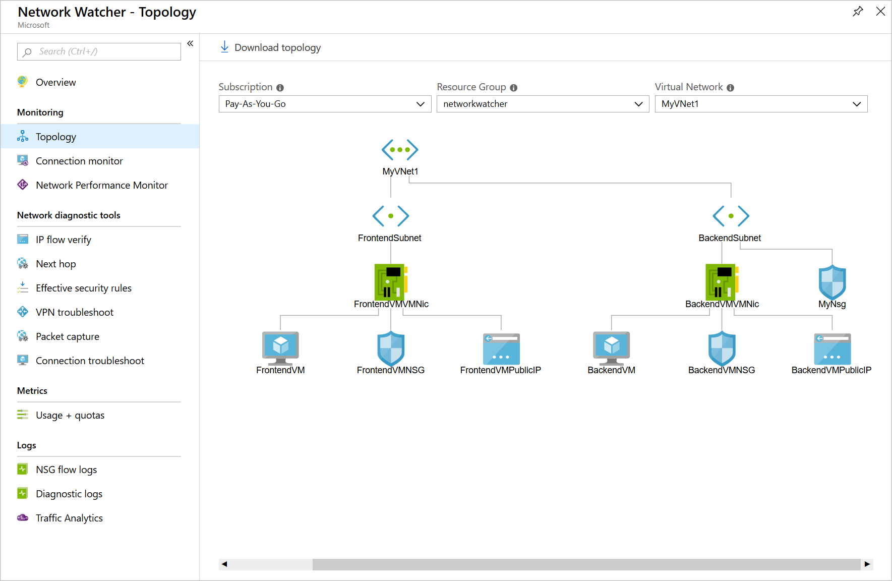
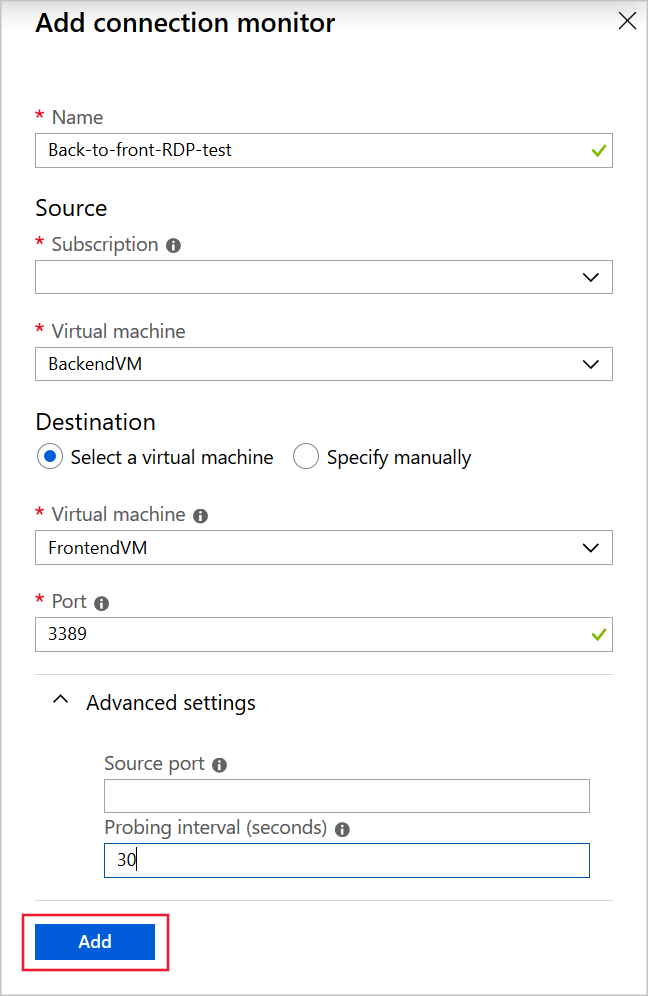
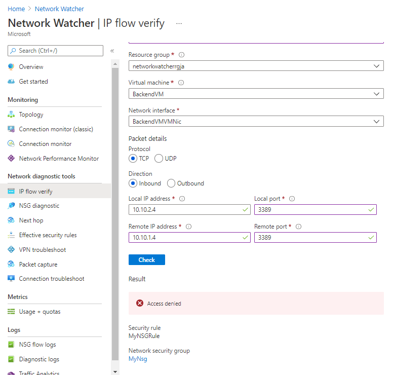

Azure Network Watcher helps you diagnose configuration errors that prevent virtual machines (VMs) from communicating.

Suppose you have two VMs that can't communicate. You want to diagnose the problem and resolve it as fast as possible. You want to use Network Watcher to do that.

Here, you'll troubleshoot connectivity between two VMs in different subnets.

[!include[](../../../includes/azure-exercise-subscription-prerequisite.md)]

## Configure a virtual network and VMs

Let's start by creating the problematic infrastructure, which includes a configuration error:

1. In your browser, open the [Azure Cloud Shell](https://shell.azure.com/?azure-portal=true), and log in to the directory with access to the subscription you want to create resources in.

1. To create a variable to store your resource group name, and a resource group for your resources, in the Bash Cloud Shell, run the following command. Replace `<resource group name>` with a name for your resource group, and `<location>` with the Azure region you'd like to deploy your resources in.

    ```azurecli
    RG=<resource group name>

    az group create --name $RG --location <location>
    ```

1. To create the virtual network **MyVNet1** and the subnet **FrontendSubnet**, in Azure Cloud Shell, run this command.

    ```azurecli
    az network vnet create \
        --resource-group $RG \
        --name MyVNet1 \
        --address-prefix 10.10.0.0/16 \
        --subnet-name FrontendSubnet \
        --subnet-prefix 10.10.1.0/24
    ```

1. To create the subnet called **BackendSubnet**, run this command.

    ```azurecli
    az network vnet subnet create \
        --address-prefixes 10.10.2.0/24 \
        --name BackendSubnet \
        --resource-group $RG \
        --vnet-name MyVNet1
    ```

    > [!NOTE]
    > If you get an error, "partofthepassword: event not found; create a new password and avoid ! marks.

1. To deploy a VM in **FrontendSubnet**, run this command. Replace `<password>` with a complex password of your choice.

    ```azurecli
    az vm create \
        --resource-group $RG \
        --name FrontendVM \
        --vnet-name MyVNet1 \
        --subnet FrontendSubnet \
        --image Win2019Datacenter \
        --admin-username azureuser \
        --admin-password <password>
    ```

1. To install IIS on **FrontendVM**, run this command.

    ```azurecli
    az vm extension set \
        --publisher Microsoft.Compute \
        --name CustomScriptExtension \
        --vm-name FrontendVM \
        --resource-group $RG \
        --settings '{"commandToExecute":"powershell.exe Install-WindowsFeature -Name Web-Server"}' \
        --no-wait
    ```

1. To deploy a virtual machine in **BackendSubnet**, run this command. Replace `<password>` with a complex password of your choice.

    ```azurecli
    az vm create \
        --resource-group $RG \
        --name BackendVM \
        --vnet-name MyVNet1 \
        --subnet BackendSubnet \
        --image Win2019Datacenter \
        --admin-username azureuser \
        --admin-password <password>
    ```

1. To install IIS on **BackendVM**, run this command.

    ```azurecli
    az vm extension set \
        --publisher Microsoft.Compute \
        --name CustomScriptExtension \
        --vm-name BackendVM \
        --resource-group $RG \
        --settings '{"commandToExecute":"powershell.exe Install-WindowsFeature -Name Web-Server"}' \
        --no-wait
    ```

1. To create a network security group (NSG), run this command.

    ```azurecli
    az network nsg create \
        --name MyNsg \
        --resource-group $RG
    ```

1. To create an NSG **configuration mistake that prevents communication** between the VMs, run this command.

    ```azurecli
    az network nsg rule create \
        --resource-group $RG \
        --name MyNSGRule \
        --nsg-name MyNsg \
        --priority 4096 \
        --source-address-prefixes '*' \
        --source-port-ranges '*' \
        --destination-address-prefixes '*' \
        --destination-port-ranges 80 443 3389 \
        --access Deny \
        --protocol TCP \
        --direction Inbound \
        --description "Deny from specific IP address ranges on 80, 443 and 3389."
    ```

1. To associate a network security group with a subnet, run this command.

    ```azurecli
    az network vnet subnet update \
        --resource-group $RG \
        --name BackendSubnet \
        --vnet-name MyVNet1 \
        --network-security-group MyNsg
    ```

## Enable Network Watcher for your region

Now, to set up Network Watcher in the same region as the infrastructure, let's use the Azure CLI.

To enable Network Watcher, run this command.

```azurecli
az network watcher configure \
    --locations "" (*Match the creation of the resource group*) \
    --enabled true \
    --resource-group $RG
```

## Use Network Watcher to show the topology

Now, you can use Network Watcher to troubleshoot connectivity between two VMs in different subnets. Your colleague has reported a connectivity issue over HTTP/HTTPS and the RDP protocol between the two VMs. First, investigate the network topology:

1. Sign in to the [Azure portal](https://portal.azure.com?azure-portal=true).

1. On the Azure portal menu, select **All services**. Then, search for **Network Watcher**. The **Network Watcher** page appears.

1. In the left nav bar, in the **Monitoring** section, select **Topology**.

1. In the dropdowns, select the **Subscription** and **Resource Group**. Network Watcher displays your network topology:

    [](../media/3-network-topology-expanded-1.png#lightbox)

## Use Connection Monitor to run tests from the back end to the front end

The topology appears to be correct. To get more information, let's set up some tests in Connection Monitor. Start by creating two tests from the back end VM to the front end VM:

1. Under **Monitoring**, select **Connection Monitor**, and then select **+ Create**. The **Create Connection Monitor** page appears.

1. Configure Connection Monitor with these values, and then select **Add**.

    | Setting | Value |
    | --- | --- |
    | Name | Back-to-front-RDP-test |
    | Subscription | Select your subscription |
    | Virtual machine | BackendVM |
    | Destination virtual machine | FrontendVM |
    | Port | 3389 |
    | Probing interval (seconds) | 30 |
    | | |

    

1. Select **+ Add**. Configure a second test with these values, and then select **Add**.

    | Setting | Value |
    | --- | --- |
    | Name | Back-to-front-HTTP-test |
    | Subscription | Select your subscription |
    | Virtual machine | BackendVM |
    | Destination virtual machine | FrontendVM |
    | Port | 80 |
    | Probing interval (seconds) | 30 |
    | | |

1. In the list of tests, select **Back-to-front-RDP-test**, select the ellipsis (**...**), and then select **Start**.

1. Examine the results.

1. In the list of tests, select **Back-to-front-HTTP-test**, select **...**, and then select **Start**.

1. Examine the results.

The results should show that, because the NSG is associated to the back-end subnet, traffic flows without issues from the back-end VM to the front-end VM.

## Use Connection Monitor to run tests from the front end to the back end

Run the same tests in the opposite direction.

1. Under **Monitoring**, select **Connection monitor**, and then select **+ Add**.

1. Configure Connection Monitor with these values, and then select **Add**.

    | Setting | Value |
    | --- | --- |
    | Name | front-to-back-RDP-test |
    | Subscription | Select your subscription |
    | Virtual machine | FrontendVM |
    | Destination virtual machine | BackendVM |
    | Port | 3389 |
    | Probing interval (seconds) | 30 |
    | | |

1. Select **+ Add**. Configure a second test with these values, and then select **Add**.

    | Setting | Value |
    | --- | --- |
    | Name | Front-to-back-HTTP-test |
    | Subscription | Select your subscription |
    | Virtual machine | FrontendVM |
    | Destination virtual machine | BackendVM |
    | Port | 80 |
    | Probing interval (seconds) | 30 |
    | | |

1. In the list of tests, select **Front-to-back-RDP-test**, select **...**, and then select **Start**.

1. Examine the results.

1. In the list of tests, select **Front-to-back-HTTP-test**, select **...**, and then select **Start**.

1. Examine the results.

The results should show that, because the NSG is associated with the back-end subnet, no traffic flows from the front-end VM to the back-end VM.

## Use IP flow verify to test the connection

Let's use the IP flow verify tool to get more information.

1. Under **Network diagnostic tools**, select **IP flow verify**.

1. Configure the test with these values, and then select **Check**.

    | Setting | Value |
    | --- | --- |
    | Subscription | Select your subscription |
    | Resource group | Select your resource group |
    | Virtual machine | BackendVM |
    | Network interface | BackendVMVMNic |
    | Protocol | TCP |
    | Direction | Outbound |
    | Local IP address | 10.10.2.4 |
    | Local port | 3389 |
    | Remote IP | 10.10.1.4 |
    | Remote port | 3389 |
    | | |

    

1. Examine the results. They show that access is denied because of NSG and security rules.

In this exercise, you have successfully used Network Watcher tools to discover the connectivity issue between the two subnets. Communication is allowed one way but blocked the other way because of NSG rules.
