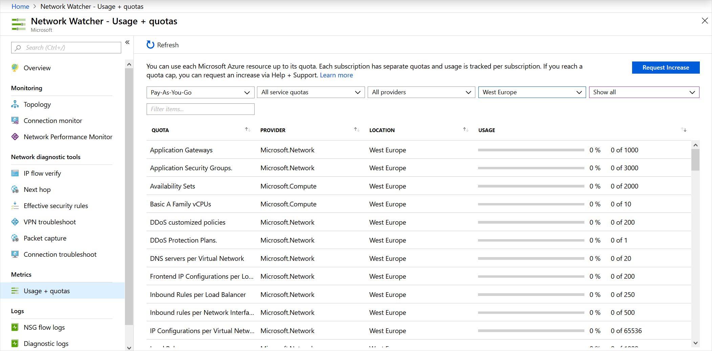

If you want to diagnose a problem quickly, you have to understand the information that's available in the Azure Network Watcher logs.

In your engineering company, you want to minimize the time it takes for your staff to diagnose and resolve any network configuration problem. You want to ensure they know which information is available in which logs.

In this module, you'll focus on flow logs, diagnostic logs, and traffic analytics. You'll learn how these tools can help to troubleshoot the Azure network.

## Usage and quotas

Each Microsoft Azure resource can be used up to its quota. Each subscription has separate quotas, and usage is tracked per subscription. Only one instance of Network Watcher is required per subscription per region. This instance gives you a view of usage and quotas so that you can see if you're at risk of hitting a quota.

To view the usage and quota information, go to **All Services** > **Networking** > **Network Watcher**, and then select **Usage and quotas**. You'll see granular data based on usage and resource location. Data for the following metrics is captured:

- Network interfaces
- Network security groups (NSGs)
- Virtual networks
- Public IP addresses

Here's an example that shows usage and quotas in the portal:

## Logs

Network diagnostic logs provide granular data. You'll use this data to understand connectivity and performance issues better. There are three log display tools in Network Watcher:

- Flow logs
- Diagnostic logs
- Traffic analytics

Let's look at each of these tools.

### Flow logs

In flow logs, you can view information about ingress and egress IP traffic on network security groups. Flow logs show outbound and inbound flows on a per-rule basis, based on the network adapter that the flow applies. NSG flow logs show whether traffic was allowed or denied based on the 5-tuple information captured. This information includes:

- Source IP
- Source port
- Destination IP
- Destination port
- Protocol

This diagram shows the workflow that the NSG follows.

Flow logs store data in a JSON file. It can be difficult to gain insights into this data by manually searching the log files, especially if you have a large infrastructure deployment in Azure. You can solve this problem by using Power BI.

In Power BI, you can visualize NSG flow logs by, for example:

- Top talkers (IP address)
- Flows by direction (inbound and outbound)
- Flows by decision (allowed and denied)
- Flows by destination port

You can also use open source tools to analyze your logs, such as Elastic Stack, Grafana, and Graylog.

> [!NOTE]
> NSG flow logs don't support storage accounts on the Azure classic portal.

### Diagnostic logs

In Network Watcher, diagnostic logs are a central place to enable and disable logs for Azure network resources. These resources might include NSGs, public IPs, load balancers, and app gateways. After you've enabled the logs that interest you, you can use the tools to query and view log entries.

You can import diagnostic logs into Power BI and other tools to analyze them.

### Traffic analytics

To investigate user and app activity across your cloud networks, use traffic analytics.

The tool gives insights into network activity across subscriptions. You can diagnose security threats such as open ports, VMs communicating with known bad networks, and traffic flow patterns. Traffic analytics analyzes NSG flow logs across Azure regions and subscriptions. You can use the data to optimize network performance.

This tool requires Log Analytics. The Log Analytics workspace must exist in a supported region.

## Use case scenarios

Now, let's look at some use case scenarios where Azure Network Watcher metrics and logs can be helpful.

### Customer reports of slow performance

To resolve slow performance, you need to determine the root cause of the problem:

- Is there too much traffic throttling the server?
- Is the VM size appropriate for the job?
- Are the scalability thresholds set appropriately?
- Are any malicious attacks happening?
- Is the VM storage configuration correct?

First, check that the VM size is appropriate for the job. Next, enable Azure Diagnostics on the VM to get more granular data for specific metrics, such as CPU usage and memory usage. To enable VM diagnostics via the portal, go to the **VM**, select **Diagnostics Settings**, and then turn on diagnostics.

Let's assume you have a VM that has been running fine. However, the VM's performance has recently degraded. To identify if you have any resource bottlenecks, you need to review the captured data.

Start with a time range of captured data before, during, and after the reported problem to get an accurate view of performance. These graphs can also be useful for cross-referencing different resource behaviors in the same period. You'll check for:

- CPU bottlenecks
- Memory bottlenecks
- Disk bottlenecks

#### CPU bottlenecks

When you're looking at performance issues, examine trends and understand if they affect your server. To spot trends, from the portal, use the monitoring graphs. You might see different types of patterns on the monitoring graphs:

- **Isolated spikes**. A spike might be related to a scheduled task or an expected event. If you know what this task is, does it run at the required performance level? If the performance is OK, you might not need to increase capacity.
- **Spike up and constant**. A new workload might cause this trend. Enable monitoring in the VM to find out what processes cause the load. The increased consumption might be due to inefficient code or normal consumption. If the consumption is normal, does the process operate at the required performance level?
- **Constant**. Has your VM always been like this? If so, you should identify the processes that consume most resources and consider adding capacity.
- **Steadily increasing**. Do you see a constant increase in consumption? If so, this trend might indicate inefficient code or a process taking on more user workload.

If you do observe high CPU utilization, you can either:

- Increase the size of the VM to scale with more cores.
- Investigate the issue further. Locate the app and process, and troubleshoot accordingly.
 
If you scale up the VM and the CPU is still running at above 95 percent, is this offering better performance or higher app throughput to an acceptable level? If not, troubleshoot that individual app.

#### Memory bottlenecks

You can view the amount of memory that the VM uses. Logs will help you understand the trend and if it maps to the time at which you see issues. You should not have less than 100 MB of available memory at any time. Watch out for the following trends:

- **Spike up and constant consumption**. High memory utilization might not be the cause of bad performance. Some apps, such as relational database engines, are memory intensive by design. But if there are multiple memory-hungry apps, you might see bad performance because memory contention causes trimming and paging to disk. These processes will cause a negative performance impact.
- **Steadily increasing consumption**. This trend might be an app *warming up*. It's common when database engines start up. However, it might also be a sign of a memory leak in an app. 
- **Page or swap file usage**. Check if you're using the Windows page file heavily, or the Linux swap file, located in /dev/sdb.

To resolve high memory utilization, consider these solutions:

- For immediate relief or page file usage, increase the size of the VM to add memory, and then monitor.
- Investigate the issue further. Locate that app or process, and troubleshoot it. If you know the app, see if you can cap the memory allocation.

#### Disk bottlenecks

Network performance might also be related to the storage subsystem of the VM. You can investigate the storage account for the VM in the portal. To identify issues with storage, look at performance metrics from the storage account diagnostics and the VM diagnostics. Look for key trends when the issues occur within a particular time range.

- To check for Azure Storage timeout, use the metrics **ClientTimeOutError**, **ServerTimeOutError**, **AverageE2ELatency**, **AverageServerLatency**, and **TotalRequests**. If you see values in the **TimeOutError** metrics, an I/O operation took too long and timed out. If you see **AverageServerLatency** increase at the same time as **TimeOutErrors**, it might be a platform issue. Raise a case with Microsoft technical support.
- To check for Azure Storage throttling, use the storage account metric **ThrottlingError**. If you see throttling, you're hitting the IOPS limit of the account. You can check this problem by investigating the metric **TotalRequests**.

To remediate high disk utilization and latency issues:

- Optimize VM I/O to scale past virtual hard disk (VHD) limits.
- Increase throughput and reduce latency. If you find that you have a latency-sensitive app and require high throughput, migrate your VHDs to Azure Premium Storage.

#### Virtual machine firewall rules that block traffic

To troubleshoot an NSG flow issue, use the Network Watcher IP flow verify tool and NSG flow logging to determine whether an NSG or User Defined Routing (UDR) is interfering with traffic flow.

Run IP flow verify, and specify the local VM and the remote VM. After you select **Check**, Azure runs a logical test on rules in place. If the result is that access is allowed, use NSG flow logs.

In the portal, go to the NSGs. Under the flow log settings, select **On**. Now try to connect to the VM again. Use Network Watcher traffic analytics to visualize the data. If the result is that access is allowed, there's no NSG rule in the way.

If you've reached this point and still haven't diagnosed the problem, there might be something wrong on the remote VM. Disable the firewall on the remote VM, and then retest connectivity. If you can connect to the remote VM with the firewall disabled, verify the remote firewall settings. Then re-enable the firewall.

#### Inability of the front end and back end subnets to communicate

By default, all subnets can communicate in Azure. If two VMs on two subnets can't communicate, there must be a configuration that's blocking communication. Before you check the flow logs, run the IP flow verify tool from the front end VM to the back end VM. This tool runs a logical test on the rules on the network.

If the result is an NSG on the back end subnet blocking all communication, reconfigure that NSG. For security purposes, you must block some communication with the front end because the front end is exposed to the public internet.

By blocking communication to the back end, you limit the amount of exposure in the event of a malware or security attack. However, if the NSG blocks everything, then it's incorrectly configured. Enable the specific protocols and ports that are required.
