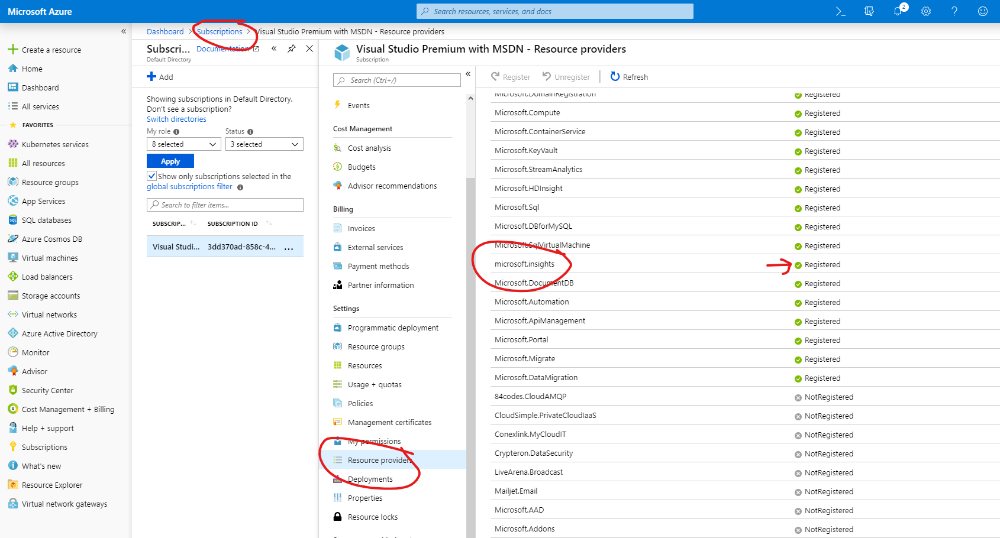
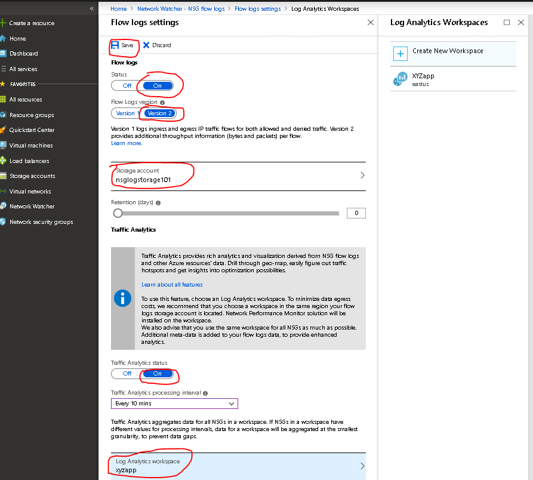

5. **Exercise - Troubleshoot networking using Network Watcher metrics and logs**

In this module, you will do an exercise which involves troubleshooting using network watcher metrics and logs. In this exercise, you will use the NSG flow logs to diagnose the connectivity issue between the 2 VMs.

1. There is connectivity issue from the backend subnet to everywhere over ports 80,443 and 3389.
 
1. Register for the Microsoft.Insights provider - NSG flow logging requires Microsoft.Insights provider. To register for the Microsoft.Insights provider, complete the following steps:
    
    - In the top, left corner of portal, select All services. In the Filter box, type Subscriptions. When Subscriptions appear in the search results, select it.
    - From the list of subscriptions, select the subscription you want to enable the Microsoft.Insights provider for.
    - Select Resource providers, under *Settings*.
    - In search bar type in *microsoft.insights*, confirm that the *Status* for the *microsoft.insights* the provider is *Registered*. If the status is *Unregistered*, then select *Register*, to the right of the provider.
      
1. Create storage account - If you don’t have an existing Azure Storage account, you need to create a storage account for the NSG flow logs. Go to *All services* search *Storage Account*  click *add* then fill in the details below
      
    - Subscription - Keep it in the same subscription as your VNET.
    - Resource group - Keep it in the same resource group as your VNET.
    - Storage account Name - nsglogstorage101
    - Location - East US
    - Performence - Standard
    - Account kind - StorageV2
    - Replication - RA-GRS
    - Access tier - Hot

     Once you have filled in all the details hit *review and create*.

1. Create log analytics workspace - To view the NSG flow logs you will use log analytics. To install log analytics 
    
   - Go to *All services* then search for *log analytics*.
   - Create log analytics workspace, use the same subscription, resource groups and location as the virtual network.  

     Once you have filled in all the details hit *ok*.

1. Next step is to enable flow logging, add the storage account and add traffic analytics for your NSGs. In the portal
    

   - Go to Network security groups, chose the *NSG*.
   - Under the monitoring tab for the NSG, click on *NSG flow logs*
   - Chose all NSG groups and turn on the flow logs
   - Add storage account you created(nsglogstorage101)
   - Turn on traffic analytics status and change the interval to 10 mins
   - Add  log analytics workspace you created

    Once you have filled in all the details hit *save*.

1. Now you are ready to generate some network traffic between VMs that will be caught in the flow log. Poke a hole in backend VM NSG and enable RDP inbound access.
    - RDP on to the backend VM and try to remote onto Frontend VM - this will fail after few seconds.
    - Search for "turn on or off windows feature" 
      - Scroll down the list and chose telnet client 
      - Open up command line interface
      - Type telnet *10.10.1.4 80* - after 10-20 seconds you will receive the message "*Could not open connection to the host, on port 80: Connect failed*"
      - Type telnet *10.10.1.4 443* - after 10-20 seconds you will receive the message "*Could not open connection to the host, on port 443: Connect failed*"

1. Diagnose the problem - Use log analytics to view the NSG flow logs. Got to *Network Watcher* then click on *Traffic Analytics*  and add your log analytics workspace. Determine the NSG rule causing the problem. Using log analytics you can display by flows, packets and bytes.
   - Traffic visualization - You can view traffic by inbound, outbound, allowed, blocked, benign and malicious.
   - Traffic distribution - View analytics of traffic flows across host, subnet and VNet.
   - NSG hits - View analytics for NSGs and NSG rules across your environment.
   - Application ports - View analytics for application ports utilized across your environment.

1.  Fix the problem - There is NSG rule that is blocking outbound traffic from the backend subnet to everywhere over the ports 80, 443 and 3389. Remove the NSG rule and configure new rules that enable backend to talk to the frontend inbound and outbound using 80,443 and 1443. NSGs are similar to access control list, NSG work top down. The lower the rule priority, the higher the rule will be in the NSG. Backend subnet should deny all other traffic. Add the rules below to the backend VM NSG.

Outbound security rules
|Priority|Name|Port|Protocol|Source|Destination|Action|
|---|---|---|---|---|---|---|
|200| HTTP-allow | 80 | TCP | 10.10.2.0/24 | 10.10.1.0/24 | Allow |
|210| HTTPS-allow | 443 | TCP | 10.10.2.0/24 | 10.10.1.0/24 | Allow |
|220| SQL-allow | 1443 | TCP | 10.10.2.0/24 | 10.10.1.0/24 | Allow |
|230| Block-all | Any | Any | Any | Any | Deny |

Inbound security rules 
|Priority|Name|Port|Protocol|Source|Destination|Action|
|---|---|---|---|---|---|---|
|200| HTTP-allow | 80 | TCP |  10.10.1.0/24 | 10.10.2.0/24| Allow |
|210| HTTPS-allow | 443 | TCP |  10.10.1.0/24 | 10.10.2.0/24| Allow |
|220| SQL-allow | 1443 | TCP |  10.10.1.0/24 | 10.10.2.0/24 | Allow |
|230|  Block-all | Any | Any | Any | Any | Deny |

