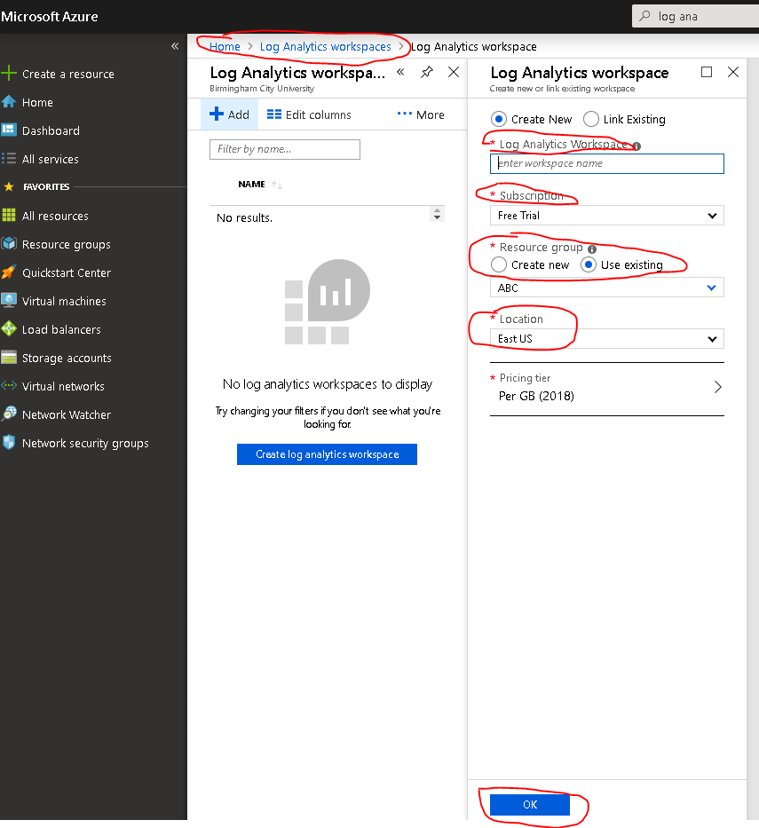

In Network Watcher, metrics and logs can diagnose complexe configuration problems.

Suppose you have two Virtual Machines (VMs) that cannot communicate. You want to obtain as much information as you can to diagnose the problem.

In this unit, you will troubleshoot by using Network Watcher metrics and logs. You will use the NSG flow logs to diagnose the connectivity issue between the two VMs.

## Register the Insights provider

NSG flow logging requires Microsoft.Insights provider. To register for the Microsoft.Insights provider, complete the following steps:

1. Sign in to the [Azure portal](https://portal.azure.com/learn.docs.microsoft.com?azure-portal=true) using the account that you used to activate the sandbox.
1. In the top left corner of portal, click **All services**. In the Filter box, type **Subscriptions**. When **Subscriptions** appears in the search results, click it.
1. Select the **Conciege** subscription, and then under **Settings**, click **Resource providers**.
1. In the search bar, type **microsoft.insights**. 
1. If the status of the **microsoft.insghts** provider is **Unregistered**, then click **Register**.

    

## Create a storage account

Now, create a storage account for the NSG flow logs:

1. In the top left corner of portal, click **Create a resource > Storage > Storage account**.
1. In the **Create storage account** page, fill in these settings:

    | Setting | Value |
    | --- | --- |
    | Subscription | Concierge |
    | Resource group | <rgn>[sandbox resource group name]</rgn> |
    | Storage account name | nsglogstorage1 |
    | Location | East US |
    | Performance | Standard |
    | Account kind | StorageV2 |
    | Replication | Read-access geo-redundant storage |
    | Access tier | Hot |

1. Click **Review + create** and then click **Create**.

    

## Create log analytics workspace

To view the NSG flow logs you will use log analytics. To install log analytics:

1. In the top left corner of portal, click **All services**. In the Filter box, type **Log analytics**. When **Log analytics workspaces** appears in the search results, click it.
1. Click **+ Add**, complete the page with these values, and then click **OK**:

    | Setting | Value |
    | --- | --- |
    | Log Analytics Workspace | testsworkspace |
    | Subscription | Concierge |
    | Resource group | <rgn>[sandbox resource group name]</rgn> |
    | Location | East US |
    | Pricing tier | Per GB |
    | | |

    

## Enable flow logging

To set up flow logging, you must configure the NSG to connect to the storage account, and add traffic analytics for the NSG:

1. In the top left corner of the portal, click **All resources** and then click the **MyNSG** network security group.
1. Under **Monitoring**, click **NSG flow logs**.
1. Click **MyNSG** and then click **On**.
1. Under **Storage account**, click **Configure**, in the **Storage account** drop-down list select the **nslogstorage1** account, and then click **OK**.
1. Under **Traffic Analytics status** click **On**, and then in the **Traffic Analytics processing interval** drop-down list, select **Every 10 mins**.
1. Click **Log Analytics workspace** and then click **testworkspace**.
1. Click **Save**.

1. Now you are ready to generate some network traffic between VMs that will be caught in the flow log. Poke a hole in backend VM NSG and enable RDP inbound access.
    - RDP on to the backend VM and try to remote onto Frontend VM - this will fail after few seconds.
    - Search for "turn on or off windows feature" 
      - Scroll down the list and chose telnet client 
      - Open up command line interface
      - Type telnet *10.10.1.4 80* - after 10-20 seconds you will receive the message "*Could not open connection to the host, on port 80: Connect failed*"
      - Type telnet *10.10.1.4 443* - after 10-20 seconds you will receive the message "*Could not open connection to the host, on port 443: Connect failed*"

1. Diagnose the problem - Use log analytics to view the NSG flow logs. Got to *Network Watcher* then click on *Traffic Analytics*  and add your log analytics workspace. Determine the NSG rule causing the problem. Using log analytics you can display by flows, packets and bytes.
   - Traffic visualization - You can view traffic by inbound, outbound, allowed, blocked, benign and malicious.
   - Traffic distribution - View analytics of traffic flows across host, subnet and VNet.
   - NSG hits - View analytics for NSGs and NSG rules across your environment.
   - Application ports - View analytics for application ports utilized across your environment.

1.  Fix the problem - There is NSG rule that is blocking outbound traffic from the backend subnet to everywhere over the ports 80, 443 and 3389. Remove the NSG rule and configure new rules that enable backend to talk to the frontend inbound and outbound using 80,443 and 1443. NSGs are similar to access control list, NSG work top down. The lower the rule priority, the higher the rule will be in the NSG. Backend subnet should deny all other traffic. Add the rules below to the backend VM NSG.

Outbound security rules
|Priority|Name|Port|Protocol|Source|Destination|Action|
|---|---|---|---|---|---|---|
|200| HTTP-allow | 80 | TCP | 10.10.2.0/24 | 10.10.1.0/24 | Allow |
|210| HTTPS-allow | 443 | TCP | 10.10.2.0/24 | 10.10.1.0/24 | Allow |
|220| SQL-allow | 1443 | TCP | 10.10.2.0/24 | 10.10.1.0/24 | Allow |
|230| Block-all | Any | Any | Any | Any | Deny |

Inbound security rules 
|Priority|Name|Port|Protocol|Source|Destination|Action|
|---|---|---|---|---|---|---|
|200| HTTP-allow | 80 | TCP |  10.10.1.0/24 | 10.10.2.0/24| Allow |
|210| HTTPS-allow | 443 | TCP |  10.10.1.0/24 | 10.10.2.0/24| Allow |
|220| SQL-allow | 1443 | TCP |  10.10.1.0/24 | 10.10.2.0/24 | Allow |
|230|  Block-all | Any | Any | Any | Any | Deny |

