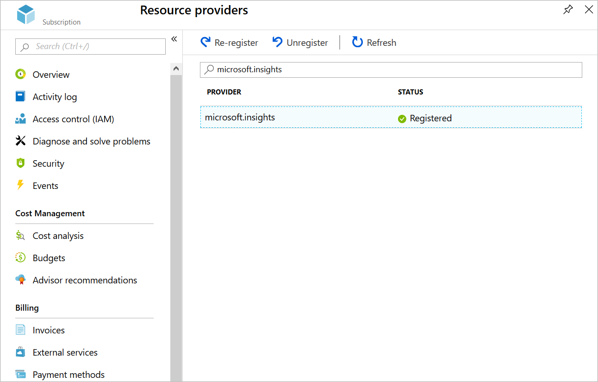

In Azure Network Watcher, metrics and logs can diagnose complex configuration issues.

Suppose you have two virtual machines (VMs) that can't communicate. You want to obtain as much information as you can to diagnose the problem.

In this unit, you'll troubleshoot by using Network Watcher metrics and logs. To diagnose the connectivity issue between the two VMs, you'll then use the network security group (NSG) flow logs.

## Register the Microsoft.Insights provider

NSG flow logging requires the *Microsoft.Insights* provider. to register for that provider, complete the following steps.

1. Sign in to the [Azure portal](https://portal.azure.com?azure-portal=true), and log in to the directory with access to the subscription you created resources in.

1. In the Azure portal, search for and select **Subscriptions**.

1. Select your subscription. Then under **Settings**, select **Resource providers**.

1. In the search bar, enter **microsoft.insights**.

1. If the status of the **microsoft.insights** provider is **Unregistered**, select **Register**.

    

## Create a storage account

Now, create a storage account for the NSG flow logs.

1. On the Azure portal menu or from the **Home** page, select **Create a resource**. Then, select **Storage** > **Storage account**. Select **Create**.

1. On the **Create storage account** page, fill in these settings:

    | Setting | Value |
    | --- | --- |
    | On **Basics** tab, under **Project details** section: |
    | Subscription | Select your subscription |
    | Resource group | Select your resource group |
    | Under **Instance details** section: |
    | Storage account name | Create a unique name |
    | Location | Select the same region as your resource group |
    | Performance | Standard |
    | Account kind | StorageV2 |
    | Replication | Read-access geo-redundant storage |

1. Go to the **Advanced** tab, and fill in this setting:

    | Setting | Value |
    | --- | --- |
    | Under **Blob storage** section: |
    | Blob access tier (default) | Hot |

1. Select **Review + create**, and then select **Create**.

## Create a Log Analytics workspace

To view the NSG flow logs, you'll use Log Analytics.

1. In the Azure portal, search for and select **Log Analytics Workspace**.

1. Select **+ Create**, complete the page with these values, and then select **Review + Create**.

    | Setting | Value |
    | --- | --- |
    | On **Basics** tab, under **Project details** section: |
    | Subscription | Select your subscription |
    | Resource group | Select your resource group |
    | Under **Instance details** section: |
    | Name | testsworkspace |
    | Region | Select the same region as your resource group |

1. Select **Next : Pricing tier**.

    | Setting | Value |
    | --- | --- |
    | On **Pricing tier** tab, under **Pricing tier** section: |
    | Pricing tier | Pay-as-you-go (Per GB) |
    | | |

## Enable flow logs

To set up flow logs, you must configure the NSG to connect to the storage account, and add traffic analytics for the NSG.

1. On the Azure portal menu, select **All resources**. Then, select the **MyNSG** network security group.

1. Under **Monitoring**, select **NSG flow logs**.

1. Select **MyNSG**, and then select **On**.

1. Under **Storage account**, select **Configure**. In the **Storage account** dropdown, select the storage account you created earlier. Then, select **OK**.

1. Under **Traffic Analytics status**, select **On**. In the **Traffic Analytics processing interval** dropdown, select **Every 10 mins**.

1. Select **Log Analytics workspace**, and then select **testworkspace**.

1. Select **Save**.

## Generate test traffic

Now, you're ready to generate some network traffic between VMs to catch in the flow log.

1. On the Azure portal menu, select **All resources**, select **FrontendVM**, and then select **Connect**.

1. Select **Download RDP File**, and then select **OK**. If you see a warning about the publisher of the remote connection, select **Connect**.

1. Sign in with the username **azureuser** and the password you specified when you created the VM, and then select **Yes**.

1. Open a PowerShell prompt, and then run this command.

    ```PowerShell
    Test-NetConnection 10.10.2.4 -port 80
    ```

The connection test fails after a few seconds.

## Diagnose the problem

Now, let's use log analytics to view the NSG flow logs.

1. On the [Azure portal](https://portal.azure.com/learn.docs.microsoft.com?azure-portal=true) menu, select **All services**. Then, select **Networking** > **Network Watcher**.

1. Under **Logs**, select **Traffic Analytics**.

1. In the **Log Analytics workspace** dropdown, select **testworkspace**.

1. Use the different views to diagnose the problem that prevents communication from the front end VM to the back end VM.

## Fix the problem

An NSG rule is blocking inbound traffic to the back end subnet from everywhere over the ports 80, 443, and 3389 instead of just blocking inbound traffic from the Internet. Let's reconfigure that rule now.

1. On the Azure portal menu, select **All resources**, and then select **MyNsg**.

1. Under **Settings**, select **Inbound security rules**, and then select **MyNSGRule**.

1. Change **Source** to be **Service Tag**, and configure **Source service tag** to be **Internet**.

1. Select **Save**.

## Retest the connection

Connections on port 80 should now work without problems.

1. In the RDP client, connect to **FrontendVM**. At the PowerShell prompt, run this command.

    ```PowerShell
    Test-NetConnection 10.10.2.4 -port 80
    ```

The connection test should now succeed.
