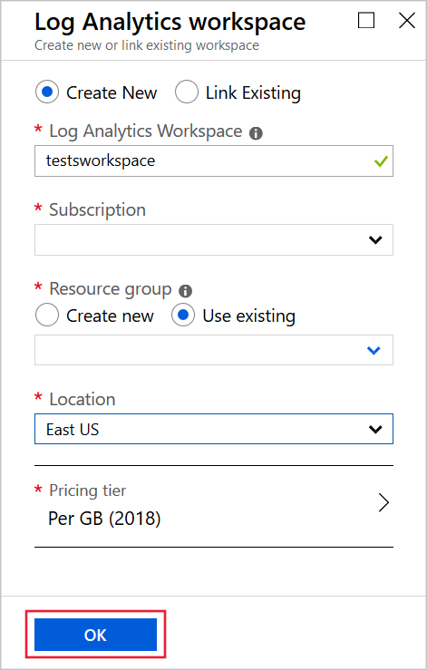

In Azure Network Watcher, metrics and logs can diagnose complex configuration problems.

Suppose you have two virtual machines (VMs) that can't communicate. You want to obtain as much information as you can to diagnose the problem.

In this unit, you'll troubleshoot by using Network Watcher metrics and logs. You'll then use the network security group (NSG) flow logs to diagnose the connectivity issue between the two VMs.

## Register the Microsoft.Insights provider

NSG flow logging requires the *Microsoft.Insights* provider. Complete the following steps to register for that provider:

1. Sign in to the [Azure portal](https://portal.azure.com/learn.docs.microsoft.com?azure-portal=true) by using the account that you used to activate the sandbox.

1. In the upper-left corner of the portal, select **All services**. In the **Filter** box, enter **Subscriptions**. When **Subscriptions** appears in the search results, select it.

1. Select the **Concierge** subscription. Then under **Settings**, select **Resource providers**.

1. In the search bar, enter **microsoft.insights**.

1. If the status of the **microsoft.insights** provider is **Unregistered**, select **Register**.

    

## Create a storage account

Now, create a storage account for the NSG flow logs:

1. In the upper-left corner of portal, select **Create a resource** > **Storage** > **Storage account**.

1. On the **Create storage account** page, fill in these settings:

    | Setting | Value |
    | --- | --- |
    | Subscription | Concierge |
    | Resource group | <rgn>[sandbox resource group name]</rgn> |
    | Storage account name | nsglogstorage1 |
    | Location | East US |
    | Performance | Standard |
    | Account kind | StorageV2 |
    | Replication | Read-access geo-redundant storage |
    | Access tier | Hot |
    
1. Select **Review + create**, and then select **Create**.

    

## Create a Log Analytics workspace

To view the NSG flow logs, you'll use Log Analytics. To install Log Analytics:

1. In the upper-left corner of the portal, select **All services**. In the **Filter** box, enter **Log analytics**. When **Log analytics workspaces** appears in the search results, select it.
1. Select **+ Add**, complete the page with these values, and then select **OK**:

    | Setting | Value |
    | --- | --- |
    | Log Analytics Workspace | testsworkspace |
    | Subscription | Concierge |
    | Resource group | <rgn>[sandbox resource group name]</rgn> |
    | Location | East US |
    | Pricing tier | Per GB |
    | | |

    

## Enable flow logs

To set up flow logs, you must configure the NSG to connect to the storage account, and add traffic analytics for the NSG:

1. In the upper-left corner of the portal, select **All resources**. Then select the **MyNSG** network security group.

1. Under **Monitoring**, select **NSG flow logs**.

1. Select **MyNSG**, and then select **On**.

1. Under **Storage account**, select **Configure**. In the **Storage account** drop-down list, select the **nslogstorage1** account. Then select **OK**.

1. Under **Traffic Analytics status**, select **On**. Then in the **Traffic Analytics processing interval** drop-down list, select **Every 10 mins**.

1. Select **Log Analytics workspace**, and then select **testworkspace**.

1. Select **Save**.

## Install Telnet on the front-end VM

You'll use the Telnet client to test connections between the VMs. Let's install that client now:

1. In the upper-left corner of the portal, select **All resources**, select **FrontendVM**, and then select **Connect**.

1. Select **Download RDP File**, and then select **OK**. If you see a warning about the publisher of the remote connection, select **Connect**.

1. Sign in with the username **azureuser** and the password **Demouser@123**, and then select **Yes**.

1. Select the **Start** button, enter **Windows features**, and then select **Turn Windows features on or off**.

1. In the **Add Roles and Features** wizard, select **Next** four times to advance to the **Features** page.

1. Select **Telnet Client**, select **Next**, and then select **Install**.

1. When the installation is complete, select **Close**.

## Generate test traffic

Now you're ready to generate some network traffic between VMs to catch in the flow log:

1. Open a command prompt, and then run this command:

    ```cmd
        telnet 10.10.2.4 80
    ```

1. Run this command:

    ```cmd
        telnet 10.10.2.4 443
    ```

Both connections fail after a few seconds.

## Diagnose the problem

Now, let's use log analytics to view the NSG flow logs:

1. In the [Azure portal](https://portal.azure.com/learn.docs.microsoft.com?azure-portal=true), select **All services**, enter **Network Watcher**, and then select the **Network Watcher** resource.

1. Under **Logs**, select **Traffic Analytics**.

1. In the **Log Analytics workspace** drop-down list, select **testworkspace**.

1. Use the different views to diagnose the problem that prevents communication from the front-end VM to the back-end VM.

## Fix the problem

An NSG rule is blocking outbound traffic from the back-end subnet to everywhere over the ports 80, 443, and 3389. Let's reconfigure that rule now:

1. Select **All resources**, and then select **MyVNet1**.

1. Under **Settings**, select **Subnets**, and then select **BackendSubnet**.

1. Select **Network security group**, select **None**, and then select **Save**.

## Retest the connection

Connections on ports 80 and 443 should now work without problems:

1. In the RDP client, connect to **FrontendVM**. At the command prompt, run this command:

    ```cmd
        telnet 10.10.2.4 80
    ```

1. Run this command:

    ```cmd
        telnet 10.10.2.4 443
    ```

*Both* connections should now work.
