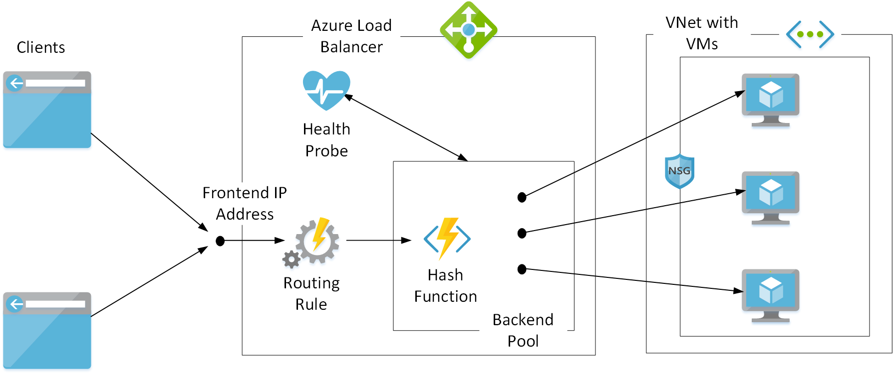

Azure Load Balancer operates at the transport layer of the network stack. Load Balancer advertises a single public IP address to which all clients connect. Load Balancer then uses its own routing and address translation rules to direct incoming TCP requests to one of a set of outbound addresses. Typically, each outbound address is associated with a different virtual machine (VM), each running an instance of your application.

Load Balancer uses a health probe to determine the availability of each VM that's referenced by addresses in the back-end pool. Load Balancer only sends requests to VMs that indicate they're healthy.

In the example scenario, you've gotten alerts indicating that Load Balancer can't direct requests to VMs in the back-end pool. You suspect a recent change in network configuration might be causing the problem. But you need to understand how network changes affect the operation of Load Balancer.

By the end of this unit, you'll be able to:

- Describe a typical configuration of Load Balancer, and the components involved in routing requests to VMs.
- Explain common problems that can cause Load Balancer to fail to distribute requests to VMs.

## How does Load Balancer work?

Azure Load Balancer includes a number of components:

- A front-end IP address
- A back-end pool of VM addresses
- One or more routing rules
- A health probe
- A collection of VMs, typically in a virtual network

The diagram shows how the various elements used by Load Balancer operate together.

### Front-end IP address and back-end pool

Load Balancer provides a transparent, end-to-end connection from a client to an application that runs on a collection of VMs. Load Balancer stores the IP addresses of these VMs in a repository commonly referred to as a *back-end pool*. Load Balancer exposes its own *front-end* IP address to clients. When a client sends a request to this address, Load Balancer selects the IP address of a VM from the back-end pool. Load Balancer then routes the request through this back-end IP address to the VM.

The client isn't aware of Load Balancer. The client sees an IP address or DNS name and sends requests to this destination. This process is the same as if the client was communicating directly with the VM. When the request arrives on the VM, the address of the original client is preserved.

Additionally, the payload of messages sent from the client to the VM are opaque to Load Balancer. Load Balancer doesn't examine the contents of any messages or manipulate them. It readdresses messages so that they're sent to the selected VM.

Load Balancer selects the IP address of a VM from the back-end pool by using an algorithm designed to distribute requests evenly. Load Balancer generates a hash by using the following information:

- Source IP and port address of the client
- Destination IP address and port
- Network protocol

The hashed value is used as a key to a table that holds the IP addresses in the back-end pool.

### Scalability

You can start additional VM instances and add their IP addresses to the back-end pool at any time. Load Balancer includes these new instances when it distributes user requests.

Load Balancer can expose more than one public front-end IP address, and might have multiple back-end pools. This scheme enables you to reuse the same instance of Load Balancer to handle requests for different systems.

### Routing rules

You define load-balancing rules to specify how requests directed toward each front-end IP address are mapped to a back-end pool. A load-balancing rule also specifies the protocol to match against, and optionally the source (client) and destination ports. Incoming requests arriving on a front-end IP address that don't match the protocol and port requirements are discarded by Load Balancer. A load-balancing rule can also configure session persistence so that a given client is likely to have its requests routed to the same VM. In this way, applications running on a VM take advantage of caching to hold session-specific information.

### Health probes

Load Balancer needs to determine whether each VM referenced by the back-end pool is available for handling requests. You add a health probe to do this. A health probe sends regular *ping* messages to a port that you specify for the VMs in the back-end pool. You provide a service on the VMs that responds to these ping messages, with an HTTP 200 (OK) message.

When the VM fails to respond after a specified number of attempts, Load Balancer assumes it's unhealthy and removes it from the list of VMs that can accept user requests. The workload is then distributed among the remaining healthy VMs. Load Balancer continues to ping an unresponsive VM. If the VM starts to reply, it's added back into the list of healthy VMs and starts receiving user requests again.

If you don't provide a health probe, Load Balancer doesn't know whether a VM is healthy. Instead, it assumes that all VMs are responsive.

### Virtual network

The VMs referenced by the back-end pool are typically in a virtual network subnet, hosted by Azure. You protect the VMs in this network by configuring a network security group (NSG). An NSG implements inbound and outbound security rules that can limit the traffic entering and exiting the virtual network to a set of well-defined endpoints.

For example, the VMs in the back-end pool of Load Balancer typically allow inbound traffic on port 80 (HTTP) and port 443 (HTTPS) that arrives from outside the virtual network. But VMs might block traffic that appears on other ports.

## Symptoms and causes of failure with Load Balancer

Problems arise when Load Balancer loses connectivity with one or more VMs in the back-end pool. Typical symptoms include:

- The application is unreachable.
- The VMs running the application are unreachable.
- Response times are slow.
- User requests are timing out.

There can be many reasons for these failures. They're most commonly associated with probing issues and data path issues.

### Probing issues

Probing issues result when one or more VMs in the back-end pool fail to respond to health probe requests. These issues could be a result of:

- An incorrect probe configuration, such as the wrong URL or port.
- A VM that fails to respond to the probe because the required port isn't open.

### Data path issues

Data path issues occur when a Load Balancer is unable to route a client request to the application that runs on a VM in the back-end pool. Possible causes include:

- A network security group rule or firewall is blocking the ports or IP addresses used by the application.
- A VM is down or not responding. The VM might be turned off or failing, or there's a security issue such as an expired certificate on the server.
- The application isn't responding. The VMs might be overloaded, the application is listening on an incorrect port, or the application is crashing.
