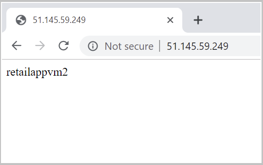
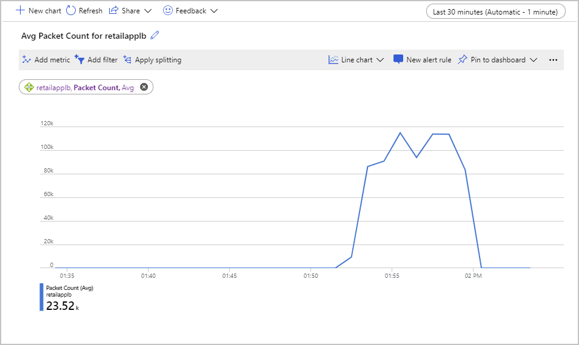

In our scenario, a change has been made to the network configuration. You've started to receive alerts informing you that virtual machines in the back-end pool aren't responding to health probes. Now you need to diagnose the cause of these failures and fix them.

In this exercise, you'll set up a pre-configured environment that's reporting health probe failures. You'll use the skills learned in this module to return the load-balanced HTTP service back to full operation.

This exercise is optional. To complete it, you need access to an Azure subscription where you can create Azure resources. If you don't have an Azure subscription, create a [free account](https://azure.microsoft.com/free/?azure-portal=true) before you begin.

## Set up your environment

1. Sign in to the [Azure portal](https://portal.azure.com?azure-portal=true).
1. Select **Cloud Shell** from the top right-hand side menu bar.
1. Select **Bash**.
1. Run the following command to download the scripts you'll use for this exercise.

    ```bash
    git clone https://github.com/MicrosoftDocs/mslearn-troubleshoot-inbound-network-connectivity-azure-load-balancer load-balancer
    ```

1. Go to the **load-balancer/src/scripts** folder:

    ```bash
    cd ~/load-balancer/src/scripts
    ```

1. Run the following command to set the user name for the VMs. You can change the user name to something different. You'll need the user name later in this exercise so make a note of what you use.

    ```bash
    export = USERNAME=azureuser
    ```

1. Run the following command to create a password for the virtual machines created by the scripts. The password is stored in a variable, and also recorded in the text file passwd.txt in case you need it later.

    ```bash
    export PASSWORD=$(openssl rand -base64 32)
    echo $PASSWORD > passwd.txt
    ```
1. Set the resource group name.
    ```bash
    export RESOURCEGROUP=learn-ts-loadbalancer-rg
    ```
1. Set the location. Replace the eastus value with a location near you.
    ```bash
    export LOCATION=eastus
    ```
    The following list has some location values you can use.

    [!include[](../../../includes/azure-sandbox-regions-note.md)]
1. Run the following command to create a resource group.
    ```bash
    az group create --name $RESOURCEGROUP --location $LOCATION
    ```
1. Run the following command to create the load balancer, virtual machines, and virtual network.

    ```bash
    bash setup.sh $RESOURCEGROUP
    ```

    This script takes up to 25 minutes to run.

### Check resources created

1. In the Azure portal, search for **Resource groups**.
1. Select **learn-ts-loadbalancer-rg**.

1. The resource group should contain the following resources:

    | Resource Name  | Resource Type  | Description |
    |---|---|---|
    | **retailappvm1_disk1_xxx** and **retailappvm1_disk1_xxx** | Disk | Virtual hard disks for the two VMs |
    | **retailapplb** | Load balancer | Load balancer for the app running on the VMs. The back-end pool in the load balancer references the **retailappvm1** and **retailappvm2** virtual machines. |
    | **nicvm1** and **nicvm2** | Network interface | Network interfaces for the two VMs |
    | **retailappnicvm1nsg**, and **retailappnicvm2nsg** | Network security group | NSGs that control the traffic entering each VM |
    | **retailappnsg** | Network security group | Acts as an initial filter for both virtual machines, but the NSG for each virtual machine provides the ability to filter traffic on a per-machine basis. |
    | **retailappip** | Public IP address | Public IP address that provides front-end access to the load balancer. |
    | **retailappvm1** and **retailappvm2** | Virtual machine | VMs running the retail application |
    | **retailappvmjumpbox** | Virtual machine | VM that is also in the virtual network, but has a pubic IP address. An administrator can sign in to this virtual machine to access the **retailappvm1** and **retailappvm2** VMs, which only have private IP addresses. |
    | **retailappvnet** | Virtual network | Virtual network for the VMs |


1. Select the **retailapplb** load balancer.
1. Under **Settings**, select **Load balancing rules**.
1. Select **retailapprule**. The load balancer is configured to route traffic that arrives on port 80 at the front-end address to port 80 on machines in the back-end pool.

1. Close the **retailapprule** page.

1. Under **Settings**, select **Health probes**.
1. Select **retailapphealthprobe**. The health probe for the back-end pool also sends messages to port 80 to check that the application is available on each virtual machine.

1. Close the **retailapphealthprobe** page.
  
## Test the load balancer

1. Return to the Cloud Shell.

1. Run the following command to find the public IP address of the load balancer front end:

    ```bash
    bash findip.sh
    ```

1. Open a browser window, and navigate to this IP address. The result should be a page with the message **retailappvm1** or **retailappvm2**, depending on how Load Balancer has routed the request.

    > [!div class="mx-imgBorder"]
    > 

1. In the Cloud Shell, run the following command to go to the **src/stresstest** folder:

    ```bash
    cd ~/load-balancer/src/stresstest
    ```

    This folder contains a .NET Core application that simulates hundreds of concurrent users sending requests through Load Balancer to the virtual machines.

1. Run the following command to start the application. Replace \<*ip address*\> with the front-end IP address of the load balancer.

    ```bash
    dotnet run <ip address>
    ```

    The application should respond with a series of messages that indicate whether a response was received from *retailappvm1* or *retailappvm2*.
    
1. Allow the application to run for five minutes. Press Enter to stop the application.

## Create charts to monitor metrics

1.  In the Azure portal, and go to the resource group **learn-ts-loadbalancer-rg**.

1. Select the **retailapplb** load balancer.

1. Under **Monitoring**, select **Metrics**.

1. Add the following metric to the empty chart:

    | Property  | Value  |
    |---|---|
    | Scope | retailapplb |
    | Metric Namespace | Load balancer standard metrics  |
    | Metric | Packet Count |
    | Aggregation | Avg |

1. At the top of the page, set the time range to **Last 30 minutes**. The chart should look similar to the one shown below. Note the peak value of the average packet count.

    > [!div class="mx-imgBorder"]
    > 

1. Select **Pin to dashboard** > **Pin to current dashboard**. If you don't have a dashboard, create a new one.

1. Select **+ New Chart**, and add the following metric:

    | Property  | Value  |
    |---|---|
    | Scope | retailapplb |
    | Metric Namespace | Load balancer standard metrics  |
    | Metric | Health Probe Status |
    | Aggregation | Avg |

1. Select **Add metric**, and add another metric to the chart with the following settings:

    | Property  | Value  |
    |---|---|
    | Scope | retailapplb |
    | Metric Namespace | Load balancer standard metrics  |
    | Metric | Data Path Availability |
    | Aggregation | Avg |

1. Set the time range to **Last 30 minutes**. The chart should report both statistics at 100 percent.

1. Select **Pin to dashboard** > **Pin to current dashboard**.

You now have a baseline set of metrics for the system when it's running correctly.

## Reconfigure load balancer and retest

1. In the Cloud Shell, go to the **src/scripts** folder.

    ```bash
    cd ~/load-balancer/src/scripts
    ```

1. Run the following command to reconfigure the load balancer, network, and virtual machines. This script introduces some problems that you'll later diagnose and correct.

    ```bash
    bash reconfigure.sh
    ```

1. Run the following commands to move to the **src/stresstest** folder:

    ```bash
    cd ~/load-balancer/src/stresstest
    ```
1. Run the stress test again where you replace <*ip address*> with the IP address of the load balancer. If you can't remember this address, run the **src/scripts/findip.sh** script again.

    ```bash
    dotnet run <ip address>
    ```

    This time, the app won't generate any output, and might eventually time out with the message *Error sending request to Load Balancer: The operation was canceled*. Press Enter to stop the application.

1. In the Azure portal, select **Dashboard**.
1. Review the dashboard that shows the health probe status and data path availability. You may need to change the time range to the past 30 minutes. It should look like the following chart, with both metrics dropped to zero:

    > [!div class="mx-imgBorder"]
    > 

    This chart shows that the virtual machines aren't responding to health probe requests from the load balancer. So they've been marked as unhealthy. There's no data path available between a client and the application running on these virtual machines.

## Diagnose and fix issues

The first step is to check that the virtual machines are running. Let's resolve issues one virtual machine at a time. So let's look at *appretailvm1* first. You'll examine *appretailvm2* later.

### Test the *appretailvm1* virtual machine

You can't ping the *appretailvm1* or *appretailvm2* virtual machines directly because they have private addresses that are only available to other virtual machines on the same subnet. First you connect to the jump box, which has a public IP address and is in the same subnet. Then you can ping the virtual machines from there.

1. Return to the Cloud Shell.

1. Run the following commands to get the IP address of the jump box virtual machine:

    ```bash
    bash ~/load-balancer/src/scripts/jumpboxip.sh
    ```

1. Run the following command to get password that you created when you ran the initial setup script. Copy this password for the next step.

    ```bash
    echo $PASSWORD
    ```
 
1. Sign in to the jump box. Replace "azureuser" if you used a different user name. 

    ```bash
    ssh azureuser@<jumpbox ip address>
    ```

1. On the jump box, run the following command to test whether the **retailappvm1** virtual machine is running:

    ```bash
    ping retailappvm1 -c 10
    ```

    The retailappvm1 virtual machine should respond, indicating that it's running. The next step is to establish whether the web app is running on this virtual machine.

1. Run the following command to send an HTTP GET request to the retailappvm1 virtual machine:

    ```bash
    wget retailappvm1
    ```

    Again, this command should be successful. You can examine the page returned with the following command:

    ```bash
    cat index.html
    ```

    The file will contain the text **retailappvm1**; this is the response from the web app running on that virtual machine.

1. Delete the *index.html* file:

    ```bash
    rm index.html
    ```

### Check health probes and routing rules

The *retailappvm1* virtual machine is up, and the application is running on that virtual machine. There must be a problem between the load balancer and the virtual machines in the back-end pool.

1. In the Azure portal, search for **Monitor**.
1. On the **Monitor - Overview** page, select **Service Health**.

    > [!div class="mx-imgBorder"]
    > 

1. Select **Resource Health**. 
1. In the **Resource type** box, select **Load balancer**, and in the list of resources, select **retailapplb**.

    > [!div class="mx-imgBorder"]
    > 

1. Wait a few minutes for the load balancer health to be evaluated.
1. Under **Health history**, expand the topmost event, and review the recommended steps. These steps suggest checking the VIP (routing rule) and DIP (health probe) endpoints in the load balancer.

    > [!div class="mx-imgBorder"]
    > 

1. Go to the resource group **learn-ts-loadbalancer-rg**, and select **retailapplb**.

1. Select **Load balancing rules** > **retailapprule**. This rule receives Tcp traffic on port 80 of the front-end IP address, and sends it to port 80 on the selected virtual machine in the back-end pool. This configuration appears to be correct, although the port used by the health probe looks suspicious. It's currently set to port 85.

    > [!div class="mx-imgBorder"]
    > 

1. Close the **retailapprule** page.

1. Select **Health probes** > **retailapphealthprobe**. 
1. Change the **Port** from 85 back to 80, and then select **Save**.

    > [!div class="mx-imgBorder"]
    > 

1. Wait for a minute.
1. Select **Dashboard** in the menu on the left of the Azure portal. 

1. On the dashboard, select the chart showing the Health Probe Status and Data Path Availability metrics. The **Data Path Availability** metric should rise to 100, but the **Health Probe Status** metric will hover around 50. There's now a path available from the load balancer to at least one virtual machine, but only 50 percent of the virtual machines are showing as healthy.

    > [!div class="mx-imgBorder"]
    > 

    Select the chart to go to the metrics page for Load Balancer. This page enables you to refresh the chart, and zoom in on a specific time period.

1. In the Cloud Shell, run the following command to leave the jump box.

    ```bash
    exit
    ```

1. Run the stress test application again using the load balancer's IP address:

    ```bash
    cd ~/load-balancer/src/stresstest
    dotnet run <ip address>
    ```

    As before, the test still fails. There's now a path from the load balancer to at least one virtual machine, but this path doesn't work from a client running outside of the virtual network. Press Enter to stop the stress test app.

### Check NSG rules for the subnet

The problem might be caused by a network security rule blocking external traffic.

1. In the Azure portal, go to the resource group **learn-ts-loadbalancer-rg**.

1. Select the **retailappnsg** network security group. This security group determines which traffic is allowed through the virtual network.

1. Select **Inbound security rules**. Although there's a rule that allows incoming traffic from the load balancer running in the virtual network, there's no rule that permits traffic originating from outside the virtual network through port 80.

1. Select **+ Add**.
1. Enter the following settings, and then select **Add**:

    | Property  | Value  |
    |---|---|
    | Source | Any |
    | Source port ranges | \*  |
    | Destination | Any |
    | Destination port ranges | 80 |
    | Protocol | Tcp |
    | Action | Allow |
    | Priority | 100 |
    | Name | Port_80 |
    | Description | HTTP port |

1. In the Cloud Shell, run the stress test application again using the load balancer's IP address:

    ```bash
    cd ~/load-balancer/src/stresstest
    dotnet run <ip address>
    ```

    The application now runs, but you only get a response from the *retailappvm1* virtual machine. Allow the application to run for two or three minutes, and then press Enter to stop it.

1. In the Azure portal, go to the dashboard.
1. Select the chart for the average Packet Count metric. Note the peak value for the latest run of the stress test application. This value should be at least double that of the value recorded earlier when both virtual machines were available. Although you now have a functioning system, you're in danger of overloading the working virtual machine.

### Test the *appretailvm2** virtual machine

It seems that the *appretailvm2* virtual machine might not be handling requests properly. You need to check whether this virtual machine is up, and whether Load Balancer can connect to it.

1. In the Cloud Shell, sign in to the jump box again:

    ```bash
    ssh azureuser@<jump box ip address>
    ```

1. Try to ping the *appretailvm2* virtual machine:

    ```bash
    ping retailappvm2 -c 10
    ```

    The virtual machine fails to respond and the ping command reports 100 percent packet loss. Either the *retailappvm2* virtual machine isn't running, or there's a network problem.

1. In the Azure portal, go to the resource group **learn-ts-loadbalancer-rg**.

1. Select the **retailappvm2** virtual machine.
1. The **Overview** page shows that the virtual machine has stopped. Select **Start**, and wait for the machine to begin running.

    > [!div class="mx-imgBorder"]
    > 

1. Return to the Cloud Shell connected to the jump box, and repeat the ping command:

    ```bash
    ping retailappvm2 -c 10
    ```

    This time, the ping operations should succeed.

1. Test whether the application running on the *retailappvm2* virtual machine responds.

    ```bash
    wget retailappvm2
    ```

    This command times out. Either the application isn't running or there might be a network issue. Press Ctrl-C to stop the command.

1. On the jump box, sign in to the *retailappvm2* virtual machine. When prompted, enter the same password that you specified earlier.

    ```bash
    ssh azureuser@retailappvm2
    ```

1. Run the following command to test the application on this virtual machine:

    ```bash
    wget retailappvm2
    ```

    The command should be successful, and create the file *index.html* containing the response.

1. Examine this *index.html* file:

    ```bash
    cat index.html
    ```

    The file should contain the message *retailappvm2* showing that this virtual machine responded as expected.

1. Close the connection to the *retailappvm2* virtual machine:

    ```bash
    exit
    ```

1. Close the connection to the jump box:

    ```bash
    exit
    ```

    The *retailappvm2* virtual machine is up and the app is running, but you can't connect to the app from outside the virtual machine. This issue suggests a network problem.

1. In the Azure portal, go to the resource group **learn-ts-loadbalancer-rg**.

1. Select the **retailappnicvm2nsg** network security group.

1. Select **Inbound security rules**.

    The network security group has an inbound rule that blocks all outside traffic using the Tcp protocol. This rule has a priority number lower than the rule (which opens port 80) so it takes precedence.

    > [!div class="mx-imgBorder"]
    > 

1. Select the **retailappvnetnsgrulevm2denyall** rule, change the priority to 300, and then select **Save**.

    > [!div class="mx-imgBorder"]
    > 

1. Wait two minutes then go to the **Dashboard**.

1. Select the chart showing the **Health Probe Status** metric. The value of this metric should rise to 100. You might need to refresh the chart a few times.

    > [!div class="mx-imgBorder"]
    > 

1. Switch to the Cloud Shell, and run the *stresstest* application again using the load balancer's IP address:

    ```bash
    cd ~/load-balancer/src/stresstest
    dotnet run <ip address>
    ```

    You should now see messages from **retailappvm1** and **retailappvm2**. You have restored full connectivity to the system.

1. Press Enter to stop the application.
