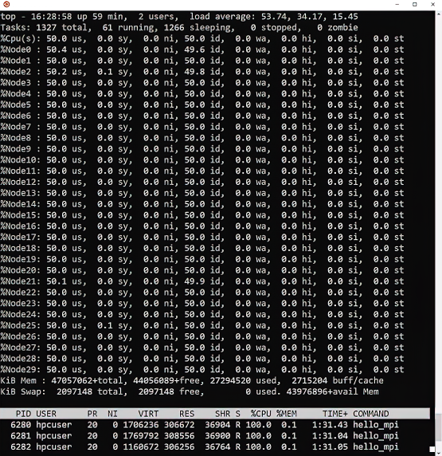

If you're running an HPC application on a large number of VMs (&gt; 16 VMs), it's best to start running a smaller problem on fewer VMs to first verify your HPC application is running as expected. Do not assume that just because you're running an HPC parallel application its wall time (elapsed real time) will continue to reduce as you run it on more VMs (with more parallel processes). In fact, many tightly coupled HPC applications can have a longer wall time when you attempt to run them on other VMs, which can happen for several reasons.

For example:

- You may have implemented a parallel algorithm inefficiently.

- The problem size, which is the model size or Number of Degrees of Freedom (NDOF), is not large enough. As your application runs on more parallel processes, the amount of computation done by each process is too small. As a result, the total wall time is dominated by the communication time between the parallel processes, thereby increasing your overall wall time.

It is important to know how well your HPC application scales running the problem size you're interested in, and determine what parallel efficiency is acceptable from a performance and cost point of view.

The following parallel speed-up formula is used to measure how well your parallel application performance improves as you add more parallel processes.

$${Parallel\ speed-up\ =\ }{\dfrac{Wall\ time \(1\ process)}{Wall\ time \(n\ processes)}}$$

The following parallel efficiency formula illustrates how efficiently you are using computational resources as you add more processes to improve the parallel applications performance.

$${Parallel\ efficiency\ =\ }{\dfrac{Parallel\ speed-up}{N\ processes}}$$

If you're unsure of the parallel scaling performance for your tightly coupled HPC application, then run a scaling study. In other words, run your application on 1, 2, 4, 8, 16, etc., parallel processes. Compute the parallel speed-up and parallel efficiency, and then decide based on these results how many parallel processes you want to use.

You might want to consider disabling any unnecessary services that could have an impact on parallel scaling, like the Windows Azure Linux Agent (WALA), before executing your jobs, and then re-enable it after your jobs have completed. This recommendation is especially true if you're using all available cores and scaling to a large number of VMs.

To stop the WALA service, use the following command.

```bash
sudo system stop waagent.service
```

## Performance sanity checks

The following information provides some basic sanity checks to help identify potential performance problems.

### Check that the correct number of processes and threads are running on each VM

An easy way to determine if you are using the correct number of processes and threads on each VM is to get the system load average on each VM with a tool like **uptime**, which should be roughly equal to the total expected number of processes and threads on each VM. If the recorded load average is lower or higher than the expected total number of processes and threads, that will indicate a problem that must be fixed.

You should carefully check your MPI arguments and how you're specifying the number of parallel threads. For example: you should check your application's command-line arguments, or the values of environmental variables such as `OMP_NUM_THREADS`.

### Check that the processes and threads are evenly distributed amongst all NUMA node domains.

If you are using the **top** or **htop** tool, you can select the NUMA node domain view by specifying `2` as a command-line parameter (For example: on HB120_v2, you should see 30 NUMA node domains using this view). The percent of user utilization should be evenly distributed amongst all the NUMA domains. If the percent of user utilization is not distributed amongst the NUMA domains, then you should check your MPI command-line arguments and environmental variables.

The following image illustrates the output of the linux **top** tool in NUMA view, we can see in this case each NUMA is 50% utilized.

[](../media/4-top-numa-expanded.png#lightbox)

### Check the processes and threads run state

To check the run state of your processes and threads, you should use **top**. Ideally, you should see all processes and threads in a Running (R) state. If some or all of your processes and threads are in an uninterruptible sleep (D) or sleep (S) state, then you need to investigate the situation to understand the reason. Depending on how your application's algorithm is designed, it may be normal and expected behavior for processes and threads to be in a sleep state, or it could indicate a resource constraint, like having insufficient I/O performance due to the storage solution that you are using.

The following formula illustrates how efficiently your parallel application is running, if it is waiting on some system resources (e.g waiting on I/O) and to what extent.

$${Application\ wait\ time\ =\ }{Wall\ time\ -\ }{\dfrac{Total\ CPU\ time\ for\ all\ parallel\ processes}{Number\ of\ parallel\ processes}}$$

### Check if the application is I/O bound

Processes and threads spending a significant amount of time in an uninterruptible sleep (D) or sleep (S) state may be an indicator that there is an I/O bottleneck that needs to be investigated. Some HPC applications provide performance profiling as part of its output, showing the percent of time spent performing I/O and read/write I/O rates, which could also point to an I/O bottleneck.

If you're unsure where your I/O is going, you can use tools like **iostat** to help you. A simple way to verify if you have an I/O issue is to change your storage solution to something you know is significantly faster than what you have been using, then rerun your HPC application. For example: You could use a fast local NVMe SSD or ramdisk. Once you have made this change, ask yourself the following questions: Do you see any improvement in I/O time? Has the overall wall time improved? If so, by how much?

### Check if the application is network bound

Determine what percentage of the overall wall time your application spends performing process communication (which is typically MPI communication). If your application is network bound, then you should verify that you're using the InfiniBand network when running your HPC application. If a hybrid parallel version is available, you should determine whether that reduces the network communication time. If you have access to the source code, you should check to see if there are more efficient ways to implement the communication. For example: you could use collective operations instead of point-to-point, or perhaps you could use asynchronous communication instead of synchronous.
