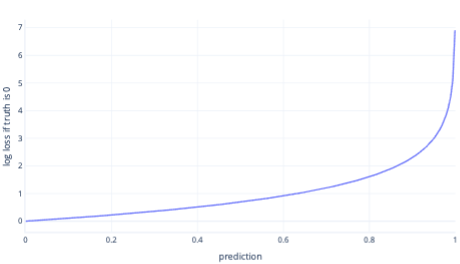
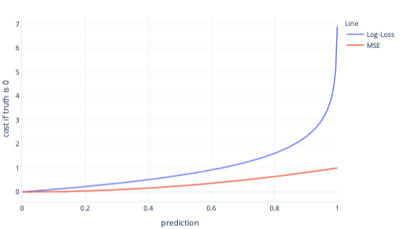

A large part of machine learning is about assessing how well models work. This takes place during training, to help shape the model, and after training, to help us judge whether the model is OK to use in the real world. Classification models need assessment, just like regression models, though the way we do this assessment can sometimes be a little more complex.

## A refresher on cost

Remember that during training, we calculate how badly a model performs, and call this **cost, or loss.** For example, in linear regression we often use a metric called mean-squared error (MSE). MSE is calculated by comparing the prediction and actual label, squaring the difference, and taking the average of the result. We can use MSE to fit our model, and to report on how well it works.

## Cost functions for classification

Classification models will be judged either on their output probabilities, such as 40% chance of an avalanche, or final labels—‘no avalanche’ or ‘avalanche’. Using the probabilities can be advantageous during training because slight changes in the model will be seen in changes in probabilities, even if they aren't enough to change the final decision. Using the final labels for a cost function is more useful if we want to estimate the real-world performance of our model, for instance, on the test set. This is because, for real-world use, we'll be using the final labels, not the probabilities.

## Log loss

Log loss is one of the most popular cost functions for simple classification. Log loss is usually applied to output probabilities. Similarly to MSE, small amounts of error result in small cost, while moderate amounts of error result in large costs. We have plotted log loss below, for a label where the correct answer was 0 (false).

On the x-axis are possible model outputs – probabilities from 0 to 1 – and on the y axis is the cost. If a model is quite confident the correct response is 0 (for example predicting 0.1), the cost is low because in this instance the correct response is 0. If the model is confidently predicting the outcome wrongly (for example, predicting 0.9) then cost becomes very high. In fact, at x=1, the cost is so high that we've cropped the x-axis here to 0.999 to keep the graph readable.

## Why not MSE?

MSE and log loss are similar metrics. There are some complex reasons why log-loss is favored for logistic regression, but some simpler reasons too. For example, **log loss** punishes wrong answers much more strongly than MSE. For example, in the example below, where the correct answer is 0, predictions above 0.8 have a much higher cost for log-loss than MSE.

Having higher cost in this way helps the model learn faster because the slope of the line is much steeper. Similarly, log-loss helps models become more confident at giving the correct answer: notice in the plot above that the MSE cost for values smaller than 0.2 are very small and the slope almost flat. This makes training slow for models that are near to correct. Log loss has a steeper slope for these values, which helps the model learn faster.

## Limitations of cost functions

Using a single cost functions for human assessment of the model is always limited because it doesn’t tell you what kind of mistakes your model is making. For example, consider our avalanche prediction scenario. A high log loss value could mean that the model is repeatedly predicting avalanches when there are none, or that it repeatedly failing to predict avalanches that then happen.

To understand our models better, it can be easier to use more than one number to assess if they work well. This is a larger topic we cover in other learning material though we'll touch on in the following exercises.