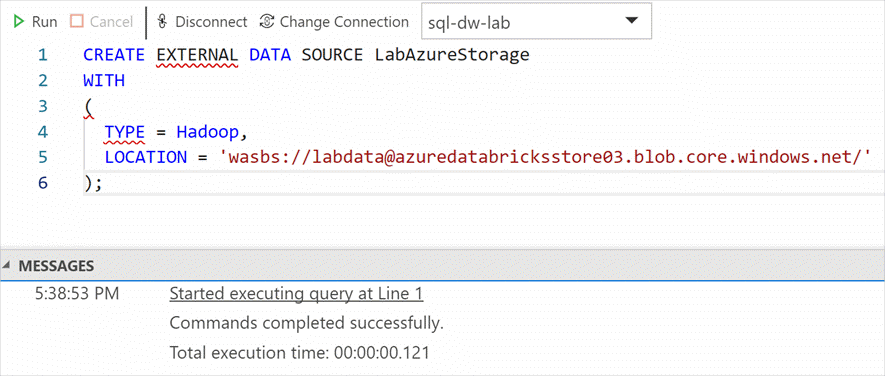

In this unit, you load data from Azure Blob Storage into SQL Data Warehouse using PolyBase.

PolyBase is a technology that accesses data outside of the database via the **t-sql** language. In Azure SQL Data Warehouse, you can import/export data from Azure Blob Storage and Azure Data Lake Store.

Follow the steps in this unit to learn how to load data from Azure Blob Storage into SQL Data Warehouse using PolyBase.

## Make a connection to SQL Data Warehouse

1. Open Azure Data Studio.

1. Navigate to the Servers list on the left-hand menu in Azure Data Studio. Right-click on the SQL Data Warehouse connection you made to the SQL Data Warehouse database, then select **New Query** from the context menu.

    

## Create external data source

Execute following statements in the query window to create an external data source, which defines connection details to the **labdata** container of the Azure Storage account provisioned in your resource group.

Replace token **<Name_Of_Storage_Account>** with name of Azure Storage account provisioned in your resource group in the final step of the Setup the Environment unit.

    ```sql
    CREATE EXTERNAL DATA SOURCE LabAzureStorage
    WITH
    (
      TYPE = Hadoop,
      LOCATION = 'wasbs://labdata@<Name_Of_Storage_Account>.blob.core.windows.net/'
    );
    ```



- TYPE = `[ HADOOP | SHARD_MAP_MANAGER | RDBMS | BLOB_STORAGE ]`

  Specifies the data source type. Use HADOOP when the external data source is Hadoop or Azure Storage blob for Hadoop.

- LOCATION = `<location_path>`

  For Azure blob storage with Hadoop, specifies the URI for connecting to Azure blob storage.

- LOCATION = `wasb[s]://container@account_name.blob.core.windows.net`

## Define external file format

A definition of the external file format helps Data Warehouse understand the format of the external file to be loaded. It defines the field terminator, string delimiter, and date field format. These properties assist in capturing the fields inside a file.

1. Clear the query window and execute following statements within to define the external file format:

    ```sql
    CREATE EXTERNAL FILE FORMAT TextFileFormat
    WITH
    (
      FORMAT_TYPE = DELIMITEDTEXT,
      FORMAT_OPTIONS (
        FIELD_TERMINATOR = ',',
        STRING_DELIMITER = '',
        DATE_FORMAT = 'yyyy-MM-dd HH:mm:ss.fff',
        USE_TYPE_DEFAULT = FALSE
      )
    );
    ```

- _FIELD_TERMINATOR_ = `field_terminator`. Applies only to delimited text files. This specifies one or more characters that mark the end of each field (column) in the
  text-delimited file. The external file used for this exercise has comma (,) as text delimiter.

- _STRING_DELIMITER_ = `string_delimiter`. Specifies the field terminator for data of type string in the text-delimited file.

- _DATE_FORMAT_ = `datetime_format`. Specifies a custom format for all date and time data that might appear in a delimited text file. The TransactionDate field holds date values (for example "2017-01-24 00:00:00.000")

## Create schema for external table

1. Clear the query window and execute the following statements to create a new schema for the external table:

    ```sql
    CREATE SCHEMA [asb];
    ```

## Create external table

External tables refer to data from an external data source. Data isn't stored within SQL Data Warehouse.

1. Clear the query window and execute following statements to define an external table:

    ```sql
    CREATE EXTERNAL TABLE [asb].[Transaction]
    (
      [TransactionId] [int] NOT NULL,
      [ProductId] [int] NOT NULL,
      [DateApsId] [int] NULL,
      [StoreId] [int] NOT NULL,
      [StaffId] [int] NOT NULL,
      [RetailChannelId] [int] NOT NULL,
      [CustomerSegmentId] [int] NOT NULL,
      [PaymentMethodId] [int] NOT NULL,
      [COGS] [money] NULL,
      [SaleQuantity] [int] NOT NULL,
      [UnitPrice] [money] NULL,
      [SaleAmount] [money] NULL,
      [TaxRate] [money] NULL,
      [TaxAmount] [money] NULL,
      [GrossAmount] [money] NULL,
      [TenderedAmount] [money] NULL,
      [ProfitMargin] [money] NULL,
      [PaymentCount] [int] NULL,
      [ReturnQuantity] [int] NULL,
      [ReturnAmount] [money] NULL,
      [TransactionDate] [datetime] NULL,
      [CogsPerUnit] [money] NULL
    )
    WITH 
    (
      LOCATION='Transaction.txt', DATA_SOURCE = LabAzureStorage, FILE_FORMAT = TextFileFormat, REJECT_TYPE = VALUE, REJECT_VALUE = 1
    );
    ```

- `CREATE EXTERNAL TABLE` allows one or more column definitions. The column definitions, including the data types and number of columns, must match the data in the external files. If there's a mismatch, the file rows will be rejected when querying the actual data.

- _LOCATION_ = `folder_or_filepath`. Specifies the folder or the file path and file name for the actual data in Hadoop or Azure blob storage. The location starts from the root folder; the root folder is the data location specified in the external data source. In the above statement, the `Transaction.txt` file contains the data, and this file is present in the container specified inside the external data source.

- _DATA_SOURCE_ = `external_data_source_name`. Specifies the name of the external data source that contains the location of the external data. This location is either Hadoop or Azure blob storage. Here we're referring to the **LabAzureStorage** external data store defined in earlier steps. This external data store points to the container inside the Azure Blob Storage account.

- _FILE_FORMAT_ = `external_file_format_name`. Specifies the name of the external file format object that stores the file type and compression method for the external data. In the above statement, the `FILE_FORMAT` is set to the **TextFileFormat** object created in earlier steps.

- _Reject Options_. You can specify reject parameters that determine how PolyBase will handle dirty records it retrieves from the external data source. A data record is considered 'dirty' if its actual data types or the number of columns do not match the column definitions of the external table.

- _REJECT_TYPE_ = `value | percentage`. Clarifies whether the `REJECT_VALUE` option is specified as a literal value or a percentage.

- _REJECT_VALUE_. If `REJECT_TYPE` is `value`, the PolyBase query will fail when the number of rejected rows exceeds `reject_value`. If `REJECT_TYPE` is `percentage`, the PolyBase query will fail when the percentage of failed rows exceeds `reject_value`. The percentage of failed rows is calculated at intervals.

  In the above statement, `REJECT_VALUE` is set to 1 to avoid headers in the external text file.

1. Clear the query window and execute the following statement to get data from the external table.

    ```sql
    SELECT * FROM [asb].[Transaction]
    ```

## Create schema for table

1. Clear the query window and execute following statement to create a new schema for tables:

    ```sql
    CREATE SCHEMA [cso];
    ```

## Create SQL Data Warehouse table and load data

Create a table in SQL Data Warehouse using the `CREATE TABLE AS SELECT` (CTAS) feature. It's a fully parallelized operation that creates a new table based on the output of a SELECT statement.

In this exercise, the CTAS feature is used to create a table in SQL Data Warehouse based on the external table defined in an earlier step. It not only creates tables but also loads data in the table obtained in the select statement.

1. Clear the query window and execute the following statement to create a table in SQL Data Warehouse:

    ```sql
    CREATE TABLE [cso].[Transaction]
    WITH
    (
      DISTRIBUTION = HASH([TransactionId])
    )
    AS
    SELECT * FROM [asb].[Transaction]
    OPTION (LABEL = 'CTAS : Load [cso].[Transaction]');
    ```

- _DISTRIBUTION_ `HASH ( distribution_column_name ) | ROUND_ROBIN | REPLICATE`. The CTAS statement requires a distribution option and doesn't have default values. The above table is created using the `HASH` distribution method on the `TransactionId` column.

- _LABEL_. This option labels the query, which helps to easily identify the query.