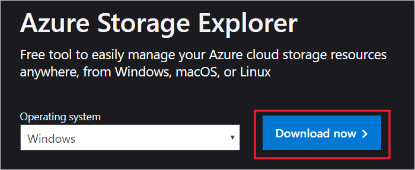
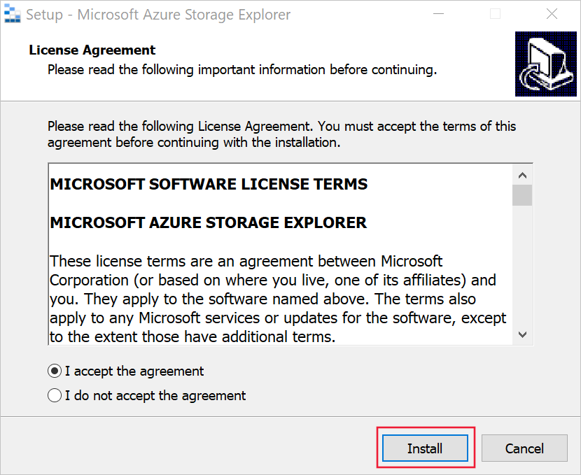
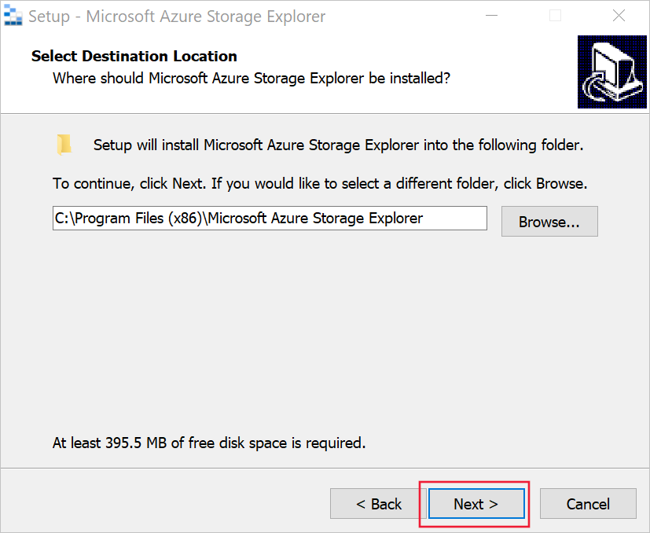
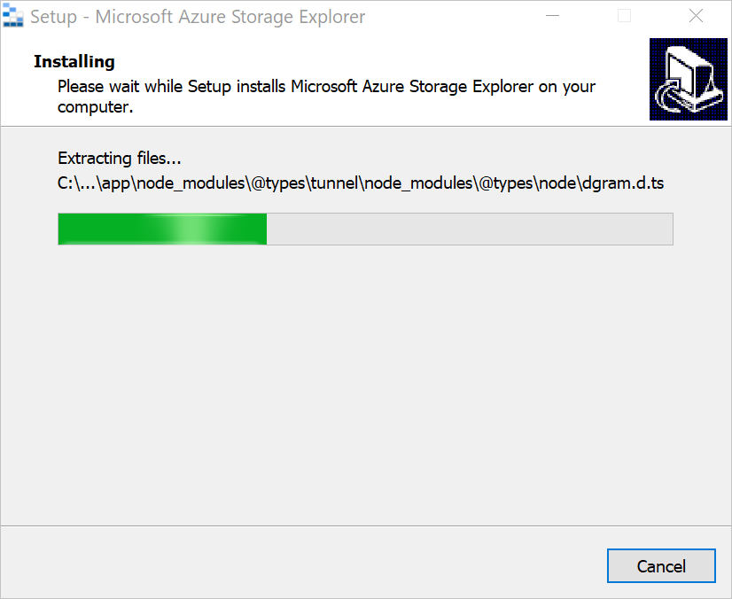
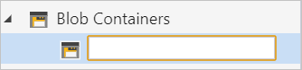
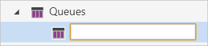

It's easy to navigate the contents of an Azure Storage account by using Azure Storage Explorer.

Now you've a better understanding of the features and capabilities of Azure Storage Explorer, you can try it for yourself. Use Azure Storage Explorer to explore some of the files your Customer Relationship Management (CRM) system places in Azure Storage. 
 
Here, you'll try Azure Storage Explorer for yourself by downloading, installing, and connecting to an Azure Storage account. You'll create a blob and a queue in your Azure Storage account.

## Download and install Azure Storage Explorer

First, you'll need to download and install Azure Storage Explorer.  

You can download it from the [Microsoft Azure Storage Explorer website](https://azure.microsoft.com/features/storage-explorer/).

1. Select your preferred **Operating system**.  You'll use the Windows version of the application for the rest of this exercise.  
1. When you've chosen your operating system, select the **Download now** button to download the Storage Explorer installer application to your local computer.
1. Locate the downloaded file and run it. For the Windows version, use the **StorageExplorer.exe** file.
1. Accept the licensing agreement, and select **Install**.

    

1. You can either browse to the location where you want to install Storage Explorer or accept the default location. When you've selected the installation destination, select **Next**.

    

1. For Windows installations, select the start menu folder. Accept the default and select **Next**.
1. When the installation is complete, select **Finish**.

    

Azure Storage Explorer automatically launches after installation.

## Connect to an Azure account

When you first launch Azure Storage Explorer, it displays the Connect to Azure Storage wizard.

1. First, you'll connect to Azure. There are several **Azure environment** options to select from:

   - Azure
   - Azure China
   - Azure Germany
   - Azure US Government
   - Add new environment

   Choose **Azure** and select **Next**.

1. An Azure sign-in page is displayed. Use your Azure credentials to sign in.

    

1. When you've signed in to your Azure instance, the associated Azure account and Azure subscription are displayed in the Account Management section.

    

   Confirm that the subscription and account details are correct, then select the **Apply** option.

You've now connected Storage Explorer to your Azure Subscription. Don't close the Storage Explorer application.

## Storage account virtual folders

Every storage account you create is given four virtual folders. These folders don't exist until you assign data to them, but can be used to create data. The four virtual folders are containers, file shares, tables, and queues. When you create a blob in your storage account, add it to the virtual folder **containers**.  Your storage account lets you have as many containers as you want, and each can have as many blobs as needed.

## Create a blob in your Azure Storage account

To create a blob in your container:

1. Using your Storage Explorer application, toggle the **Explorer** view.

    

1. In the resource tree, find the **Concierge Subscription**, and expand the options.
1. Select the **cloudshell** storage account. The cloudshell storage account created in your sandbox might end with a different set of numbers. You'll see it has four virtual folders: Blob Containers, File Shares, Queues, and Tables.
1. Right-click the **Blob Containers** virtual folder to access the context menu, and select **Create Blob Container**.

    

1. An empty and unnamed blob container is now created inside the Blob Containers folder. To create the blob storage container, give it a name.  

   > NOTE:
   > Containers have specific rules governing how they can be named: They must begin and end in either a letter or number, must be all lowercase, and can have numbers and hyphens. Names can't contain a double hyphen.

   

   Name this new blob **myblob**, and then press **Enter**. Each created container appears in a tab to the right of the resource tree.

   

1. From this view, you can manage the content of the blob container.

## Create a queue in your Azure Storage account

To create a queue in your storage account:

1. In the resource tree, find the **Concierge Subscription**, and expand the options.
1. Select the **cloudshell** storage account.
1. Right-click on the **Queues** virtual folder to access the context menu, and select **Create Queue**.

    

1. An empty and unnamed queue is created inside the Queues folder. The queue won't be created until you give it a name.

    > NOTE:
    > Containers have specific rules governing how they can be named: they must begin and end in either a letter or number, must be all lowercase, and can have numbers and hyphens. The name can't contain a double hyphen.

   

   Name this new queue **myqueue**, and press **Enter** to create the queue. Each created queue appears in a tab to the right of the resource tree.

   

1. From this view, you can manage the content of the queue.