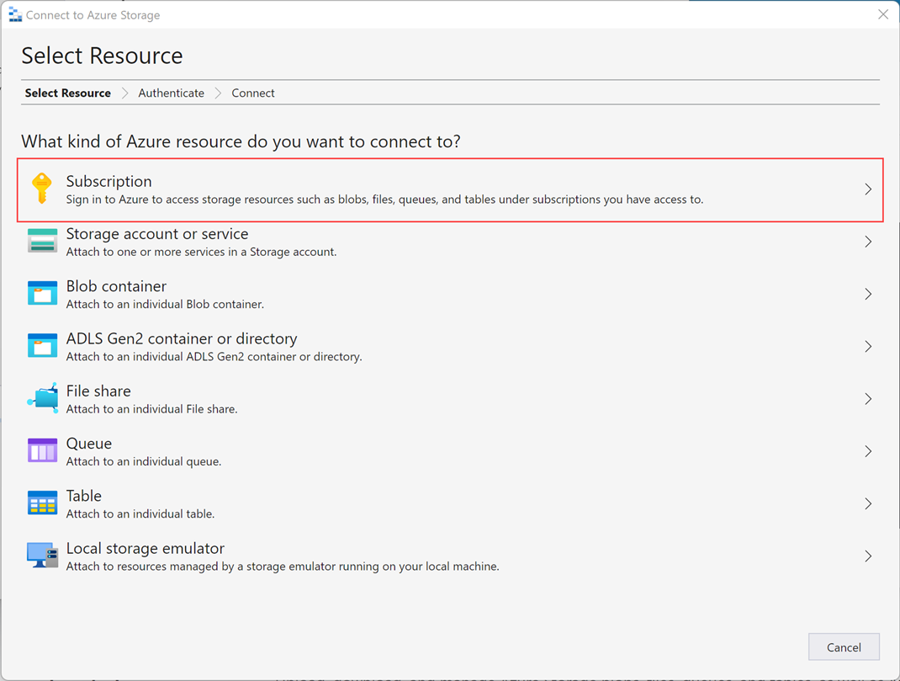
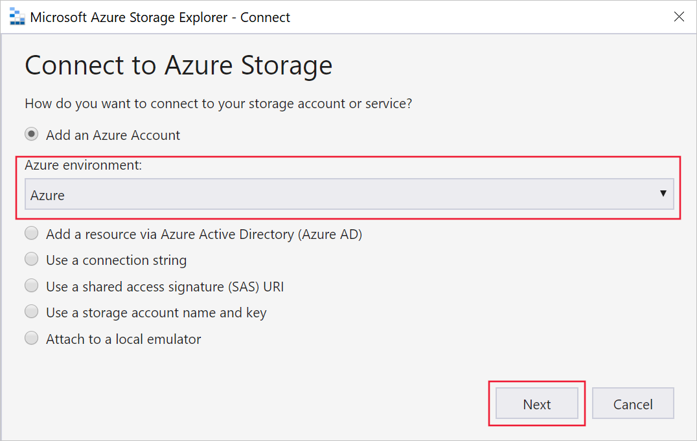
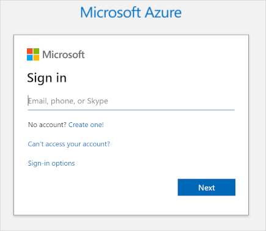
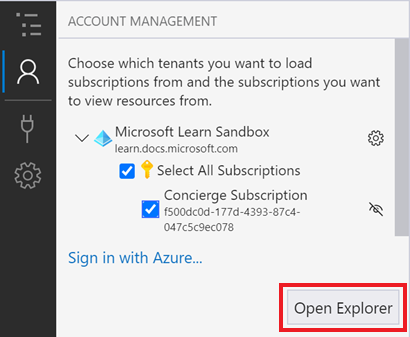
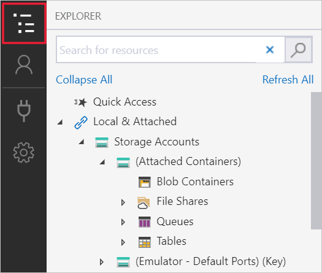
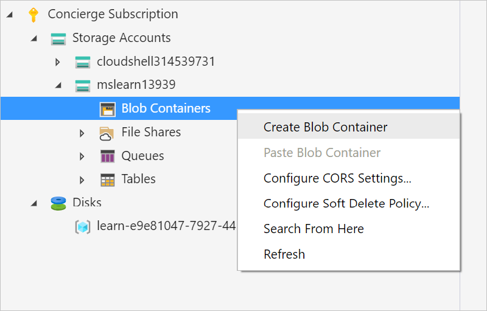
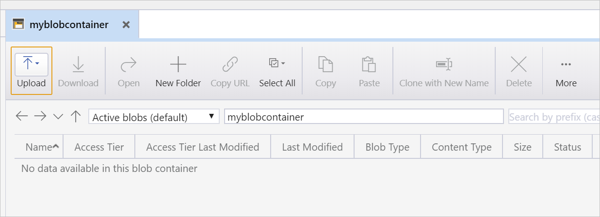
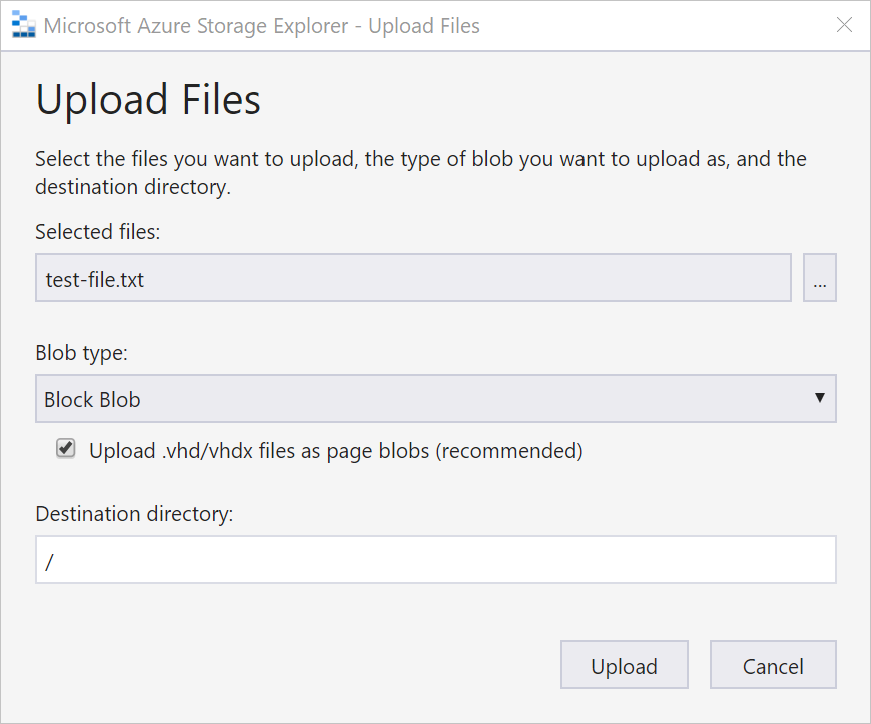
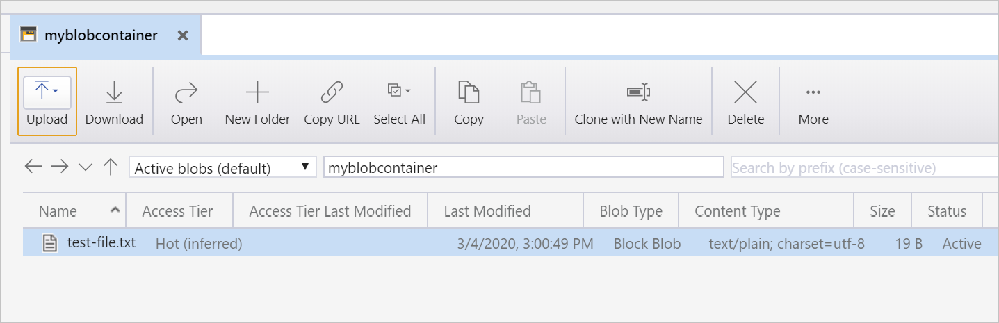
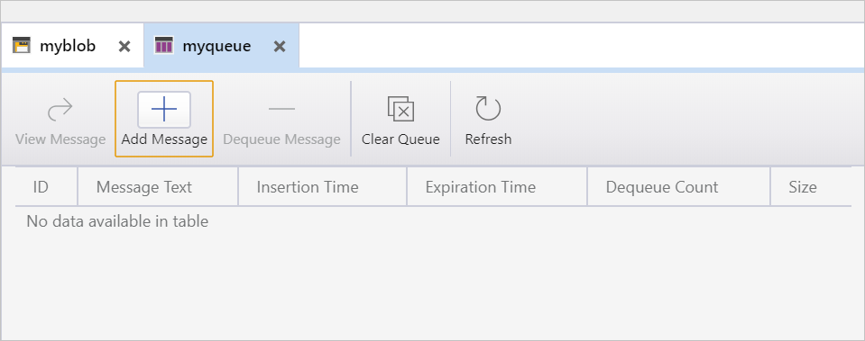

It's easy to browse through the contents of an Azure storage account by using Azure Storage Explorer.

Now that you have a better understanding of the features and capabilities of Storage Explorer, you can try it for yourself. Use Storage Explorer to explore some of the files that your CRM system stores in Azure Storage.

Here, you'll try Storage Explorer by downloading, installing, and connecting to an Azure storage account. You'll create a blob and a queue in your storage account.

## Download and install Azure Storage Explorer

First, you need to download and install Storage Explorer.  

1. Browse to the [Azure Storage Explorer website](https://azure.microsoft.com/features/storage-explorer/?azure-sandbox=true).

1. Select **Download now**, then select your preferred operating system. The following steps will go through the Windows version of the application. Your steps will be different if you're using a different OS.

1. Locate the downloaded file and run it. For the Windows version, use the **StorageExplorer.exe** file.

1. Accept the license agreement and select **Install**.

1. Browse to the location where you want to install Storage Explorer or accept the default location. Select **Next**.

1. For Windows installations, select the **Start menu** folder. Accept the default and select **Next**.

1. When the installation is complete, select **Finish**.

Storage Explorer automatically opens after installation.

## Connect to an Azure account

When you first open Storage Explorer, it displays the **Connect to Azure Storage** wizard.

1. First, connect to Azure. Choose **Subscription**.

    

1. There are several **Azure environment** options to select from. Select **Azure**, then select **Next**.

    

1. Your browser opens and an Azure sign-in page appears. Use your Azure credentials to sign in.

    

1. When you've signed in to your Azure instance, the associated Azure account and Azure subscription appear in the **Account Management** section.

    

   Confirm that the **Concierge Subscription** subscription is selected and account details are correct, and then select **Open Explorer**.

You've now connected Storage Explorer to your Azure subscription. Leave Storage Explorer open while you work through the next steps.

## Create a storage account and add a blob

1. In Azure Cloud Shell, run the following command to create a storage account.

    ```azurecli
    az storage account create \
    --name  mslearn$RANDOM \
    --resource-group <rgn>[sandbox resource group name]</rgn> \
    --sku Standard_GRS \
    --kind StorageV2
    ```

    In the output, note the name of the storage account. After the storage account is created, switch back to Storage Explorer.

1. If it isn't currently visible, toggle the **EXPLORER** view so that the pane is shown.

1. In the **EXPLORER** pane, select **Refresh All**, then locate and expand **Concierge Subscription**.

    

1. Locate and expand the storage account that you created earlier. It should be named something similar to **mslearn12345**, ending with a different set of numbers. It has four virtual folders: **Blob Containers**, **File Shares**, **Queues**, and **Tables**.

    > [!NOTE]
    > If the storage account you created earlier isn't listed, wait a few moments and select **Refresh All**; it can take a couple of minutes for the account to appear.

1. Right-click the **Blob Containers** virtual folder to access the shortcut menu, and then select **Create Blob Container**.

    

1. Name the container **myblobcontainer**, and press <kbd>Enter</kbd>.

    Each created container appears in a tab to the right of the resource tree.

   

1. Upload a blob to the container. In the **myblobcontainer** pane, select **Upload**, and then select **Upload Files**. The **Upload Files** dialog box appears.

1. For **Selected files**, select the ellipsis (**...**). Browse to a small file on your device and select **Open**. Select **Upload** to upload the file.

    

    You should now see your file stored in your storage account.

    

From here, you can upload additional files, download files, make copies, and do other administrative tasks.

## Create a queue in your Azure storage account

To create a queue in your storage account:

1. In the resource tree, find **Concierge Subscription** and expand the options.

1. Expand the **cloudshell** storage account.

1. Right-click the **Queues** virtual folder to access the shortcut menu, and then select **Create Queue**.

1. An empty and unnamed queue is created inside the **Queues** folder. The queue won't be created until you give it a name.

    > [!NOTE]
    > Containers have specific rules that govern how they can be named. They must begin and end with either a letter or a number, must be all lowercase, and can have numbers and hyphens. The name can't contain a double hyphen.

    Name this new queue **myqueue** and press <kbd>Enter</kbd> to create the queue. Each created queue appears on a tab to the right of the resource tree.

    

    From this view, you can manage the queue's content. If our application used this queue and experienced an issue with processing a message, you could connect to the queue and view the message contents to determine the issue.
