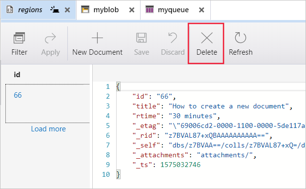

Azure Storage Explorer doesn't just access Azure Storage. You can also use it to access data in Cosmos DB and Azure Data Lake.

You've worked through the basics of connecting Storage Explorer to your Azure account. In the customer relationship management system, your developers use Cosmos DB for day-to-day operations, and an Azure Data Lake for big data storage. You want to understand if Storage Explorer can be used to connect to both of these databases.

## Using Storage Explorer to manage Cosmos DB

You can use Storage Explorer to connect to a Cosmos DB and do useful activities like creating and deleting databases, collections, documents, and graphs.

### Connect by using a connection string

There are a multiple ways to connect to Cosmos DB from Storage Explorer. The primary method is to use a connection string. A connection string contains all the information you need to find and connect to a particular Cosmos DB. The connection string has a specific composition, as shown here:

```plaintext
AccountEndpoint=https://<YOUR-COSMOS-DB-NAME>.documents.azure.com:443/;AccountKey=<PRIMARY-MASTER-KEY>;
```

In this template, replace `<YOUR-COSMOS-DB-NAME>` with the name of your Cosmos DB. The `<PRIMARY-MASTER-KEY>` is a unique key for the Cosmos DB.

There are two ways to obtain the connection string.

You could use the Azure portal to find the Cosmos DB that you want to connect to. You'd look for the **Keys** menu item and make a copy of the primary connection string.

The other way is to use the Azure Cloud CLI. This method gives you the primary master key for the Cosmos DB database. Use this command:

```azurecli
az cosmosdb keys list \
    --name COSMOS-DB-NAME \
    --resource-group myresourcegroup \
    --subscription "My Subscription" \
    --type keys
```

Using the connection string template, add the name of the Cosmos DB, along with the primary master key returned from the above command.

Now you have a connection string, you can use Storage Explorer to connect to your Cosmos DB. You'll be able to create or delete a database, create or delete collections, and create or delete documents.

1. Launch Storage Explorer.
1. Open the resource tree and select the branch **Local & Attached**.
1. Right-click Cosmos DB Accounts, and select **Connect to Cosmos DB...**.
1. When the Cosmos DB wizard launches, paste in the connection string.  You'll see the name of the Cosmos DB appear in the Account label field.
1. A summary of the connection information is displayed before the connection completes.

<!-- ### Create a Cosmos DB database

Now you've connected to your Azure Cosmos DB, you can use Storage Explorer to create Cosmos databases. You use Storage Explorer to manage database content, collections, documents, and graphs.

1. To add a database, select the Cosmos DB you want to use. Then right-click on it, and select **Create Database**.
1. Give your database a name. When created, the database appears beneath the Cosmos DB instance.

### Delete a Cosmos DB database

To remove or delete a database:

1. Right-click the Cosmos DB database, and then select **Delete Database**.
1. Confirm that you want to delete the database and its content. When you select **Yes**, the database and all the content is removed. -->

<!-- ### Create a collection in Cosmos DB database

Now you have a Cosmos DB database, it's time to create a collection. A database can have as many collections in it as you need. Each collection name has to be unique. You create collections using Storage Explorer.

1. Enter a name for the collection.
1. Decide whether this collection has a finite amount of storage space or whether it will grow to match the size of the collection. The fixed option gives you a maximum collection size of 10 GB.  
1. The last field is Throughput. Accept the default of 400.
1. You'll see each collection added under the Cosmos database.   -->

<!-- ### Delete a collection from a Cosmos DB database

Deleting a collection removes all the entities and data inside it. Be sure you want to delete the data before you use this option. To delete a collection:

1. Find the collection in your database.
1. Right-click on the collection and select **Delete Collection** from the context menu.
1. You'll see a warning and final check message asking to confirm you want to delete the collection.  
1. Select **Yes** to delete the collection. -->

<!-- ### Create a document in Cosmos DB

The collection can contain any items. You can use Storage Explorer to manage these items, including new documents in your collection.

1. Select any collection you created earlier.
1. This will show the collection pane. From here, you can manage the data in your collection.

    

1. To add a document, select **New Document**. An empty document is displayed in the window below.
1. Replace the content of the document with this JSON:

   ```JSON
    {
        "id": "66",
        "title": "How to create a new document",
        "rtime": "30 minutes",
        "_etag": "WFFta1FHgQEtttIE1aaa"
    }
   ```

1. Select **Save** when you're ready.

   

1. The document now appears in the ID panel.   -->

<!-- ### Delete a document from a Cosmos DB database collection

To delete a document, select the ID of the document from the list. Then select the **Delete** option.



### Create a graph database

Cosmos DB supports the storage of graph data.  When creating a graph Cosmos DB, you'll need to enable Gremlin API support.  It's slightly different from creating a standard Cosmos DB. You'll need to run this **az cosmosdb create** command in your Azure Cloud Shell:

```azurecli
az cosmosdb create \
    -n "cosmosGraph" \
    -g <rgn>[Sandbox resource group]</rgn> \
    --capabilities EnableGremlin
```

Now you've created a Cosmos DB, create a Gremlin graph database:

 ```azurecli
az cosmosdb gremlin database create \
    -a "cosmosGraph" \
    -g <rgn>[Sandbox resource group]</rgn> \
    -n 'cosmosGraph01'
 ```

You've now created a Cosmos DB graph database.

### Delete a graph database

Deleting a database removes all the data contained inside it. To delete a graph database:

1. Launch Storage Explorer and connect to your Azure subscription.
1. Find the **cosmosGraph01** database.
1. Right-click it and select **Delete Database**.
1. You'll see a warning and final check message asking to confirm that you want to delete the graph database.
1. Select **Yes** to delete the collection. -->

## Use Storage Explorer to manage Azure Data Lake

Azure Data Lake is a service used for storing and analyzing large data sets. It supports large data workloads, and is well suited to capture data of any type or size, and at any speed. Azure Data Lake supports all the expected enterprise-grade capabilities like security, scalability, reliability, manageability, and availability.

There are two types of Azure Data Lake: Gen1 and Gen 2. Both types are supported in Storage Explorer.

You can use Storage explorer to connect to Azure Data Lake accounts. You can use it to create, delete, and manage containers, as well as uploading, managing, and administration of blobs, just like storage accounts.

Let's go through creating Cosmos DB and Data Lake storage, and use Storage Explorer to connect to them.

<!-- ### Connect to a Data Lake Storage account

Before you create a Data Lake Storage account by using the Azure Cloud Shell, add a preview extension to the CLI. Use the following command:

```azurecli
az extension add --name storage-preview
```

An Azure Data Lake Gen2 storage account requires a general-purpose v2 storage account.

1. Make sure your Azure subscription supports a Gen 2 Azure Data Lake.
1. Using an Azure Data Lake can be expensive, so it's a good idea to create a specific resource group for it. Make sure that the resource group uses the **Storage V2 (general-purpose v2)** option. Azure Data Lake resource groups can only exist in the following specific locations:

    - East US 2
    - West US 2
    - North Europe
    - Central US
    - West Europe
    - Australia East

1. Make sure you enable **Hierarchical namespaces**.

An Azure Data Lake Storage account holds all your data objects like blobs, queues, tables, files, and disks. 

Now you've created a Data Lake Storage account, you can connect to it using Storage Explorer.

1. Launch Storage Explorer.
1. From the resource tree, expand your subscription. 
1. Select the V2 storage container you created earlier.
1. Right-click on the storage container and select the **Connect to Data Lake Storage...** option.
1. Enter the URI for your data lake.

    

You've now connected to your data lake.

### Create a container

A container is equivalent to a folder in your file system. Just as you create a folder to hold specific information, you create containers to do the same in a data lake. Organizing your data into folders makes managing your Azure Data Lake easier.

To create a container:

1. Find the Data Lake you created. It will have a suffix of **(ADLS Gen2)**.
1. Right-click on the Storage Account and select  **Create Blob container** from the context menu.
1. An empty container is displayed. Enter the name of the container and press **Enter** to create it.

    

Bear in mind that all container names have the following constraints: 

- The full name must be in lowercase 
- The full name must start with or end with an alphanumeric
- The full name can use hyphens, but you can't have a double hyphen anywhere in the name

You can have an unlimited number of containers, each displayed within the Data Lake branch.

### Upload and view blobs

All data stored in an Azure Data Lake is considered blob storage. There are three supported types: block, append, and page. The most common type of blob storage is a block. For instance, if you're managing log files, you'll use an append blob. For IaaS based VMs, you'd use page blobs.

To upload a file, select an Azure Data Lake container to display the tools ribbon and any content in the display view on the right.


From this menu, you can upload and download whole directories or individual files.

When you select the upload option, all files are queued and processed in turn. All results from uploads appear in the **Activities** window.

### Download data or blobs

To download any file, select the data folder or data file you want to download. Now select the **Download** option. Use the file save dialogue, and then choose the location to save the file. When you select **Save**, the download starts. -->