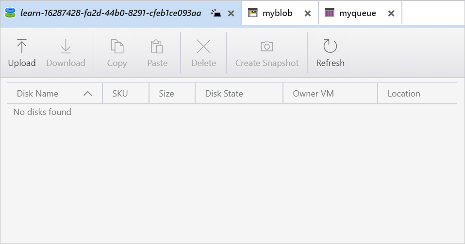
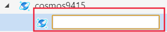

Azure Storage Explorer isn't just about Azure Storage accounts. You can also use it to investigate and download data from Cosmos DB or Azure Data Lake.

You've seen how simple it is to create and manage blob and queue resources in your Azure Storage account. Now you want to push your understanding further and see how it connects to your developers' Cosmos DB and Azure Data Lakes, which they use to store infrastructure data for the Customer Relationship Management (CRM) system.

Here, you'll learn how to create a new Storage Explorer connection to a Cosmos DB, create a database, and populate it with content. Finally, you'll see how to connect to a Data Lake Storage Gen 2 account, create a container, and upload data into it. 

## Create a Cosmos DB

Before you use Storage Explorer to connect to a Cosmos DB with a connection string, you'll need to create a Cosmos DB.

1. From the Azure Cloud Shell, use these commands to create a Cosmos DB account.

    ```azurecli
    export NAME=cosmos$RANDOM
    az cosmosdb create \
        --name $NAME \
        --kind GlobalDocumentDB \
        --resource-group <rgn>[sandbox resource group name]</rgn>
    ```

   This command takes a few minutes to run, while it creates a new Cosmos DB for you.

1. When it's complete, you'll see something similar to this JSON response. These details also tell you the name of the cosmos DB. The database name has been marked so you can find it easily.

   ```json
   {
     "capabilities": [],
     "connectorOffer": null,
     "consistencyPolicy": {
       "defaultConsistencyLevel": "Session",
       "maxIntervalInSeconds": 5,
       "maxStalenessPrefix": 100
     },
     "databaseAccountOfferType": "Standard",
     "documentEndpoint": "https://cosmos26829.documents.azure.com:443/",
     "enableAutomaticFailover": false,
     "enableCassandraConnector": null,
     "enableMultipleWriteLocations": false,
     "failoverPolicies": [
       {
         "failoverPriority": 0,
         "id": "cosmos26829-westus",
         "locationName": "West US"
       }
     ],
     "id": "/subscriptions/74a1aed8-22d4-4e40-9f22-ac5d5b3ffb34/resourceGroups/learn-16287428-fa2d-44b0-8291-cfeb1ce093aa/providers/Microsoft.DocumentDB/databaseAccounts/cosmos26829",
     "ipRangeFilter": "",
     "isVirtualNetworkFilterEnabled": false,
     "kind": "Parse",
     "location": "West US",
     "name": "cosmos26829",   <!-- This is the name of your cosmos database -->
     "provisioningState": "Succeeded",
     "readLocations": [
       {
         "documentEndpoint": "https://cosmos26829-westus.documents.azure.com:443/",
         "failoverPriority": 0,
         "id": "cosmos26829-westus",
         "isZoneRedundant": false,
         "locationName": "West US",
         "provisioningState": "Succeeded"
       }
     ],
     "resourceGroup": "learn-16287428-fa2d-44b0-8291-cfeb1ce093aa",
     "tags": {},
     "type": "Microsoft.DocumentDB/databaseAccounts",
     "virtualNetworkRules": [],
     "writeLocations": [
       {
         "documentEndpoint": "https://cosmos26829-westus.documents.azure.com:443/",
         "failoverPriority": 0,
         "id": "cosmos26829-westus",
         "isZoneRedundant": false,
         "locationName": "West US",
         "provisioningState": "Succeeded"
       }
     ]
   }
   ```

   Make a note of your Cosmos DB name as you'll need it later. In this example, the Cosmos DB name is **cosmos26829**.

## Obtain your Cosmos DB connection string

Next, obtain the primary master key for your Cosmos DB which you can use to connect Storage Explorer to Cosmos DB.

1. In Cloud Shell, use the following command:

    ```azurecli
    az cosmosdb keys list \
        --name $NAME \
        --resource-group <rgn>[Sandbox resource group]</rgn> \
        --type keys
    ```

    The command returns a response similar to this JSON:

    ```json
    {
      "primaryMasterKey": "9xuqPVI9AlJgSnOtJKspKGWtKxJRNZgXk5JLoXiaoMJJCGRBmxrspjmJv577W9eSPOQDuniBvgCwogWmr7z6vw==",
      "primaryReadonlyMasterKey": "NzllFVsC64Z9EPxAIIdb9gIDtUoGaIoI2rolLKRf62CgdOjQIKUt33va1YfByju1oYFMyBpQeumJt6TyiwM2TA==",  
      "secondaryMasterKey": "RsALCKV6YbAASu8ZdNPoYXVJYhU9bZsOdZhOKxkgDaEjYcsNEu4XXLPc02CwgMzlx8R6768Oy2Bx8bGK37dYAA==",
      "secondaryReadonlyMasterKey": "9OZNISEi1CW5VYW2viVZ8S0PbQQyHNWw1vBFwCqGrfqO81SN56CscmovqCH8MdXTO5zhp08xp8Y2VNH9bK1Aaw"
    }
    ```

    Make a note of the primary master key as you'll need it next.

1. You can now build your connection string. You'll need the name of your Cosmos DB account and the key, both of which you obtained. To construct the connection key, replace `<YOUR-COSMOS-DB-NAME>` Add these items to this template.

    ```plaintext
    AccountEndpoint=https://<YOUR-COSMOS-DB-NAME>.documents.azure.com:443/;AccountKey=<PRIMARY-MASTER-KEY>;
    ```

### Connect to a Cosmos DB with a connection string

Next, connect Storage Explorer to your Cosmos DB through a connection string.

1. If necessary, launch Azure Store Explorer and connect to your Azure account.

1. In the **EXPLORER** pane, expand **Local & Attached**.

    

1. You'll see a **Cosmos DB Accounts** item. Right-click it and select **Connect to Cosmos DB...**.

    

1. The connection wizard needs the connection string to the Cosmos DB.

    

    Copy the following connection string and paste it into the **Connection string** box. Then, replace `<YOUR-COSMOS-DB-NAME>` with the name of your Cosmos DB account. Replace `<PRIMARY-MASTER-KEY>` with the primary master key you retrieved earlier.

    ```plaintext
    AccountEndpoint=https://<YOUR-COSMOS-DB-NAME>.documents.azure.com:443/;AccountKey=<PRIMARY-MASTER-KEY>;
    ```

1. You'll now see a **Summary** view that shows the **Account** label and name, the account endpoint, and the account key. Verify that they're correct, and then select **Connect**. Select **Next**.

1. The Cosmos DB connection appears in the Cosmos DB Accounts folder, with the view displayed to the right.

    

You're now connected to your Cosmos DB account.

### Create a Cosmos DB database

So far, you've created a Cosmos DB instance, and connected to it using Storage Explorer. Now, you'll use Storage Explorer to create a Cosmos DB database.

1. In the **EXPLORER** pane, select the Cosmos DB account you created previously. Right-click it and select **Create Database**.

   

1. Give your database the name **products** and select **Enter**.

   

You've now created a database called **products** in your Cosmos DB.

### Create a collection in a Cosmos DB database

Now you have a Cosmos DB database, it's time to create a collection. When you create a collection, you'll need to know its ID or name, and the maximum storage capacity.


1. Let's give this collection the name **regions**.

1. Next, specify whether this collection has a finite amount of storage space or whether it will grow to match the size of the collection. A fixed option gives you a maximum collection size of 10 GB.

1. The last field is **Throughput**. Accept the default of 400.

1. Select **OK**.

You'll now see that the region's collection is added under the production database. You can add as many collections as you want.

### Create documents in a Cosmos DB database collection

The collection can contain many items. You use Storage Explorer to manage these, including creating new documents in your collection.

1. Select the **regions** collection you created earlier.
1. In the right-hand panel, you'll see the collection panel. From here, you can manage the data in your collection.

   

1. To add a document, select **New Document**. A new empty document is available in the window below.

1. Replace the content of the document with this JSON:

   ```json
   {
       "id": "66",
       "title": "How to create a new document",
       "rtime": "30 minutes",
       "_etag": "WFFta1FHgQEtttIE1aaa"
   }
   ```

1. Select **Save**.

   

The new document shows in the ID pane.

## Create to a Data Lake Storage Gen2 account

Let's now take a look at connecting to a Data Lake Storage Gen2 account. Before you can use Storage Explorer to manage your Data Lake Storage Gen2 account, you'll need to create the storage account in Azure.

1. In Cloud Shell, install the preview extension to enable creation of Gen2 accounts, currently in preview.

    ```azurecli
    az extension add --name storage-preview
    ```

1. To create the V2 storage account, use the **az storage account create** command:

   ```azurecli
   az storage account create \
       --name dlstoragetest$RANDOM \
       --resource-group <rgn>[Sandbox resource group]</rgn> \
       --location westus2 \
       --sku Standard_LRS \
       --kind StorageV2 \
       --hierarchical-namespace true
   ```

## Connect to your Azure Data Lake Gen2 storage account

Now you've created a V2 storage account, you can connect to it in Storage Explorer.

1. In Storage Explorer, in the **EXPLORER** pane, locate the **Concierge Subscription** and expand it to show all the storage accounts.

1. Right-click on **Storage Accounts** and select **Connect to Azure Storage...**.

   

1. If prompted, sign in with your Azure account.

1. When successful, you'll see the **dlsstoragetest001 (ADLS Gen2)** storage account displayed under the storage accounts. Your account will have a different number suffix.

   

### Create a container

All containers in an Azure Data Lake Gen2 storage account are blobs. To create a new container:

1. Right-click on the **dlsstoragetest001** storage account, and select the **Create Blob Container** from the context menu.

    

1. Name the new container **myfilesystem**.

1. When the container is created, the pane for the container will appear, where you can manage the container contents.

    

## Upload and view blob data

With the new **myfilesystem** container created, you can now upload files or folders to it. 


1. To upload a file, select the **Upload** option, and choose **Upload Files...**.

1. The upload dialogue is displayed.

   

1. Use the **ellipses** (**...**) to select the file you want to upload.

1. When you've found the file you want to upload, select the **Upload** button.

1. The file is available to the **myfilesystem** container.

    

You can upload as many files as you want to this folder. Also, you can create an unlimited number of folders. You can then organize and manage the content in your folders, as you do with your file system.
