Azure Storage Explorer isn't just about storage accounts. You can also use it to investigate and download data from Azure Cosmos DB or Azure Data Lake.

You've seen how simple it is to create and manage blob and queue resources in your Azure storage account. Now you want to push your understanding further and see how the storage account connects to your developers' Cosmos DB database and data lake, which they use to store infrastructure data for the CRM system.

Here, you'll learn how to create a new Storage Explorer connection to Azure Cosmos DB, create a database, and populate it with content. Finally, you'll see how to connect to an Azure Data Lake Storage Gen2 account, create a container, and upload data into it. 

> [!NOTE]
> The Azure Cosmos DB integration with Storage Explorer has been deprecated. Any existing functionality will not be removed for a minimum of one year from this release. You should use the [Azure Portal](https://portal.azure.com/?azure-portal=true), [Azure Portal desktop app](https://portal.azure.com/App/Download?azure-portal=true) or the standalone [Azure Cosmos explorer](https://cosmos.azure.com/?azure-portal=true) instead. The alternative options contain many new features that aren’t currently supported in Storage Explorer.

## Create a Cosmos DB account

Before you use Storage Explorer to connect to Azure Cosmos DB with a connection string, you need to create an account.

1. From Azure Cloud Shell, run this command:

    ```azurecli
    export NAME=cosmos$RANDOM
    az cosmosdb create \
        --name $NAME \
        --kind GlobalDocumentDB \
        --resource-group <rgn>[sandbox resource group name]</rgn>
    ```

   This command takes a few minutes to run.

1. When the command finishes, you'll see JSON structured output with the details of the Cosmos DB account. Note the value of the **name** of the account for use in a later step.

## Obtain your Cosmos DB connection string

Next, obtain the primary master key for your Cosmos DB account. You'll use that key to connect Storage Explorer to Azure Cosmos DB.

1. In Cloud Shell, use the following command:

    ```azurecli
    az cosmosdb keys list \
        --name $NAME \
        --resource-group <rgn>[Sandbox resource group]</rgn> \
        --type connection-strings
    ```

    The command returns a response similar to this JSON:

    ```json
        {
      "connectionStrings": [
        {
          "connectionString": "AccountEndpoint=https://cosmos10632.documents.azure.com:443/;AccountKey=iEMq9yqfmjvrm1yGjbMdhebv6cv6FSFr5C2qAZSHzXmAQTBmP5vvyjdR7kdR3sV054JvAS2HREdYkRXT3xuHmA==;",
          "description": "Primary SQL Connection String"
        },
        {
          "connectionString": "AccountEndpoint=https://cosmos10632.documents.azure.com:443/;AccountKey=igsE0P0EJtq68X374aDXvbVS7d3ELcebxxGLMs42uSyjNpAXbnSsVT5zviC3lgre5eYmzXzcC6YqxtodNHCwAA==;",
          "description": "Secondary SQL Connection String"
        },
        {
          "connectionString": "AccountEndpoint=https://cosmos10632.documents.azure.com:443/;AccountKey=iskqlnpSh9w9Vndzj8acic5KpFXot7oapHxu53HKowKtLwokpXwT2upimu2hytc8KDQ45tM2jgVWzeR1q1SOGQ==;",
          "description": "Primary Read-Only SQL Connection String"
        },
        {
          "connectionString": "AccountEndpoint=https://cosmos10632.documents.azure.com:443/;AccountKey=bngJ453xU0otnkMALdbuTnKGFzL4NX4ppCEWPu5tOdmWRkipelwHa7bIf35E4VIyzvt5VLWwRRpI6Rja9bkePA==;",
          "description": "Secondary Read-Only SQL Connection String"
        }
      ]
    }
    ```

    Make a note of the **Primary SQL Connection String** because you'll need it next.

### Connect to Azure Cosmos DB by using a connection string

Next, connect Storage Explorer to Azure Cosmos DB through a connection string.

1. If necessary, open Storage Explorer and connect to your Azure account.

1. In the **EXPLORER** pane, expand **Local & Attached**.

    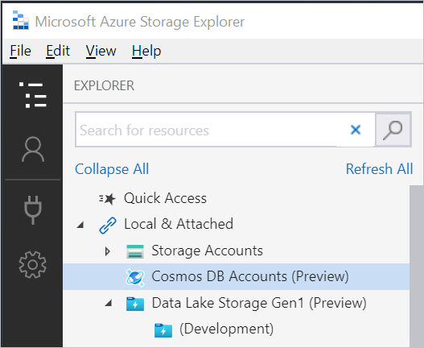

1. You'll see a **Cosmos DB Accounts** item. Right-click it and select **Connect to Cosmos DB**.

    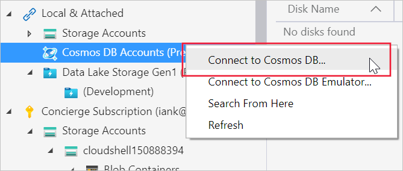

1. The connection wizard needs the connection string to Azure Cosmos DB. Copy and paste the **Primary SQL Connection String** you generated earlier into the **Connection string** box. 

    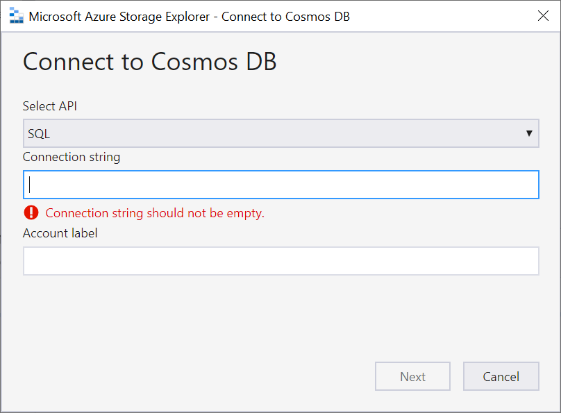  

1. You'll now see a **Summary** view that shows the **Account** label and name, the account endpoint, and the account key. Verify that they're correct, and then select **Connect**. Select **Next**.

1. The Azure Cosmos DB connection appears in the **Cosmos DB Accounts** folder, with the view displayed to the right.

You're now connected to your Cosmos DB account.

### Create a Cosmos DB database

So far, you've created an Azure Cosmos DB instance and connected to it by using Storage Explorer. Now, you'll use Storage Explorer to create a Cosmos DB database.

1. In the **EXPLORER** pane, select the Cosmos DB account that you created earlier. Right-click it and select **Create Database**.

   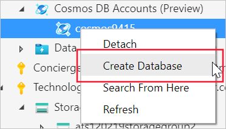

1. Give your database the name **products** and select **Enter**.

    :::image type="content" source="../media/5-cosmos-db-create-database-name.png" alt-text="Screenshot that shows the field where you can name your database." loc-scope="other"::: <!-- no-loc -->

You've now created a database called **products** in Azure Cosmos DB.

### Create a collection in a Cosmos DB database

Now that you have a Cosmos DB database, it's time to create a collection. When you create a collection, you'll provide an ID or name, and the maximum storage capacity.

1. Right-click the **products** database and select **Create collection**.

1. For **Collection ID**, enter an ID of **regions**.

   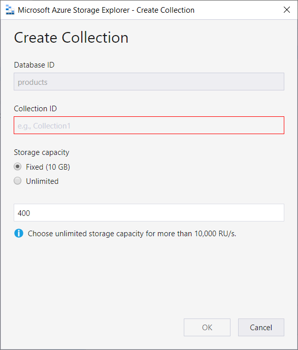

1. Next, specify whether this collection has a finite amount of storage space or whether it will grow to match the size of the collection. A fixed option gives you a maximum collection size of 10 GB.

1. The last field is **Throughput**. Accept the default of 400.

1. Select **OK**.

You now see that the region's collection is added under the **products** database. You can add as many collections as you want.

### Create documents in a Cosmos DB database collection

The collection can contain many items. You use Storage Explorer to manage these, including creating new documents in your collection.

1. In the **EXPLORER** pane, expand the **regions** collection. Select **Documents**.

1. You now see the **regions** collection pane. From here, you can manage the data in your collection.

1. To add a document, select **New Document**. A new empty document is available in the window below.

    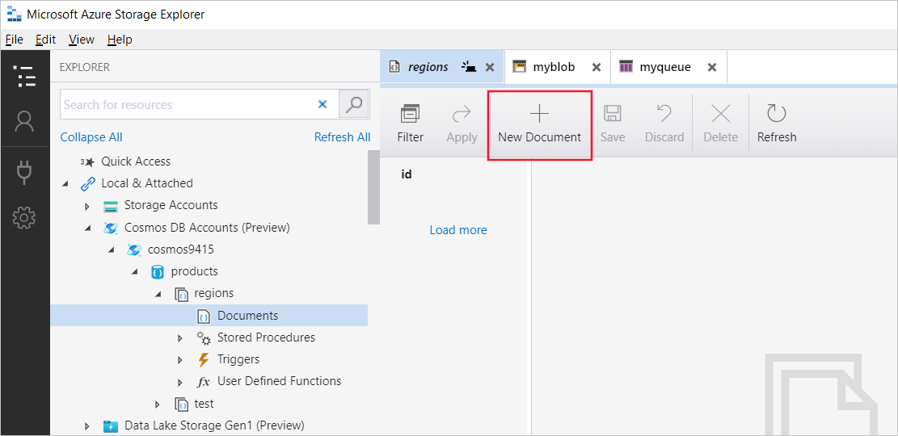

1. Replace the content of the document with this JSON:

   ```json
   {
       "id": "66",
       "title": "How to create a new document",
       "rtime": "30 minutes",
       "_etag": "WFFta1FHgQEtttIE1aaa"
   }
   ```

1. Select **Save**.

   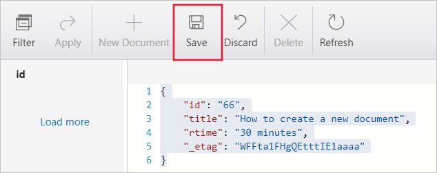

The new document appears in the ID pane.

## Create a Data Lake Storage Gen2 account

Let's now look at connecting to a Data Lake Storage Gen2 account. Before you can use Storage Explorer to manage your Data Lake Storage Gen2 account, you need to create the storage account in Azure.

1. In Cloud Shell, install the preview extension to enable the creation of Gen2 accounts, currently in preview.

    ```azurecli
    az extension add --name storage-preview
    ```

1. To create the Gen2 storage account, use the **az storage account create** command:

   ```azurecli
   az storage account create \
       --name dlstoragetest$RANDOM \
       --resource-group <rgn>[Sandbox resource group]</rgn> \
       --location westus2 \
       --sku Standard_LRS \
       --kind StorageV2 \
       --hns
   ```

## Connect to your Data Lake Gen2 storage account

Now that you've created a Gen2 storage account, you can connect to it in Storage Explorer.

1. In Storage Explorer, in the **EXPLORER** pane, locate **Concierge Subscription** and expand it to show all the storage accounts.

1. Right-click **Storage Accounts** and select **Connect to Azure storage**.

   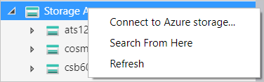

1. If you're prompted, sign in with your Azure account.

1. When the connection is successful, you'll see the **dlsstoragetest001 (ADLS Gen2)** storage account displayed under the storage accounts. Your account will have a different number suffix.

   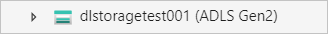

### Create a container

All containers in an Azure Data Lake Gen2 storage account are blobs. To create a new container:

1. Right-click the **dlsstoragetest001** storage account, and select **Create Blob Container** from the shortcut menu.

    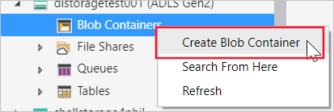

1. Name the new container **myfilesystem**.

1. When the container is created, the pane for the container appears. There, you can manage the container contents.

    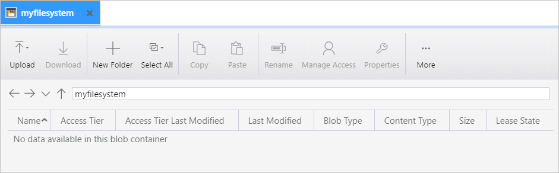

### Upload and view blob data

With the new **myfilesystem** container created, you can now upload files or folders to it.

1. To upload a file, select the **Upload** option, and select **Upload Files**.

    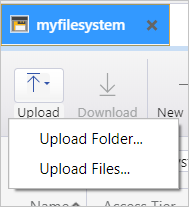

1. In the dialog box, use the ellipsis (**...**) to select the file that you want to upload.

1. Select the **Upload** button.

1. The file is available to the **myfilesystem** container.

    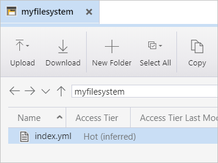

You can upload as many files as you want to this folder. Also, you can create an unlimited number of folders. You can then organize and manage the content in your folders, as you do with your file system.
