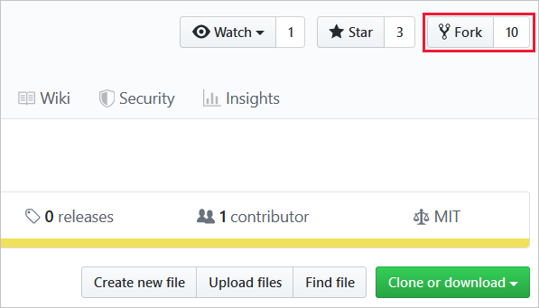
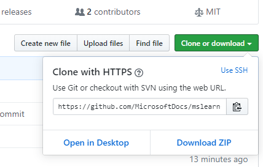
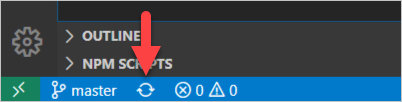
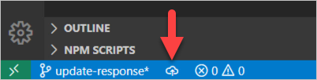
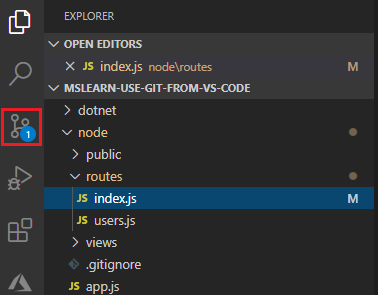

As we stated in the introduction, Visual Studio Code provides tight source control integration with Git by default and with other source code management (SCM) providers through extensions.   

If you're an avid user of Visual Studio Code, it's possible you have kept Git bash open in a separate window, or used Visual Studio Code's integrated terminal window to type Git commands.  While this technique will work, you may come to realize that you can enhance your workflow by learning more about what Visual Studio Code has to offer.  Visual Studio Code provides lots of visual cues, helpful prompts, and shortcuts to common git features tucked away and available using common tools like the Command Palette, the Status Bar, and the Source Control view.

## What you'll accomplish in this exercise

In this first exercise, you'll simulate the process of contributing to an open-source library.  This will provide the perfect context for using Visual Studio Code's Git integration.  You'll see how each tool and feature plays a part in creating a local clone and making your first change to the project's code.  In the next exercise, we'll stage and commit the changes and push to your remote fork.

> [!IMPORTANT]
> To continue with this exercise, you will need to observe the requirements for this module: Git should be installed locally, as well as Visual Studio Code.  Also, you'll need a GitHub account.  Finally, this exercise assumes you already know how to use Git.  The intent is to demonstrate Git integration in Visual Studio Code.

### Step 1 - Create a fork of an open-source project in GitHub.

First, log into your GitHub account.  If you don't already have an account, you should create one now.

Next, navigate to: 

[https://github.com/aaronpowell/trivia-api](https://github.com/aaronpowell/trivia-api?azure-portal=true)

We don't need to worry about what the code in this repository does, how it works, nor get it running locally since we're only interested in Visual Studio Code's Git integration.  This project contains code we can fork, clone, and modify.

Next, select the Fork button near the upper right-hand corner of the web page.



After a moment or two, the repository will be forked to your GitHub account.

### Step 2 - Copy the URL to your forked repository.

You'll need the URL to clone your fork to your local hard drive.

To copy the URL, select the green "Clone or download" button near the upper-right hand corner of the web page.  A dropdown will appear titled "Clone with HTTPS".  

Select the clipboard icon next to the URL to copy the URL to your computer's clipboard.



### Step 3 - Clone the forked project to your local development environment.

Launch Visual Studio Code.

In Windows, select <kbd>Ctrl+Shift+P</kbd> to open the Visual Studio Code Command Palette.

Enter the word `clone`.  The dropdown option should list "Git: Clone" as the selected option.  Select <kbd>Enter</kbd>.

The Command Palette will prompt you to enter the "Repository URL".  Select <kbd>Ctrl+V</kbd> to paste the URL you copied in the previous step.  Select <kbd>Enter</kbd>.

> [!NOTE]
> The Command Palette provides access to many git features with helpful prompts.  If you're curious as to what you can accomplish from the Command Palette, open it by selecting select <kbd>Ctrl+Shift+P</kbd>, then type `git`.  You'll see a long list containing dozens of commands.

Next, the Select Folder dialog will appear.  Choose the folder on your local hard drive where you want to store the files for the cloned repository.  Once you've navigated the file system, select the "Select Repository Location" button to continue.

A dialog will appear in the lower right-hand corner asking if you would like to open the closed repository.  Choose "Open".

You should now see all of the code files for the repository in Visual Studio Code's Explorer view.

> [!NOTE]
> You might see another dialog appear in the lower right-hand corner suggesting you install one or more Visual Studio Code extensions for the files in this workspace.  You can safely ignore this by selecting the dialog's `X` icon in the upper right-hand corner.

### Step 3 - Create a branch for your changes.

The Status Bar provides a host of functionality depending on the extensions you have loaded and what you're working on.  The Status Bar features some handy Git information and functionality.  There are two parts:

- On the left, you see the name of current working branch.  If you modify any tracked files in the working branch, it will add an asterisk symbol `*` next to the branch name.  


When you stage those changes, the asterisk changes into a plus symbol `+`.  Once you commit staged changes, the plus symbol disappears and you only see the branch name.

- On the right, you see an icon that switches from a circle with arrows ("Synchronize Changes") to a cloud with an arrow pointing upwards ("Publish Changes").

The following image shows you what the "Synchronize Changes" icon looks like:



And the following image shows you what the "Publish Changes" icon looks like:



To create a branch, click the branch name (currently set to `master`) in the Status Bar.  This will pop open the Command Palette and allow you to either:
- Switch to an existing branch
- Create a new branch

Start typing the name of the new branch: `update-response`.  When you do, you'll notice that the existing branch names disappear.

After typing `update-response`, select <kbd>Enter</kbd>.  The Command Palette will prompt you to select the branch you will base your new branch on.  Select `master`.

The Status Bar should now display `update-response` indicating the branch you're now working on.


### Step 4 - Make a change to the source code.

In the Explorer View, expand the `GetAllQuestions` folder and select the `index.js` file so that it is displayed in the code editor area of Visual Studio Code.

Update the code example to match the following passage of code:

```javascript
const questions = require("../questions");

module.exports = async function(context, req) {
  context.log("Request for all questions");

  // context.res = {
  //    body: questions
  // };

  context.res = {
    body: questions.map(q => {
      return {
        question: q.question,
        answers: q.incorrect_answers.concat([q.correct_answer]).sort()
      };
    })
  };
  
};
```

> [!IMPORTANT]
> Resist the urge to save your changes for now.  We want to reserve that task for the next step so we can observe how Visual Studio Code provides visual feedback that your code is in a state that needs to be staged and committed.

### Step 5 - Observe the current state of your branch in the status bar.

If you pay close attention, you'll notice several visual clues indicating a change of state to your files in Visual Studio Code.  As you're editing the file, a small blue icon will appear on the Explorer View icon in the left column.  The number indicates how many files have unsaved changes.

Once you save your changes to the file using <kbd>Ctrl+S</kbd>, the blue icon on the Explorer View will disappear.  However, a moment later, a new blue icon featuring a clock will appear over the Source Control View's icon in the left column.  This indicates that Visual Studio Code is working with Git behind the scenes to understand what just changed.

After a moment, the clock icon will disappear, and a new blue icon with a number will appear indicating the number of pending changes (unstaged or staged changes) are ready to be committed.  The number will increment as you make more changes to the files.



This corresponds to the appearance of the asterisk symbol `*` in the Status Bar next to the branch name.

Finally, after you commit your changes, this icon will disappear.  We'll do that in the next exercise.

> [!NOTE]
> If you ever forget what any symbol means and are unsure about what to do next, you can always open Terminal from the View menu, and perform `git status` to understand the current state of your branch.  You always have the option of using a combination of command line git operations and Visual Studio Code's integrated Git functionality together.

## Recap

There are a few important takeaways from this exercise:

- To quickly clone a repository, open the Command Palette (<kbd>Ctrl+Shift+P</kbd>) and enter `clone`.
- To quickly see which branch you're working with, glance at the Status Bar.
- To quickly switch to a new branch or create a new branch, click the current branch name in the Status Bar.
- To quickly perform a `git pull` and `git push` on an existing branch, click the "Synchronize Changes" button.
- To quickly perform a `git push` on a new branch, click the "Publish Changes" button.
- To quickly see how many unstaged or staged changes there are, glance at the blue icon over the Source Control icon in the left column.


