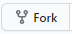
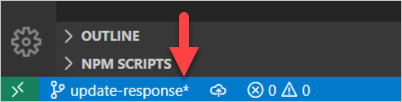
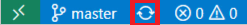
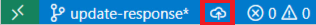

## What you'll accomplish in this exercise

In this first exercise, you'll simulate the process of contributing to an open-source library.  This provides the perfect context for using the Visual Studio Code integration with Git. You'll see how each tool and feature plays a part in creating a local clone and making your first change to your project code.

In the next exercise, you'll stage and commit your changes and then push them to your remote fork.

> [!IMPORTANT]
> To continue with this exercise, you need to observe the requirements for this module: both Git and Visual Studio Code should be installed locally. Also, you'll need a GitHub account. Finally, this exercise assumes that you already know how to use Git.  The intent of the exercise is to demonstrate Git integration with Visual Studio Code.

### Step 1 - Create a fork of an open-source project in GitHub

If you clone someone else's GitHub repository and make some changes, you'll find that you don't have permission to push those changes back to GitHub. The workflow for making contributions to other people's projects on GitHub is a little more complex than working directly in the project repository.

It all starts with creating a *fork*.

A fork is a copy of a GitHub repository that's associated with your GitHub account. When you create a fork, you're granted full permissions to push changes to it, even if you don't have those permissions in the original repository.

After you've created a fork of the repository that you want to contribute to, you can clone that fork to your computer, make the changes you want, and then push them back to your fork. You can then ask the project maintainers to merge your changes from your fork into their repository by creating GitHub pull requests.

Creating a fork of the repository that you want to contribute to is an important first step. Forking takes place entirely within GitHub, so you use the GitHub web interface to do it, not a tool on your development computer.

Next, go to the repository that we've named [mslearn-use-git-from-vs-code](https://github.com/MicrosoftDocs/mslearn-use-git-from-vs-code).

At this time, don't worry about what the code in this repository does or how it works, or try to get it running locally. In this exercise, you're interested only in learning about the Visual Studio Code integration with Git. This project contains code that you can fork, clone, and modify.

Next, select **Fork** near the upper right of the webpage.



After a moment or two, the repository is forked to your GitHub account.

### Step 2 - Copy the URL to your forked repository

When you're working with a fork of a project repository, you usually want to perform the clone operation from your own fork, not from the original repository. This automatically configures Git on your development computer to push your changes to the fork, where you have permissions to do so.

You need the URL of your fork to clone it to your local hard drive. While at the root of this repository, copy the URL of your address bar. It will be in the format of `https://github.com/{Owner}/{Repository}`. For example, https://github.com/Microsoft/terminal.

That address is all we need to clone the fork to your machine.

### Step 3 - Clone the forked project to your local development environment

Open Visual Studio Code.

Press <kbd>Ctrl+Shift+P</kbd> (macOS: <kbd>Cmd+Shift+P</kbd>) to open the **Command Palette**.

In the Search box, enter **clone**.  The drop-down option should list `Git: Clone` as the selected option. Press <kbd>Enter</kbd>.

At the prompt, enter the repository URL by pressing <kbd>Ctrl+V</kbd> (macOS: <kbd>Cmd+V</kbd>). This action pastes the URL that you copied from the **Clone with HTTPS** window in Step 2. Press <kbd>Enter</kbd>.

> [!NOTE]
> The Command Palette provides access to many Git features with helpful prompts.  If you're curious about what you can accomplish from the Command Palette, open it by pressing <kbd>Ctrl+Shift+P</kbd> (macOS: <kbd>Cmd+Shift+P</kbd>), then type **git** to display a list containing dozens of commands.

Next, the **Select Folder** window appears. Select the folder on your local hard drive where you want to store the files for the cloned repository.

Select **Select Repository Location**.

A window appears at the lower right asking whether you want to open the closed repository. Select **Open**.

All the repository's code files appear in the Visual Studio Code **Explorer** view.

> [!NOTE]
> An additional window might open at the lower right, suggesting that you install one or more Visual Studio Code extensions for the files in this workspace. You can safely dismiss it for now by selecting **Close** (**X**).

### Step 4 - Create a branch for your changes

The **Status Bar** appears at the bottom of the Visual Studio Code window, and provides a host of functionality depending on the extensions you've loaded and what you're working on. The Status Bar features some handy Git information and functionality. It displays two parts:

- On the left is the name of the current working branch. If you modify any tracked files in the working branch, the Status Bar adds an asterisk symbol (*) next to the branch name.

   

   When you stage your changes, the asterisk becomes a plus sign (+). After you commit your staged changes, the plus sign disappears, and only the branch name appears.

- On the right is an icon that switches from a circle with arrows (**Synchronize Changes**) to a cloud with an arrow pointing upward (**Publish Changes**).

   The **Synchronize Changes** icon is displayed beside the current branch name. Pressing this icon will synchronize your local and remote commits between your machine and your GitHub repository.

   

   The **Publish Changes** icon is displayed beside the current branch name. Pressing this will your local commit to your GitHub repository.

   

To create a branch, click on the branch name (currently set to **master**) in the Status Bar.  This opens the **Command Palette** and allows you to either switch to an existing branch or create a new branch.

Start entering the name of the new branch, **update-response**. As you enter characters, notice that the existing branch names disappear.

After you type **update-response**, press <kbd>Enter</kbd>.  The Command Palette prompts you to select the branch that you will base your new branch on. Select **master**.

The Status Bar should now display **update-response**, indicating the branch you're now working on.

### Step 5 - Make a change to the source code

In the Explorer View, expand the `node/routes` folder and select the `index.js` file so that it is displayed in the code editor area of Visual Studio Code.

Update the code example to match the following code without saving your changes:

```javascript
const express = require('express');
const router = express.Router();

/* GET home page. */
router.get('/', function(req, res, next) {
  res.render('index', { title: 'Hello Git!' });
});

module.exports = router;

```

### Step 6 - Observe the current state of your branch in the status bar

If you didn't save the `index.js` file in the previous step, you'll notice several visual cues that indicate a change of state to your files in Visual Studio Code.  As you're editing the file, a small blue circle with a number appears on the **Explorer View** icon in the left column.  The number indicates how many files have unsaved changes.

When you save your changes to the file by using <kbd>Ctrl+S</kbd>, the blue circle will disappears and a new blue icon with a number appears on the Source Control Icon, indicating the number of pending changes (unstaged or staged) that are ready to be committed.  The number increments as you make more changes to more files.

:::image type="content" source="../media/3-exercise-clone-branch-06.png" alt-text="Screenshot of the Source Control icon with a circled number indicating the number of changed files ready to commit.":::

This number corresponds to the appearance of the asterisk symbol (*) in the Status Bar next to the branch name.

Finally, after you commit your changes, this icon disappears. You'll commit the changes in the next exercise.

> [!NOTE]
> If you ever forget what any symbol means and are unsure about what to do next, you can select **Terminal** from the **View** menu, and run `git status` to understand the current state of your branch. You can use a combination of command-line Git operations and Visual Studio Code functionality integrated with Git.

## Recap

Here are a few important takeaways from this exercise:

- To quickly clone a repository, open the Command Palette by pressing <kbd>Ctrl+Shift+P</kbd> and typing **clone**.
- To quickly see which branch you're working with, look at the Status Bar.
- To quickly switch to a new branch or create a new branch, select the current branch name in the Status Bar.
- To quickly run `git pull` and `git push` commands on an existing branch, select **Synchronize Changes**.
- To quickly run a `git push` command on a new branch, select **Publish Changes**.
- To quickly view the number of unstaged or staged changes, look at the blue numbered circle over the Source Control icon in the left column.
