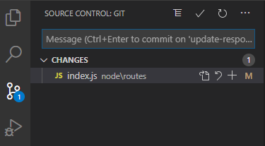
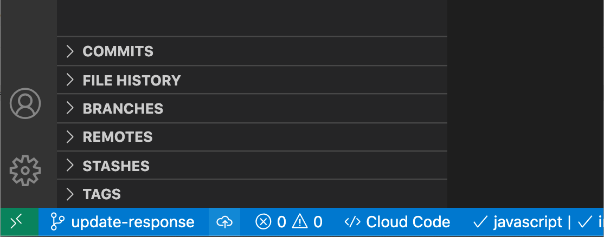
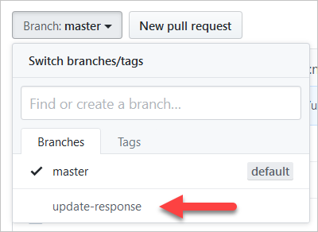

If you've worked with Git, you've probably relied heavily on the `git status` command to help you understand what files are unstaged or staged.  Furthermore, you've likely relied on `git commit -m "Your commit message"` to commit staged files.  Visual Studio Code's Git integration helps accelate these activities and more.

## What you'll accomplish in this exercise

Having already made a change to the source code in the previous exercise, we now have a unstaged change that we need to commit.  Finally, we will want to push our new branch with our new commit to our forked repository.  We'll use Visual Studio Code's integrated Git tooling to perform these activities.

### Step 1 - Open the Source Control view to see unstaged changes.

Choose the Source Control icon on the left.  The Source Control view shows both staged and unstaged changes.  Our goal is to create a commit, which we can also do from this view.  But first we must decide which changes should be added to our commit.



We can see that our `index.js` file is listed under the section titled "Changes".  To the right of the file name, there are four icons.  They are:

- A file icon to open and display the file in the main area.
- An arrow curved backwards icon to discard changes.  This will revert the file to its state in the previous commit.
- A plus symbol `+` icon to stage our changes to be committed.
- An `M` Icon indicating that this file existed previously and has been modified.

### Step 2 - Stage the changed file.

Click the "Stage changes" icon.  

This moves the file under a new section titled "Staged Changes".

One of the icons to the right of the file name is a minus, or dash, symbol `-`.  This will unstage a staged change.

### Step 3 - Unstage the change.  (Then stage it again.)

Click the minus symbol `-` next to the file name to unstage the change.  This moves the change back to the unstaged "Changes" section.  This might be useful if you mistakenly staged a change you intended for a different commit.

Repeat step 2 (above) to re-stage the change.

### Step 4 - Create a commit.

Near the top of the Source Control view are several icons.  The checkmark icon commits your changes.

We want to add a commit message to our commit.  In the text box beneath the checkmark icon, enter the message:

```
updated response object
```

> [!NOTE]
> This text box will warn you if you use more than 50 characters in the subject line (which is a commonly accepted limit).

Select `Ctrl+Enter` or click the checkmark icon to create a commit.

### Step 5 - Push to your repository.

In the previous exercise, we talked about the Synchronize Changes icon in the Status Bar.  Next to the icon, you should see a down arrow with the number zero next to it, indicating that there are no commits to pull.  However, next to that you should see an up arrow with the number one next to it, indicating that there is one commit to push.



Select that icon now to perform a `git pull` then a `git push`.  There should be nothing new to pull, but should push our latest commit to our branch on our forked repository.

### Step 6 - Confirm that your new branch and commit were created in GitHub.

Back in GitHub, navigate to your fork of the repository you created in the previous exercise.

Click on the "Branch: master" button to reveal a dropdown containing all the branches in your repository.  Select the branch you just created in this exercise.



Next, click on the "Commits" link above the "Branch: update-response" button.  This will display all of the commits, and the commit you created in an earlier step of this exercise should be listed at the top.


## Next steps

If this were a real open source project, you might want to create a pull request (PR) to add the commits in your fork to the project's source code stored in the upstream repository.  For more information on this, see the following URL:

[https://help.github.com/en/github/collaborating-with-issues-and-pull-requests/about-pull-requests](https://help.github.com/en/github/collaborating-with-issues-and-pull-requests/about-pull-requests?azure-portal=true)

## Recap

There were several important ideas covered in this exercise:

- To stage changes, use the Source Control view and select the plus icon `+` next to the file name you want to stage.
- To unstage changes, select the minus (dash) icon `-` next to the file you want to unstage.
- To commit, click the checkmark icon or select the keyboard shortcut `Ctrl+Enter`.  To add a commit message, type it in the textbox below the checkmark.
- To push, choose the "Synchronize Changes" icon in the Status Bar.  Clicking this icon performs a `git pull` and `git push`.  View the number of commits that will be pulled and pushed in the text next to the button.