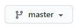
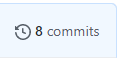
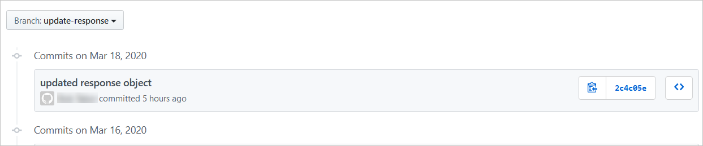

If you've worked with Git, you've probably relied heavily on the `git status` command to help understand which files are unstaged or staged. You've also likely relied on `git commit -m "<Your commit message>"` to commit staged files. The Visual Studio Code integration with Git helps accelerate these and other activities.

## What you'll accomplish in this exercise

Having made a change to the source code in the preceding exercise, you now have an unstaged change that you need to commit. After that, you want to push the new branch with your new commit to your forked repository. You'll do these things by using integrated Git tooling in Visual Studio Code.

### Step 1 - Open the Source Control view to view unstaged changes

In Visual Studio Code, select the Source Control icon in the left column.  The Source Control view shows both staged and unstaged changes.  Your goal is to create a commit, which you can also do from this view.  But first you must decide which changes should be added to your commit.

:::image type="content" source="../media/5-exercise-stage-commit-01.png" alt-text="Screenshot of the Visual Studio Code Source Control view with the file containing changes listed in the Changes section.":::

You can see that your *index.js* file is listed under **Changes**.  To the right of the file name are four icons:

- **File icon**: Select to open and display the file in the main editor pane.
- **Counterclockwise arrow icon**: Select to discard changes and revert the file to its state in the previous commit.
- **Plus sign (+) icon**: Select to stage your changes to be committed.
- **"M" icon**: Indicates that this file existed previously and has been modified.

### Step 2 - Stage the changed file

Select the **plus sign** (**+**) to move the file to a new section titled **Staged Changes**.

### Step 3 - Unstage the changed file, and stage it again

To unstage the changed file, under **Staged Changes**, select the **minus sign** (**-**) next to the *index.js* file.  This action moves the file back to the unstaged **Changes** section. You might find this useful if you mistakenly stage a change that was intended for a different commit.

To restage the change, repeat Step 2.

### Step 4 - Create a commit

The Source Control pane displays several icons at the upper right. To begin committing your changes, select the **checkmark** icon.

You want to add a commit message to your commit.  In the text box below the **checkmark** icon, enter the following message:

```
updated response object
```

> [!NOTE]
> You'll receive a warning if the subject line contains more than 50 characters, the commonly accepted limit.

To complete the commit, select <kbd>Enter</kbd> or select the checkmark icon.

### Step 5 - Push the changes to your repository

In the preceding unit, we talked about the **Synchronize Changes** (two clockwise arrows) icon in the Status Bar. As shown in the following image, to the right of the icon is a down arrow with a zero (0) next to it, indicating that there are no commits to *pull*.  Next to that is an up arrow with a one (1) next to it, indicating that there is one commit to *push* to the repository.


Select the **Synchronize Changes** icon now to perform a `git pull` and then a `git push`.  There should be nothing new to pull, but the action should push your latest commit to your branch on your forked repository.

### Step 6 - Confirm that your new branch and commit were created in GitHub

Back in GitHub, go to your fork of the repository you created in the preceding unit.

Select the **Branch: master** drop-down arrow to display a list of all the branches in your repository.



From the list of available branches, select the new branch **update-response**.

Next, click the **X commits** link.



Selecting this link displays all commits in this branch, and the commit you created earlier in this exercise should be listed at the top.



## Next steps

When you work on a real open-source project, you might want to create a pull request (PR) to add the commits in your fork to the project source code that's stored in the upstream repository.  For more information, see [About pull requests](https://help.github.com/en/github/collaborating-with-issues-and-pull-requests/about-pull-requests?azure-portal=true).

## Recap

Several important ideas were covered in this exercise:

- To stage your changes, open the **Source Control** view, and then select the plus sign (+) next to the file you want to stage.
- To unstage your changes, select the minus sign (-) next to the file you want to unstage.
- To commit your changes to your forked repository, select the checkmark icon or select the keyboard shortcut <kbd>Enter</kbd>.  To add a commit message, type it in the box below the checkmark.
- To push your changes, select the **Synchronize Changes** icon in the Status Bar.  This action performs a `git pull` and a `git push` to your forked repository. Displayed next to the icon are the number of commits that will be pulled and pushed.
