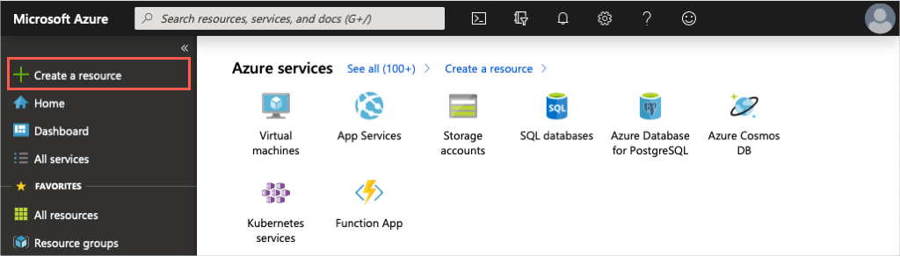
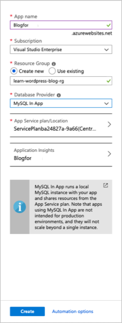
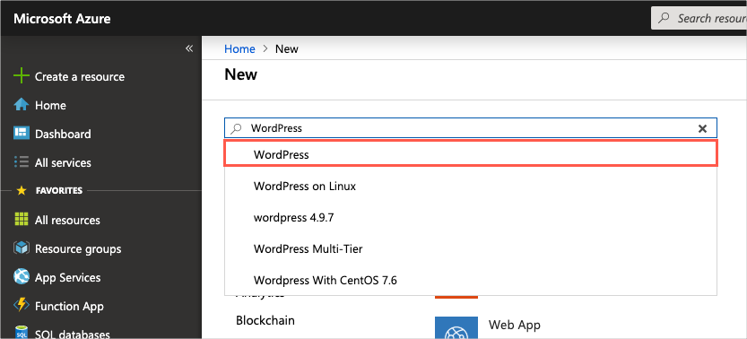
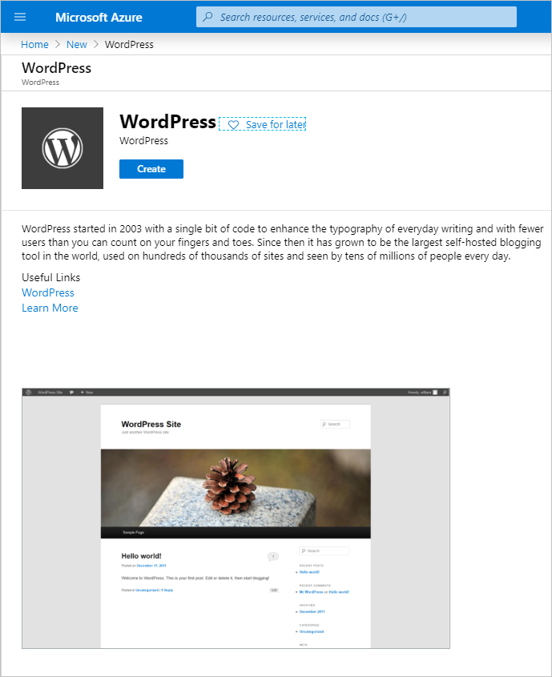
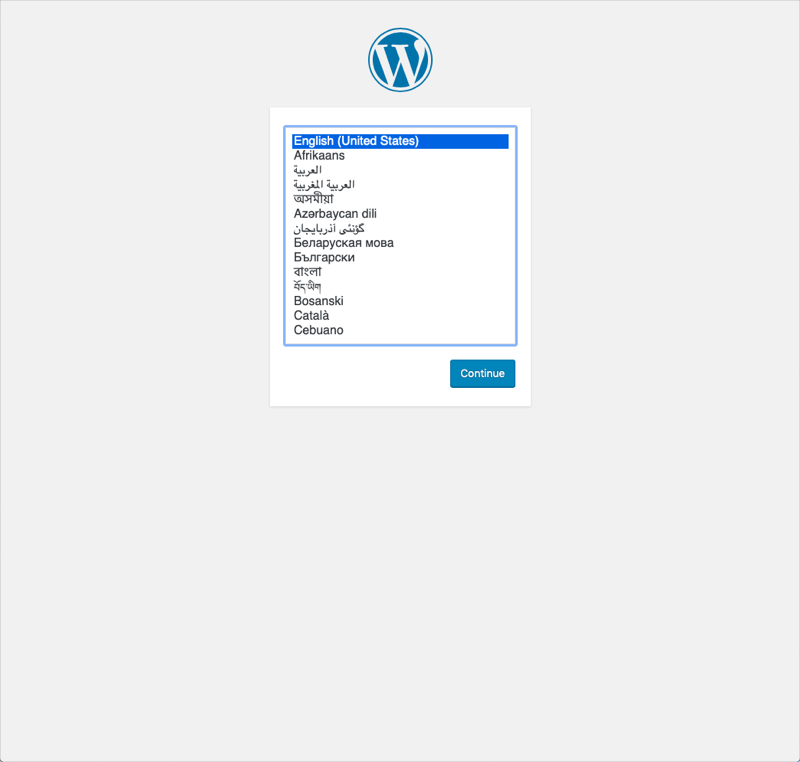

As a technology professional, you likely have expertise in a specific area. Perhaps you're a storage admin or virtualization expert, or maybe you focus on the latest security practices. If you're a student, you may still be exploring what interests you most.

No matter your role, most people get started with the cloud by creating a website. Here you'll deploy a website hosted in an App Service.

Let's review some basic terms and get your first website up and running.

## What is an App Service?

Azure App Service is an HTTP-based service that enables you to build and host many types of web-based solutions without managing infrastructure. For example, you can host web apps, mobile back ends, and RESTful APIs in several supported programming languages. Applications develop in .NET, .NET Core, Java, Ruby, Node.js, PHP, or Python can run in and scale with ease on both Windows and Linux-based environments.

We aim to create a website in less than the time it takes to eat lunch. Therefore, we're not going to write any code and will instead deploy a predefined application from the Microsoft Azure Marketplace.

## What is the Microsoft Azure Marketplace?

The Microsoft Azure Marketplace is an online store that hosts applications that are certified and optimized to run in Azure. Many types of applications are available, ranging from AI + Machine Learning to Web applications. As you'll see in a couple of minutes, deployments from the store are done via the Azure portal using a wizard-style user interface. This user interface makes evaluating different solutions easy.

We're going to use one of the WordPress application options from the Azure Marketplace for our website.

[!include]

## Creating resources in Azure

Typically, the first thing we'd do is to create a *resource group* to hold all the things that we need to create. The *resource group* allows us to administer all the services, disks, network interfaces, and other elements that potentially make up our solution as a unit. We can use the Azure portal to create and manage our solution's resource groups. However, keep in mind that you can also manage resources via a command line using the Azure CLI. The Azure CLI is a useful option should you need to automate the process in the future.

You can use the following resource group **learn-wordpress-blog-rg** name in the exercises. You want to clean up the resources in this resource group at the end of this module so that you will not continue to be charged for them.

## Choosing a location

[!include]

## Create a WordPress website

1. Sign in to the [Azure portal](https://portal.azure.com/learn.docs.microsoft.com?azure-portal=true) with your Azure subscription.

1. In the top left of the Azure portal, select **Create a resource**.

    

    You'll notice how the portal updates it's itself and present additional UI that either provides you with options to refine selection or update configuration variables. We call these panels *blades*.

    

1. We have several application types to choose from, and unfortunately, we'll not discuss each in detail. You're however welcome to go through the list and explore each item at a later stage. Since we know that we want to install WordPress, we can do a quick search for it. In the *search box* above the listed application options, type in **WordPress**. Select the default *WordPress* option from the list of options available.

    

    > [!NOTE]
    > There are several selections available relating to WordPress that you would have noticed in this step. Each of these items provides you with different options regarding the operating system and the amount of configuration to customize the application. Be aware that not all of these options are enabled in the sandbox. You'll have to try the different options in your personal Azure subscription where additional costs will apply.

1. In the newly presented blade, you'll typically find additional information about the item you're about to install. Make sure to review this information. Click the **Create** button when ready.

    

1. Recall from earlier, that we'll use a wizard type interface to create our website. The newly presented blade is our first step in this process. Here, we have to set some values for the required options.

    | Option | Value |
    |--- | --- |
    | **App Name** | Choose a unique for the App name. It will form part of a Fully Qualified Domain Name (FQDN).|
    | **Subscription** | Select the appropriate subscription. |
    | **Resource Group** | Create a new Resource Group **learn-wordpress-blog-rg**. We'll reuse this resource group in later exercises. |
    | **Database Provider** | You'll notice that you have two provider options. The default provider is an **Azure database for MySQL**. The second option is the **MySQL in App** provider that allows us to run a local MySQL database instance with our app. We're going to use the **MySQL in App** provider for our website to simplify our deployment. Pay attention to the call out though, MySQL in App provider isn't intended for production environments.|
    | **App Service plan/location** | The App Service plan/location allows you to select the capabilities and limits available to your application. Keep in mind that different locations sometimes also have different resources available. Leave this value set at the current default. We'll explore App Service plans further in our next exercise. |
    | **Application Insights** | Application Insights allows you to monitor the performance of your application using powerful analytics tools. Leave the value as set by the default configuration. |

    Here is a screenshot to give you an idea of the configuration values. Finally, click on the **Create** button to start the deployment of your new site.

    

## Verify your website is running

The deployment of the new website can take a few minutes to complete, and you're welcome to explore the portal further on your own.

We can track the progress of the deployment at any time.

1. Click on the **notification** bell.

    

1. Click on the **Deployment in progress** link in the dialogue to see the detail information about all the resources that are created.

    

    Notice how resources are listed as they're created and the status changes to green checkmarks as each component in the deployment completes.

    

1. Once the deployment status message change to **Your deployment is complete**, you'll notice the status in the notification dialogue changes to *Deployment succeeded*. Click on the **Go to Resource** button to navigate to the App Service overview.

    

1. Find the URL in the Overview section.

    

    Copy the **URL** information. Open a new tab in your browser and use the information to browse to your new WordPress site. You can now configure your WordPress website and add content.

   
