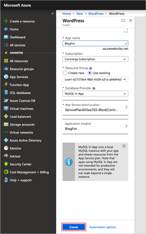
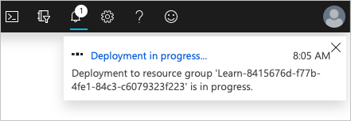
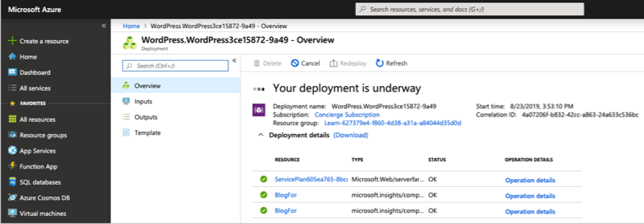
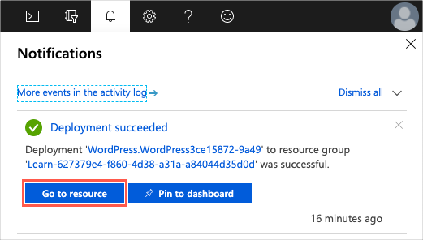

As a technology professional, you likely have expertise in a specific area. Perhaps you're a storage admin or virtualization expert, or maybe you focus on the latest security practices. If you're a student, you may still be exploring what interests you most.

No matter your role, most people get started with the cloud by creating a website. Here you'll deploy a website hosted in an App Service.

Let's review some basic terms and get your first website up and running.

## What is an App Service?

Azure App Service is an HTTP-based service that enables you to build and host many types of web-based solutions without managing infrastructure. For example, you can host web apps, mobile back ends, and RESTful APIs in several supported programming languages. Applications developed in .NET, .NET Core, Java, Ruby, Node.js, PHP, or Python can run in and scale with ease on both Windows and Linux-based environments.

We aim to create a website in less than the time it takes to eat lunch. Therefore, we're not going to write any code and will instead deploy a predefined application from the Microsoft Azure Marketplace.

## What is the Microsoft Azure Marketplace?

The Microsoft Azure Marketplace is an online store that hosts applications that are certified and optimized to run in Azure. Many types of applications are available, ranging from AI + Machine Learning to Web applications. As you'll see in a couple of minutes, deployments from the store are done via the Azure portal using a wizard-style user interface. This user interface makes evaluating different solutions easy.

We're going to use one of the WordPress application options from the Azure Marketplace for our website.

## Create resources in Azure

Typically, the first thing we'd do is to create a *resource group* to hold all the things that we need to create. The *resource group* allows us to administer all the services, disks, network interfaces, and other elements that potentially make up our solution as a unit. We can use the Azure portal to create and manage our solution's resource groups. However, keep in mind that you can also manage resources via a command line using the Azure CLI. The Azure CLI is a useful option should you need to automate the process in the future.

In the free Azure sandbox environment, you'll use the pre-created resource group **<rgn>[sandbox resource group name]</rgn>**, eliminating the need to create resources independently.

## Select a location

[!include]

## Create a WordPress website

1. If you haven't already, verify that you have activated the sandbox identified at th start of this exercise. Activating the sandbox will allocate the subscription and resource group you will use in this exercise. This step is required for any Microsoft Learn exercises that use a sandbox.

1. Sign in to the [Azure portal](https://portal.azure.com/learn.docs.microsoft.com?azure-portal=true) using the same account you activated the sandbox with.

    [!include]

1. From the top left of the Azure portal, select **Create a resource**.

    :::image source="../media/4-create-resource.png" alt-text="Screenshot of Azure portal showing left-hand navigation with Create a resource option option highlighted.":::

    The **New** window appears on the Home page containing the **Azure Marketplace**.

    :::image source="../media/4-azure-marketplace.png" alt-text="Screenshot of Azure portal showing Azure Marketplace categories in a left column and popular options in a right column.":::

1. The Azure Marketplace has many services, solutions, and resources available for you to use. Because we know that we want to install WordPress, we can do a quick search for it. In the **Search the Marketplace** search box above the listed application options, enter **WordPress**. Select the default *WordPress* option from the list of options available.

    :::image source="../media/4-search-select-wordpress.png" alt-text="Screenshot of Azure portal showing search results for the term WordPress with the WordPress option highlighted.":::

1. In the WordPress panel that appears, you'll typically find additional information about the item you're about to install, including the publisher, a brief description of the resource, and links to more information. Make sure to review this information. Select **Create** to begin the process to create a WordPress app.

    :::image source="../media/4-create-site.png" alt-text="Screenshot of Azure portal showing WordPress resource type summary.":::

1. Next, you're presented with several options to configure your deployment. Enter the following values for each setting.

    | Setting | Value |
    | --- | --- |
    | **App Name** | Choose a unique value for the App name. It will form part of a Fully Qualified Domain Name (FQDN). |
    | **Subscription** | Make sure the **Concierge Subscription** is selected. |
    | **Resource Group** | From the dropdown, select the **<rgn>[sandbox resource group name]</rgn>** resource group. |
    | **Database Provider** | Select **MySQL in App**. |
    | **App Service plan/Location** | In the **App Service plan** panel, select the dropdown. The **App Service plan** panel appears. Select **Create new**. The **New App Service Plan** panel appears. The App Service plan specifies the compute resources and location for the web app. Enter the following values for each setting. |

    | Setting | Value |
    | --- | --- |
    | **App Service plan** | Enter a *name* for the new service plan. |
    | **Location** | Select **Central US** to make sure we pick a region that allows the service plan you will pick. Normally, you would pick the region that is closest to your customers while offering the services you need. |
    | **Pricing tier** | Select the dropdown. The **Spec Picker** panel appears. The **Spec Picker** enables us to select a new pricing tier for our application. This panel opens to the *Production* tab, with the S1 pricing tier selected. Select the **Dev / Test** tab, then select the **F1** pricing tier for our website, and then select **Apply**. |

1. The **New App Service Plan** panel reappears. Select **OK**. The **WordPress** *Create* panel reappears.

    Your configuration should look like this:

    

    > [!NOTE]
    > If you still see a section called **Database**, make sure you selected the correct **Database Provider** described in this configuration.

1. Select **Create** to start the deployment of your new site.

    > [!NOTE]
    > If you encounter an issue creating the resources, verify you've selected the **F1** pricing tier in the new App Service plan. This is a requirement of the sandbox system when creating our WordPress site.

## Verify your website is running

The deployment of our new website can take a few minutes to complete. You're welcome to explore the Azure portal further on your own.

We can track the progress of the deployment at any time.

1. Select the **notification bell** icon at the top of the portal. If your browser window width is smaller, it may be shown when you select the ellipsis (**...**) icon at the top right.

    

1. Select **Deployment in progress...** to see the details about all the resources that are created.

    

    Notice how resources are listed as they're created and the status changes to a green check as each component in the deployment completes.

    

1. After the deployment status message changes to **Your deployment is complete**, you'll notice the status in the notification dialog changes to **Deployment succeeded**. Select **Go to resource** to navigate to the App Service overview.

    

1. Find the URL in the Overview section. Copy the **URL** information from the *Copy to clipboard* icon.

    

1. Open a new tab in your browser to browse to your new WordPress site. You can now configure your WordPress website, and add content.

    :::image type="content" source="../media/4-configure-wordpress.png" alt-text="Screenshot showing pre-configured WordPress website waiting on language/location selection." loc-scope="third-party":::
