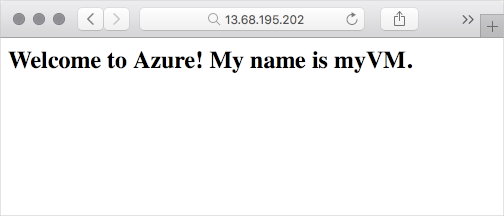

Here you'll install a web server in your VM and serve up a basic web page that displays the VM's hostname.

To configure a VM, you have several choices. You can connect directly and interactively configure your system. For example, on Windows systems you can create a Remote Desktop session to connect to the UI of your remote Windows computer as if you were seated at it. On Linux systems, you can create an SSH connection to securely work with your remote Linux system from the terminal.

Manual configuration is a good start, but as you add systems, you can automate your deployments. Automation involves running repeatable processes such as programs and scripts that take care of the heavy lifting for you.

::: zone pivot="windows-cloud"

Here, you'll configure IIS remotely from your Cloud Shell session using a feature of Windows-based Azure virtual machines called the Custom Script Extension.

::: zone-end

::: zone pivot="linux-cloud"

Here, you'll configure Nginx remotely from your Cloud Shell session using a feature of Linux-based Azure virtual machines called the Custom Script Extension.

::: zone-end

::: zone pivot="windows-cloud"

## What is IIS?

Internet Information Services, or IIS, is a web server that runs on Windows. You can use IIS to serve standard web content (HTML, CSS, and JavaScript) or run ASP.NET and other kinds of web applications. IIS comes with Windows Server, but you need to activate it to start serving web pages.

## What's the Custom Script Extension?

The Custom Script Extension is an easy way to download and run scripts on your Azure VMs. It's just one of the many ways you can configure the system once your VM is up and running.

You can store your scripts in Azure storage or in a public location such as GitHub. You can run scripts manually or as part of a more automated deployment. Here, you'll run an Azure CLI command to download a PowerShell script from GitHub and execute it on your VM. The script configures IIS.

## Configure IIS

<!-- TODO: https://github.com/MicrosoftDocs/learn-pr/issues/1864 -->

Here you'll use the Custom Script Extension to configure IIS remotely on your VM from Cloud Shell. You'll also configure the firewall to allow inbound network access on port 80 (HTTP).

1. From Cloud Shell, run this `az vm extension set` command to download and execute a PowerShell script that installs IIS and configures a basic home page.

    ```azurecli
    az vm extension set \
      --resource-group <rgn>[sandbox resource group name]</rgn> \
      --vm-name myVM \
      --name CustomScriptExtension \
      --publisher Microsoft.Compute \
      --settings '{"fileUris":["https://raw.githubusercontent.com/MicrosoftDocs/mslearn-welcome-to-azure/master/configure-iis.ps1"]}' \
      --protected-settings '{"commandToExecute": "powershell -ExecutionPolicy Unrestricted -File configure-iis.ps1"}'
    ```

    The process to configure IIS, set the contents of the homepage, and start the service takes a couple minutes to complete.

    In the meantime, you can [examine the PowerShell script](https://raw.githubusercontent.com/MicrosoftDocs/mslearn-welcome-to-azure/master/configure-iis.ps1?azure-portal=true) from a separate browser tab if you'd like. The script installs IIS and configures the home page to display a welcome message along with the VM's computer name, "myVM".

1. Run this `az vm open-port` command to open port 80 (HTTP) through the firewall.

    ```azurecli
    az vm open-port \
      --name myVM \
      --resource-group <rgn>[sandbox resource group name]</rgn> \
      --port 80
    ```

## Verify the configuration

Now that IIS is set up, let's verify that it's running.

1. Run this `az vm show` command to list your VM's public IP address.

    ```azurecli
    az vm show \
      --name myVM \
      --resource-group <rgn>[sandbox resource group name]</rgn> \
      --show-details \
      --query [publicIps] \
      --output tsv
    ```

    You see your VM's public IP address, for example, 104.211.9.245.

1. In a new browser tab, navigate to your VM's IP address (`http://` followed by the IP address). You'll see your welcome message and your VM's name.

    

    If you don't see your welcome message:

    * Verify that you're using your VM's IP address and not the IP address shown in any of the examples.
    * Verify that you ran the `az vm open-port` command shown earlier to open port 80 (HTTP) through the firewall.
    * Wait a few moments and refresh the page. Although IIS is installed, the service may not yet have fully started.

::: zone-end

::: zone pivot="linux-cloud"

## What is Nginx?

Nginx (pronounced "engine-x") is a popular, free, open-source web server that runs on Unix, Linux, macOS, and Windows. Here you'll use Nginx to serve a basic web page.

## What's the Custom Script Extension?

The Custom Script Extension is an easy way to download and run scripts on your Azure VMs. It's just one of the many ways you can configure the system once your VM is up and running.

You can store your scripts in Azure storage or in a public location such as GitHub. You can run scripts manually or as part of a more automated deployment. Here, you'll run an Azure CLI command to download a Bash script from GitHub and execute it on your VM. The script configures Nginx.

## Configure Nginx

<!-- TODO: https://github.com/MicrosoftDocs/learn-pr/issues/1864 -->

Here you'll use the Custom Script Extension to configure Nginx remotely on your VM from Cloud Shell. You'll also configure the firewall to allow inbound network access on port 80 (HTTP).

1. From Cloud Shell, run this `az vm extension set` command to download and execute a Bash script that installs Nginx and configures a basic home page.

    ```azurecli
    az vm extension set \
      --resource-group <rgn>[sandbox resource group name]</rgn> \
      --vm-name myVM \
      --name customScript \
      --publisher Microsoft.Azure.Extensions \
      --settings '{"fileUris":["https://raw.githubusercontent.com/MicrosoftDocs/mslearn-welcome-to-azure/master/configure-nginx.sh"]}' \
      --protected-settings '{"commandToExecute": "./configure-nginx.sh"}'
    ```

    The process to configure Nginx, set the contents of the homepage, and start the service takes a couple minutes to complete.

    In the meantime, you can [examine the Bash script](https://raw.githubusercontent.com/MicrosoftDocs/mslearn-welcome-to-azure/master/configure-nginx.sh?azure-portal=true) from a separate browser tab if you'd like. The script installs Nginx and configures the home page to display a welcome message along with the VM's computer name, "myVM".

1. Run this `az vm open-port` command to open port 80 (HTTP) through the firewall.

    ```azurecli
    az vm open-port \
      --name myVM \
      --resource-group <rgn>[sandbox resource group name]</rgn> \
      --port 80
    ```

## Verify the configuration

Now that Nginx is set up, let's verify that it's running.

1. Run this `az vm show` command to list your VM's public IP address.

    ```azurecli
    az vm show \
      --name myVM \
      --resource-group <rgn>[sandbox resource group name]</rgn> \
      --show-details \
      --query [publicIps] \
      --output tsv
    ```

    You see your VM's public IP address, for example, 104.211.9.245.

1. In a new browser tab, navigate to your VM's IP address. You see your welcome message and your VM's name.

    

    If you don't see your welcome message:

    * Verify that you're using your VM's IP address and not the IP address shown in any of the examples.
    * Verify that you ran the `az vm open-port` command shown earlier to open port 80 (HTTP) through the firewall.
    * Wait a few moments and refresh the page. Although Nginx is installed, the service may not yet have fully started.

::: zone-end
