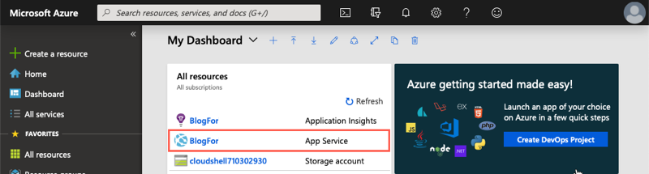
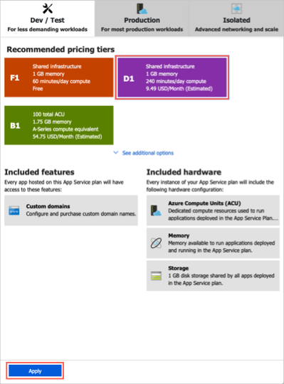
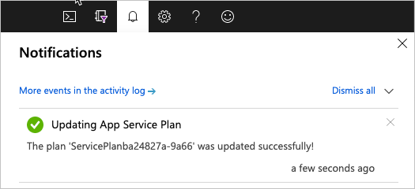

Recall from earlier, that we're using an App Service to run our WordPress application. Here we'll look at additional information exposed about our application and explore some of the available options to configure our website.

Let's have a look at some of this information.

> [!IMPORTANT]
> This exercise uses the WordPress website you created in the  **Exercise - Create a Website** unit. Please make sure you've completed that exercise before continuing.

[!include]

1. Sign in to the [Azure portal](https://portal.azure.com/learn.docs.microsoft.com?azure-portal=true) with your Azure subscription.

1. Click on the **Dashboard** link on the left sidebar to access a list of all resources in your subscription.

    

1. Click on the **App Service** with the name you chose it in the previous exercise.

    

1. By default, the *App Service*'s overview is displayed, if not click **Overview**.

    

1. Scroll down in the overview view to where you can see the graphs for your newly created website. These graphs provide statistics about the number of requests received by our website, the amount of data in / data out and the number of errors encountered on the site.

    

    The information displayed here is near real-time data and gives a quick overview of the performance of your website. Problems with the site's performance will manifest in these graphs as early warnings.

## What is scale?

Suppose you deployed your website and it becomes popular. By looking at the graphs in the overview, you realize that your site can't effectively manage all the requests it's receiving. To solve the problem, you'll need to increase the server's hardware capacity.

_Scale_ refers to adding network bandwidth, memory, storage, or compute power to achieve better performance.  

You may have heard the terms _scaling up_ and _scaling out_.

Scaling up, or vertical scaling means to increase the memory, storage, or compute power on an existing virtual machine. For example, you can add additional memory to a web or database server to make it run faster.

Scaling out, or horizontal scaling means to add extra virtual machines to power your application. For example, you might create many virtual machines configured in exactly the same way and use a load balancer to distribute work across them.

> [!TIP]
> The cloud is elastic. You could _scale down_ or _scale in_ your deployment if you needed to scale up or scale out only temporarily. Scaling down or scaling in can help you save money.  **Azure Advisor** and **Azure Cost Management** are two services that help you optimize cloud spend. You can use these services to identify where you're using more than you need, and then scale back to the capacity you're actually using.

When you have more time, feel free to go through each section and explore the various options available.

## How to change the App Service configuration

The App Services has many configurable options available and group in sections of functionality.

The first section displayed is a group of common options you'd access to get a view of the health of your application. However, each following section provides additional functionality and information.

For example, the **Settings** section gives you access to configure various aspects such as application settings, backups, custom domains, TLS/SSL settings, options to scale up the resources of the application, and so on.

## Scale up your App Service

> [!NOTE]
> You're welcome to test these options in your personal Azure subscription. However, keep in mind that additional costs will apply.

1. Find the *Settings* configuration section for your App Service. Click on **Scale up (App service plan)**.

    

1. Notice that there are three workload categories to choose from in the configuration blade. These three categories make it easier to decide the type of workload we'll run.

    | Category | Description |
    | --- | --- |
    | **Dev / Test** | This category is ideal for less demanding workloads. This category is predominantly focused on providing shared infrastructure. In this category, you have additional features that become available to the App Service application. For example, Custom domains / SSL and manual scale. |
    | **Production** | This category is ideal for less demanding workloads. In this category, you'll also notice added features such as staging slots, daily backups, and a traffic manager. |
    | **Isolated** | This category is ideal for workloads that require advanced networking and fine-grained scaling. |

    Within each category, there are recommended pricing tiers that will allow us to scale the resources available to our App service. These pricing tiers give us access to the additional features mentioned above.

1. Select the **P1V2** pricing tier.

    

1. Click the **Apply** button to activate the new price tier.

1. The scaling process stops the website while the process runs. You can monitor the scale process's progress using the notification bell as we did earlier.

    

    Your website is automatically started once the scaling process complete.
