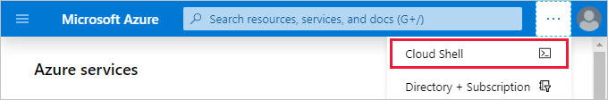
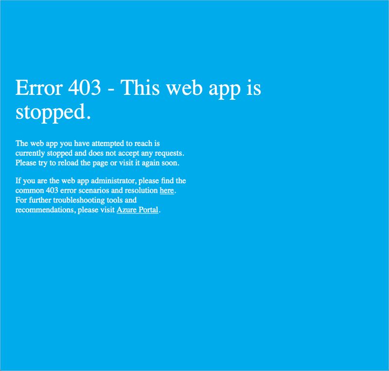

The Azure portal offers a convenient user interface to search, install, and access the various Azure offerings available. You'll find, however, some of these tasks are repetitive and are candidates for automation using a command-line enabled interface.

## What is Azure Cloud Shell?

Azure Cloud Shell is a browser-based command-line experience for managing and developing Azure resources. Think of Cloud Shell as an interactive console that you run in the cloud.

Cloud Shell provides two experiences to choose from, Bash and PowerShell. Both include access to the Azure command-line interface called Azure CLI and to Azure PowerShell.

You can use any Azure management interface, including the Azure portal, Azure CLI, and Azure PowerShell, to manage Azure resources. For learning purposes, here you'll use the Azure CLI to start and stop the WordPress site we created earlier.

Suppose you have several websites deployed and want to stop or start each of these websites without accessing each App service individually using the portal. This effort is an easy task that you can convert into a script using Cloud Shell and Azure CLI.

In this exercise, you'll use the Cloud Shell window shown side by side with the exercise instructions. When normally accessing the Cloud Shell from within the Azure portal, you'll click the Cloud Shell icon from the top navigation bar. This icon is sometimes within the ellipsis (...) menu icon next to your profile.



For this exercise, we'll use the Cloud Shell experience as part of our sandbox implementation.

[!include[](../../../includes/azure-cloudshell-copy-paste-tip.md)]

1. Our first step is to make sure that we work with the correct Azure subscription before we change any settings. We'll use the `az account list` list command. By default, the command returns a *JSON* string. However, we'll format the output as a table to make the information easier to work with. Run the following command.

    ```azurecli
    az account list --output table
    ```

1. Recall that we used a pre-created resource group called **<rgn>[sandbox resource group name]</rgn>** when we created our website. However, if you ever need to list all the resource groups in a subscription, then you'll run the `az group list` command.

    ```azurecli
    az group list --output table
    ```

1. Next, we'll list all the resources in the **<rgn>[sandbox resource group name]</rgn>** using the `az resource list` command. The command will return a list of resources. By specifying, `--resource-type` we can filter the result to include only the resource information related to websites.

    Run the following command.

    ```azurecli
    az resource list \
        --resource-group <rgn>[sandbox resource group name]</rgn> \
        --resource-type Microsoft.Web/sites
    ```

    Here an example of the command's output:

    ```json
    {
    "id": "/subscriptions/xxxxxxxx-xxxx-xxxx-xxxx-xxxxxxxxxxx/resourceGroups/<rgn>[sandbox resource group name]</rgn>/providers/Microsoft.Web/sites/BlogFor",
    "identity": null,
    "kind": "app",
    "location": "centralus",
    "managedBy": null,
    "name": "MyWebApp",
    "plan": null,
    "properties": null,
    "resourceGroup": "<rgn>[sandbox resource group name]</rgn>",
    "sku": null,
    "tags": null,
    "type": "Microsoft.Web/sites"
    }
    ```

    Copy the value of `name`. We'll use it in the next steps to first stop and then start our website.

1. We'll use the `az webapp stop` command to stop the web application running in our app service. Replace `<web app name>` with the name of your web app you copied, then run this command to stop your web app.

    ```azurecli
    az webapp stop \
        --resource-group <rgn>[sandbox resource group name]</rgn> \
        --name <web app name>
    ```

1. Open the website in a new browser tab. You'll find the URL to the site in the overview of the App service in the portal. You'll see a message in your browser that reads:

    

1. Finally, let's start the web app by running the `az webapp start` command. Replace `<web app name>` with the name of your web app you copied, then run this command to start your web app.

    ```azurecli
    az webapp start \
        --resource-group <rgn>[sandbox resource group name]</rgn> \
        --name <web app name>
    ```

1. Switch back to the tab for your website and refresh the page. Your website will be available after a couple of seconds.
