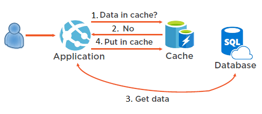
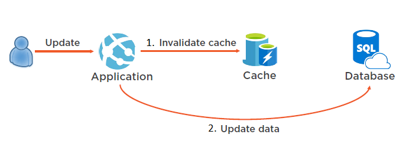

When building an application, you want to provide a great user experience, and a part of that is quick data retrieval. Retrieving data from a database is typically a slow process, and if this data is read often, this could provide a poor user experience. The cache-aside pattern describes how you can implement a cache in conjunction with a database, to return the most commonly accessed data as quickly as possible.

Here, you'll learn how the cache-aside pattern can be used to ensure your important data is quickly accessible.

## What is the cache-aside pattern?

The cache-aside pattern dictates that when you need to retrieve data from a data source, like a relational database, you should first check for the data in your cache. If the data is in your cache, use it. If the data is not in your cache, then query the database, and when you're returning the data back to the user, add it to your cache. This will then allow you to access the data from your cache the next time it's needed.

## When to implement the cache-aside pattern?

Reading data from a database is usually a slow process. It involves compilation of a complex query, preparation of a query execution plan, execution of the query, and then preparation of the result. In some cases, this process may read data from the disk as well. There are optimizations that can be done on the database level, like pre-compiling the queries, and loading some of the data in memory. However, execution of the query and preparation of the result will always happen when retrieving data from a database.

We can solve this problem by using the cache-aside pattern. In the cache-aside pattern, we still have the application and the database, but now we also have a cache. A cache stores its data in memory, so it doesn't have to interact with the file system. Caches also store data in very simple data structures, like key value pairs, so they don't have to execute complex queries to gather data or maintain indexes when writing data. Because of this, a cache is typically more performant than a database. When you use an application, it will try to read data from the cache first. If the requested data is not in the cache, the application will retrieve it from the database, like it always has done. However, then it stores the data in the cache for subsequent requests. Next time when any user requests the data, it will return it from the cache directly.

### How to manage updating data

When you implement the cache-aside pattern, you introduce a small problem. Since your data is now stored in a cache and a data store, you can run into problems when you try to make an update. For example, to update your data, you would need to update both the cache and the data store.

The solution to this problem in the cache-aside pattern is to invalidate the data in the cache. When you update data in your application, you should first delete the data in the cache and then make the changes to the data source directly. By doing this, next time the data is requested, it won't be present in the cache, and the process will repeat. 

## Considerations for using the cache-aside pattern

Carefully consider which data to put in the cache. Not all data is suitable to be cached.

- **Lifetime**: For cache-aside to be effective, make sure that the expiration policy matches the access frequency of the data. Making the expiration period too short can cause applications to continually retrieve data from the data store and add it to the cache.

- **Evicting**: Caches have a limited size compared to typical data stores, and they'll evict data if necessary. Make sure you choose an appropriate eviction policy for your data.

- **Priming**: To make the cache-aside pattern effective, many solutions will prepopulate the cache with data that they think will be accessed often.

- **Consistency**: Implementing the cache-aside pattern doesn't guarantee consistency between the data store and the cache. Data in a data store can be changed without notifying the cache. This can lead to serious synchronization issues.

The cache-aside pattern is useful when you're required to access data frequently from a data source that uses a disk. Using the cache-aside pattern, you'll store important data in a cache to help increase the speed of retrieving it. 